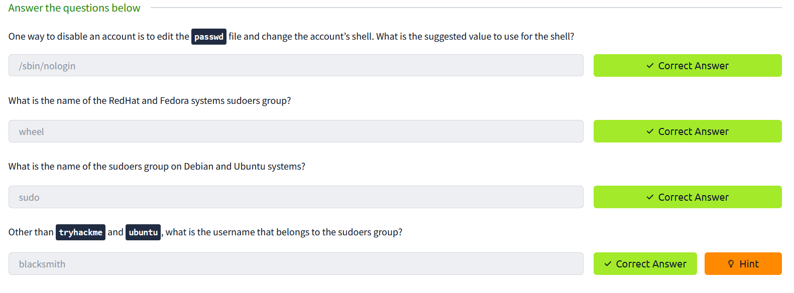
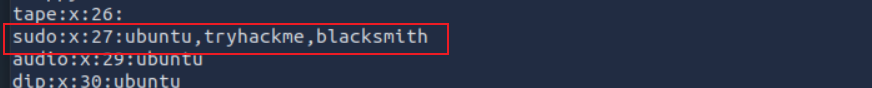

# 4.用户账户策略

权限越大，风险越大，`root`用户有很大的权限，因此存在很大的风险。您可能因一个简单的错误操作，而导致系统无法启动。建议使用非root账户进行日常工作，以避免破坏您的操作系统。然而当进行系统维护、安装/删除软件以及更新系统时任需要`root`权限。

## 使用sudo

`sudo`命令的做用是使普通用户可以临时以`root`权限去执行命令，前提是将该普通用户添加到 `sudoers`中。

我们可以通过以下方式将用户添加到`sudoers`组，某些发行版（如Debian和Ubuntu将`sudoers` 组称为`sudo`），其他发行版（例如：RedHat和Fedora将sudoers 组称为`wheel`）：
::: code-group

```bash [Debain]
usermod -aG sudo username 
```

```bash [RedHat]
usermod -aG whell username
```

:::
>[!NOTE]
>- `usermod` : 修改用户账户
>- `-aG` : 附加到组
>- `sudo`:  sudoers 组（基于Debian的发行版）
>- `whell` : sudoers 组（基于RedHat和Fedora）
>- `username` ：要修改的用户的名称

## 禁用root

创建用户管理的账户，并将其添加到`sudo`/ `wheel` 组后，您可以考虑禁用`root`账户。您可以通过修改 `/etc/passwd` 中 `root`用户默认`shell` 实现：

将 `root:x:0:0:root:/root:/bin/bash`  这一行中的 `/bin/bash` 改为  `/sbin/nologin`


## 强密码策略

`libpwquality` 库为linux 系统提供了许多密码约束选项，配置文件可以在以下位置找到：

- `/etc/security/pwquality.cof` :  RedHat和Fedora上。
- `/etc/pam.d/common-password` : 在 Debain 和Ubuntu上（如果不存在，您可以通过命令行安装它`apt-get install libpam-pwquality`）。

以下是一些示例选项：
- `difok`允许您指定旧密码中不存在的新密码中的字符数。
- `minlen`设置新密码允许的最小长度。
- `minclass`指定所需的字符类的最小数量;类可以是字符串、字符串和数字等。
- `badwords`提供了一个空格分隔的单词列表，这些单词不得包含在所选密码中。
- `retry=N`在返回错误之前提示用户`N`次。

下面是一个例子：

```sh
sudo cat /etc/security/pwquality.conf  
difok=5 
minlen=10 
minclass=3 
retry=2
```

您可以通过`man pwquality.conf`手册查看所有可用选项。

## 禁用未使用的用户

作为系统维护的一部分，禁用不再需要访问相关系统的用户至关重要。列如，这些用户可能已经转到另一个部门或者退出公司。

您可以像禁用`root`用户一样，修改`/etc/passwd` 中用户默认`shell` 为`/sbin/nologin`我们也可以为当地服务账户禁用登录。因为这些服务需要账户才能在系统上运行，但是永远不需要登录和访问`shell`。（我们应该对所有本地服务例如`sbin/nologin`、`www-data`和`mongo`禁用登录）这些服务中的任何一个都可能存在RCE（远程代码执行）漏洞，通过将shell设置为`nologin`，我们至少可以阻止受影响服务帐户的交互式登录。

## 回答下面问题



**最后一题解题过程如下：**
- ssh 远程链接靶机
- 查看/etc/group文件
	