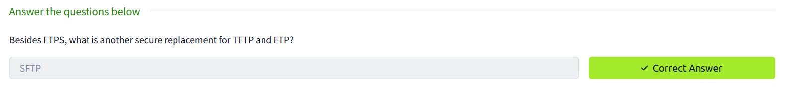

# 5.软件和服务

您在系统上安装的每一个软件也会增加潜在漏洞的数量。换句话说，安装额外的软件包和新服务会增加攻击者可以利用的漏洞，从而访问您的系统，并最终访问您网络上的其他系统。您可以遵循一些指导原则来帮助您减少攻击面。
## 禁用不必要服务

改善安全状况的最简单方法之一是删除或禁用不需要的服务和软件包。简而言之，我们需要尽量减少安装的系统软件包的数量，因为每个软件包都有一定的风险，我们无法知道何时会发现相关的漏洞。最好的策略是避免安装不需要的软件包。

例如，如果您不需要Web服务器，则应确保不安装。如果您曾经需要运行Web服务器，但现在不再需要它，您应该删除它或至少禁用它。否则，您将使自己面临不必要的风险。

## 阻止不需要的网络端口

在您删除任何不需要的软件包并禁用可能不会删除的预安装服务后，相应地设置防火墙规则至关重要。如果您没有Web服务器，则没有理由允许数据包到达TCP端口80和443。这背后的原因是，如果攻击者设法启动禁用的服务，防火墙将阻止其流量，攻击者将无法访问其TCP端口。

## 避免遗留协议
在过去的某个时候，FTP是远程访问系统的主要协议; TFTP协议通常用于传输文件。这种协议不应该再被允许，因为安全的替代方案已经发布。

## 删除标识字符串

当你连接到远程服务器时，它通常会回复它的版本号。这些信息会向攻击者泄露各种信息，例如服务器/程序的名称、版本号和主机操作系统。

## 回答下面问题

