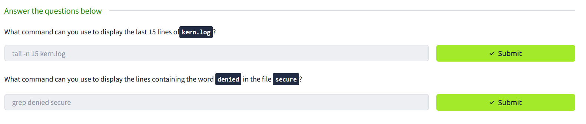

# 7.审计和日志配置

Linux系统上的大多数日志文件都存储在`/var/log`目录中。以下是一些在调查威胁时可以参考的日志：

- `/var/log/messages`  用于Linux系统的通用日志
- `/var/log/auth.log` 列出所有身份验证尝试的日志文件（基于Debian的系统）
- `/var/log/secure` 列出所有身份验证尝试的日志文件（基于Red Hat和Fedora的系统）
- `/var/log/utmp` 访问日志，其中包含有关当前登录到系统的用户的信息
- `/var/log/wtmp` 访问日志，其中包含所有登录和退出系统的用户的信息
- `/var/log/kern.log`包含来自内核的消息的日志文件
- `/var/log/boot.log` 包含启动消息和`boot`信息的日志文件

我们将进行简单的演示：

- 由于新事件会附加到日志文件中，因此查看当前事件可以使用`tail`命令查看最后几行。例如，`tail -n 12 boot.log`将显示最后12行。
- 搜索包含特定关键字的日志行的一种方法是使用命令`grep`。例如，`grep FAILED boot.log`将只显示带有单词`FAILED`的行。

>[!TIP]
>请注意，您必须以root用户身份登录，或者在命令前加上`sudo`才能查看系统日志文件。

## 回答下面问题

