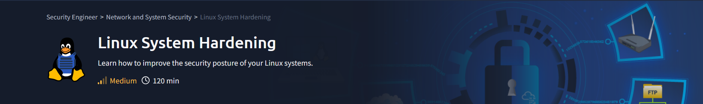

# 介绍

---

Linux 作为开源系统，为闭源系统（如MS Windows Server 和 UNIX）提供了一种可靠的替代方案。此外选择Linux系统可以帮助大幅降低许可成本。如果您不相信，请将使用Debian 11托管Web服务器的成本与使用MS Windows Server 2022托管Web服务器的成本进行比较。
当我们比较这些现代版本的许可证和最低硬件要求的综合成本时，我们将有一个强有力的理由支持Linux。当然，我们不能说Linux总是最好的选择;但是，Linux是许多情况下的最佳选择。在使用此选项之前，我们必须集中精力保护我们的Linux系统，也称为Linux强化。

## 学习目标
在本部模块结束时，您将通过以下操作来了解Linux系统安全性的更多信息：
- 物理安全
- 文件加密
- 防火墙配置
- 远程访问
- 软件和服务
- 更新和升级
- 日志
## 先决条件

在开始此模块前，我们建议用户对Linux操作系统有良好的工作知识，并对基本安全原则有扎实的理解。如果您想了解linux 我们推荐阅读[[]] ,或通过[linux 之旅]( https://linuxjourney.com/)学习。
 

## Linux VM
Tryhackme 提供了Linux虚机，可以通过VPN或web直接访问，也可以自己准备一台linux虚机进行练习。

|              |                 |
| ------------ | --------------- |
| **Username** | tryhackme       |
| **Password** | insecurePass123 |
| **IP**       | MACHINE_IP      |
