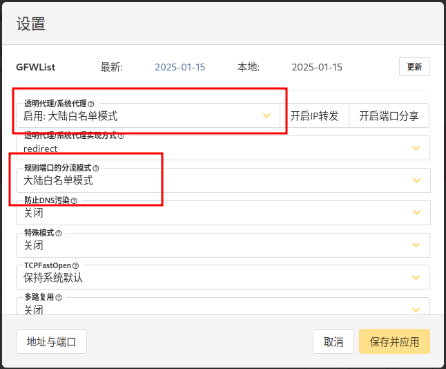
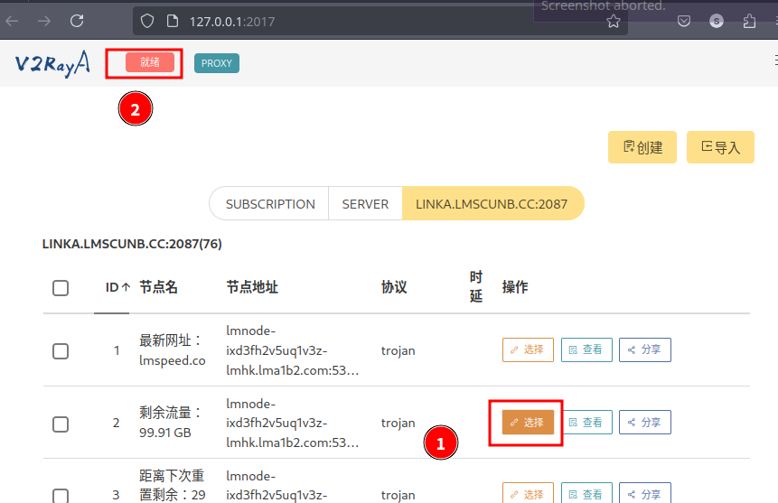

系统版本：`EndeavourOS`

窗口管理器：`bspwm`

## Bspwm 窗口管理区


在`EndeavourOS` 部分桌面可以直接安装，但是社区的一些窗口管理器需要手动安装，在官网上可以找到关于社区窗口管理区的github项目连接。我安装的是`Bspwm`。
### 安装

```bash
git clone https://github.com/EndeavourOS-Community-Editions/bspwm.git
cd bspwm
sudo ./bspwm-install.sh
```

### 快捷键

`bspwm` 的快捷键配置文件为`.config/sxhkd/sxhkdrc` 如果需要添加快捷键，可以在此配置。 

## 中文输入法（fxitx5）

安装：

```bash
sudo pacman -S fcitx5 fcitx5-chinese-addons fcitx5-configtool fcitx5-gtk fcitx5-pinyin-zhwiki fcitx5-qt
```

配置：

```bash file:/etc/environment
...
##fcitx5
GTK_IM_MODULE=fcitx5
QT_IM_MODULE=fcitx5
XMODIFIERS=@im=fcitx5
```

## 截图工具

```bash file:flameshot
sudo pacman -S flameshot
```

## Obsidian

```bash file:obsidian
sudo pacman -S obsidian
```
## virtualbox

```bash file:virtralbox
sudo pacman -S virtrabox
```
## v2raya

### 安装

```bash
yay -S v2raya
systemctl start v2raya
systemctl enable v2raya
```

### 注册&重置账户
v2rayA的UI是以网页的形式呈现的，所以我们打开浏览器，访问v2rayA的地址[http://localhost:2017/](http://localhost:2017/)


首次打开需要创建一个管理员账号，如果遗忘，使用下面的命令重置。

```bash file:重置账户
sudo v2raya --reset-password
```

### 创建节点

以创建或导入的方式导入节点，导入支持节点链接、订阅链接、扫描二维码和批量导入等方式。

### 设置

点击右上角设置按钮，按官方推荐进行设置。

### 启用

选中导入的节点，然后选在左上角选择就绪，开启代理。

## zsh安装配置

### zsh 及插件安装

```bash
sudo pacman -Sy zsh
sudo pacman -S zsh-autosuggestions zsh-syntax-highlighting 
yay -S zsh-theme-powerlevel10k  zsh-completions

chsh -s /usr/bin/zsh
```

在`~/.zshrc` 中引用安装好的插件：

```bash file: ~/.zshrc
source /usr/share/zsh/plugins/zsh-syntax-highlighting/zsh-syntax-highlighting.plugins.zsh
source /usr/share/zsh/plugins/zsh-autosuggestions/zsh-autosuggestions.plugins.zsh
source /usr/share/zsh-theme-powerlevel10k/powerlevel10k.zsh-theme
```

重新启动terminal,会弹出设置提示，按提示设置即可。

### 启用tab补全

```bash file:~/.zshrc
autoload -Uz compinit && compinit -u
autoload -U +X bashcompinit && bashcompinit
```

### Color Auto

配置 `ls` 和`grep`命令打印内容按文件类型显示不同颜色。

```bash file:~/.zshrc
alias ls='ls --color=auto'
alias grep='grep --color=auto'
```

### zsh主题配置

对`～/.zshrc`配置完成后,通过`source ～/.zshrc` 命令引用文件，之后`powerlevel10k.zsh-theme`主题会在用户目录自动创建一个配置文件`p10k.zsh`，用户可以按自己喜好配置主题样式。

#### 获取可用颜色值

```bash
for code ({000..255}) print -P -- "$code: %F{$code}最左侧三位数字即颜色值Text Color%f"

```

#### 查找或下载 Nerd Fonts字体（图标）

[https://www.nerdfonts.com/cheat-sheet](https://www.nerdfonts.com/cheat-sheet)

#### 配置文件

下面是`～/.p10k.zsh` 文件的部分配置内容

```bash file:.p10k.zsh
# 命令行分割线（两旁的转角线）#青色
  # Connect left prompt lines with these symbols.
  typeset -g POWERLEVEL9K_MULTILINE_FIRST_PROMPT_PREFIX='%039F╭─'
  typeset -g POWERLEVEL9K_MULTILINE_NEWLINE_PROMPT_PREFIX='%039F├─'
  typeset -g POWERLEVEL9K_MULTILINE_LAST_PROMPT_PREFIX='%039F╰─'
  # Connect right prompt lines with these symbols.
  typeset -g POWERLEVEL9K_MULTILINE_FIRST_PROMPT_SUFFIX='%039F─╮'
  typeset -g POWERLEVEL9K_MULTILINE_NEWLINE_PROMPT_SUFFIX='%039F─┤'
  typeset -g POWERLEVEL9K_MULTILINE_LAST_PROMPT_SUFFIX='%039F─╯'

...
    # The color of the filler.
    # 命令行分割线颜色设置
    typeset -g POWERLEVEL9K_MULTILINE_FIRST_PROMPT_GAP_FOREGROUND=39

...
  # OS identifier color.
  
  typeset -g POWERLEVEL9K_OS_ICON_FOREGROUND=31 #紫135, 值为空默认白色 ，橙色208
  # Custom icon.
  #typeset -g POWERLEVEL9K_OS_ICON_CONTENT_EXPANSION=$'\uF346' # arch
  #typeset -g POWERLEVEL9K_OS_ICON_CONTENT_EXPANSION=$'\uF35D' # sway
  typeset -g POWERLEVEL9K_OS_ICON_CONTENT_EXPANSION=$'\uF17C' # linux
  #typeset -g POWERLEVEL9K_OS_ICON_CONTENT_EXPANSION=$'\uF355' # Bspwm

...
  
  # Default prompt symbol.
  typeset -g POWERLEVEL9K_PROMPT_CHAR_{OK,ERROR}_VIINS_CONTENT_EXPANSION='>>'
  # Prompt symbol in command vi mode.
  typeset -g POWERLEVEL9K_PROMPT_CHAR_{OK,ERROR}_VICMD_CONTENT_EXPANSION='<<'

...

  # Default current directory color.
  # 默认目录颜色
  typeset -g POWERLEVEL9K_DIR_FOREGROUND=208 #31
  # If directory is too long, shorten some of its segments to the shortest possible unique
  # prefix. The shortened directory can be tab-completed to the original.
  typeset -g POWERLEVEL9K_SHORTEN_STRATEGY=truncate_to_unique
  # Replace removed segment suffixes with this symbol.
  typeset -g POWERLEVEL9K_SHORTEN_DELIMITER=
  # Color of the shortened directory segments.
  # 缩短的目录段颜色
  typeset -g POWERLEVEL9K_DIR_SHORTENED_FOREGROUND=52
  # Color of the anchor directory segments. Anchor segments are never shortened. The first
  # segment is always an anchor.
  # 锚点目录颜色（如根目录)
  typeset -g POWERLEVEL9K_DIR_ANCHOR_FOREGROUND=208 #39
  # Display anchor directory segments in boldi.
  typeset -g POWERLEVEL9K_DIR_ANCHOR_BOLD=true
...
  # Current time color.
  typeset -g POWERLEVEL9K_TIME_FOREGROUND=076
  # Format for the current time: 09:51:02. See `man 3 strftime`.
  #typeset -g POWERLEVEL9K_TIME_FORMAT='%D{%H:%M:%S}'
  # If set to true, time will update when you hit enter. This way prompts for the past
  # commands will contain the start times of their commands as opposed to the default
  # behavior where they contain the end times of their preceding commands.
  ## 默认值为false,表示每秒更新，开销大，可以修改：
  #typeset -g POWERLEVEL9K_TIME_UPDATE_ON_COMMAND=false
  typeset -g POWERLEVEL9K_TIME_UPDATE_INTERVAL=60  # 每分钟更新
  typeset -g POWERLEVEL9K_TIME_FORMAT='%D{%H:%M}'  # 时间格式
  # Custom icon.
  # 图标颜色为橙色
  #typeset -g POWERLEVEL9K_TIME_VISUAL_IDENTIFIER_EXPANSION=$'\uE641' 
  typeset -g POWERLEVEL9K_TIME_VISUAL_IDENTIFIER_EXPANSION='🕒' 
  #typeset -g POWERLEVEL9K_TIME_VISUAL_IDENTIFIER_COLOR=208
  # 电量低于20时，时间为红色
  typeset -g POWERLEVEL9K_TIME_LOW_BATTERY_FOREGROUND=196
  typeset -g POWERLEVEL9K_TIME_LOW_BATTERY_THRESHOLD=20
...

```

## nvm

nvm 是一个nodejs 的版本管理器
### 安装nvm

```bash file:yay
yay -S nvm
echo 'source /usr/share/nvm/init-nvm.sh' ~/.zshrc
source ~/.zshrc
```

### 管理nodejs

```bash
nvm ls-remote  # 查看可安装的nodejs版本
nvm install v22.13.0  # 安装合适的版本
nvm use v22.12.0 # 应用安装好的版本
node -v         # 查看当前使用的node版本
```

### 启用pnpm

```bash file:pnpm
corepack enable pnpm
pnpm -v # 查看版本
```

如果需要在项目中固定pnpm版本需要进使用以下命令，在本地 `package.json` 中添加一个 `"packageManager"` 字段，指示 Corepack 始终在该项目上使用特定版本。
```bash
corepack use pnpm@latest
```


由于网络原因，在国内更新pnpm包有时会出现错误，因此我们需要修改pnpm 源为国内镜像。

```bash 
pnpm get registry
# 查看pnpm当前使用镜像
pnpm config set registry https://registry.npmmirror.com/
# 修改为国内镜像
pnpm config set registry https://registry.npmjs.org/
# 还原为官方镜像
```

##  ssh 密钥管理

当需要为多个主机配置不同的密钥时，我们可以通过在`~/.ssh`目录下配置`config`文件来实现密钥的管理。

```bash file:~/.ssh/config
#github
HOST github.com
  HOSTNAME github.com
  #PreferredAuthentications Publickey
  IdentityFile ~/.ssh/id_github
#server1
HOST 10.10.10.2
  HOSTNAME 10.10.10.2
  #PreferredAuthentications Publickey
  IdentityFile ~/.ssh/id_ed25519_server1

```