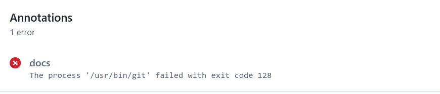
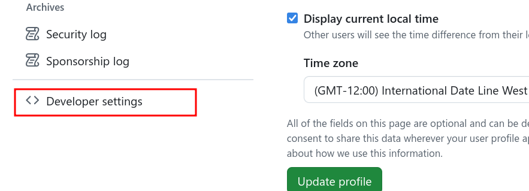
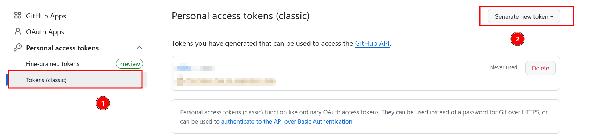
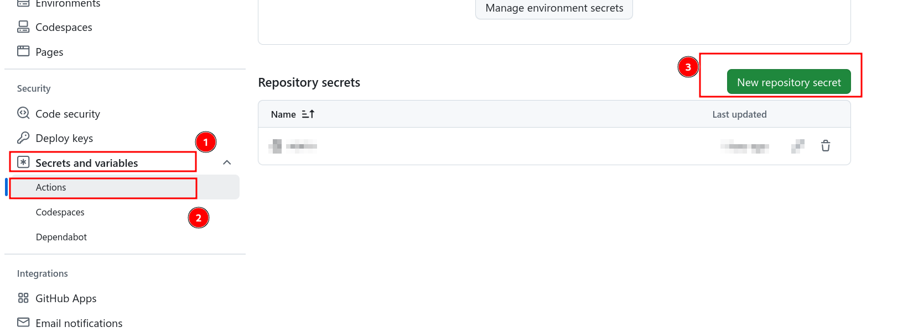
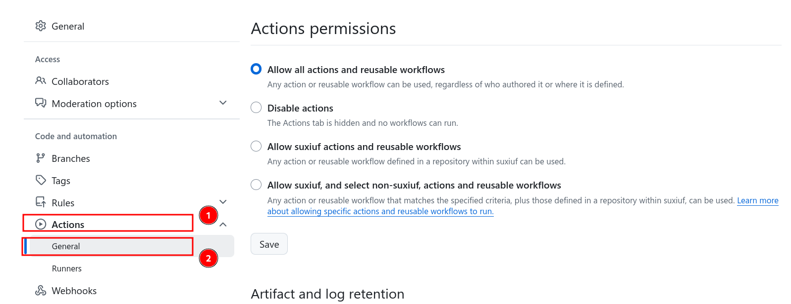
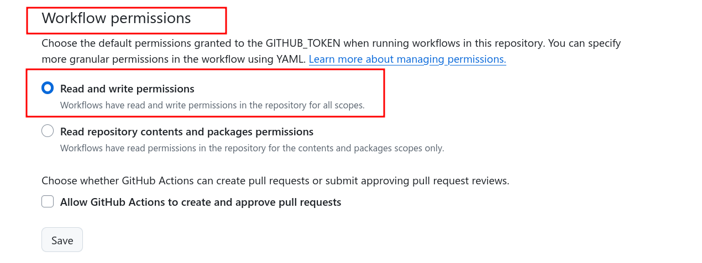

本站基于[vuepress-theme-plume](https://theme-plume.vuejs.press/)

## GitHub Page

### Workflow  部署

项目开始选择部署方式为Github,自动生成`.github/workflows/deploy.yml`文件

```ad-warning
title: 部署时`The process '/usr/bin/git' failed with exit code 128` 错误处置
collapse: true

**错误信息**：


**处置步骤**
- 在右上角点击头像，左侧菜单栏拉到最下
	
- 点击进入视图，配置tocken
	
- 回到仓库，使用刚才得到的token创建授权
	
- 配置**Action**  `Workflow permissions`
	
- 选择 `Read and write permissions`
	
```

### 首页图片引用

主题默认将`.vuepress/puplic/`目录作为图片根目录，并将该目录下的文件上传到`gh-page`分支根目录。因此，如果在主页或其他配置文件中引用图片，要对相对路径进行修改。