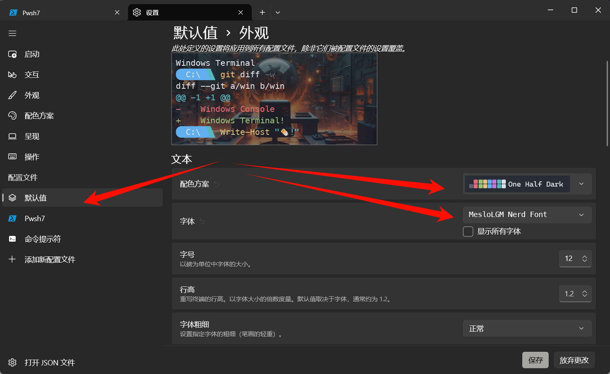
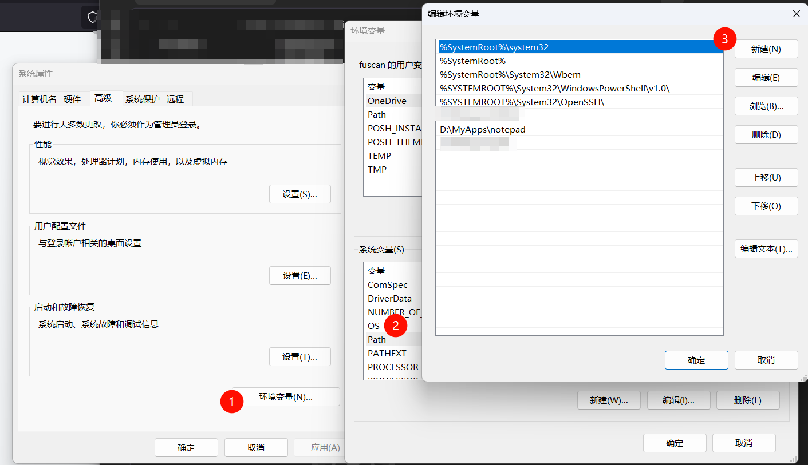

## DNS刷新

国内一些DNS厂商为了过度的安全，会屏蔽掉一些网站，因此偶尔需要更换DNS服务器，在手动修改后建议进行DNS缓存清除：

```powershell file:清除DNS缓存
ipconfig /flushdns
```

## WSL
```powershell file:powershell
wsl --update
# 可能需要重启后进行下一步
wsl --update --pre-release # 安装完子系统后才能执行
wsl --export kali-Linux D:\WSLDATA\kali.tar
# 将子系统kali-linux 导出到指定位置
wsl --unregister kali-linux
# 清除指定子系统
wsl --import kali-linux  D:\WSLDATA\kali-linux D:\WSLDATA\kali.tar 
# 导入子系统
```

## Oh-my-posh

官方给出了详细的安装配置步骤，简单易懂，可以按[Oh-my-posh官方](https://ohmyposh.dev/docs/installation/windows)给的步骤进行安装，也可以参考[Windows官方给出的手册](https://learn.microsoft.com/zh-cn/windows/terminal/tutorials/custom-prompt-setup)(*如果失败，可能是国内防火墙导致的无法访问github，需要翻墙*)。

当然如果翻墙也不行，可以尝试修复系统（*我的WIndows 做了优化后`Microsoft Store` 使用不了，所以需要修复*）：

```powershell file:powershell
SFC /scannow
```

### `winget`换源
命令行进行安装，安装前要修改winget 源为国内源，不然安装很慢。

```powershell file:powershell
winget source remove winget  
# 删除官方源
winget source add winget https://mirrors.ustc.edu.cn/winget-source
## 改为中科大镜像源
```

修改完成后可以通过以下命令验证

```powershell file:powershell
winget source list
```

如果想恢复Microsoft官方源，可以使用以下命令：
```powershell file:powershell
winget source reset winget  
```

### 安装Oh-my-posh
按以下命令安装`Oh-my-posh`然后重启终端就可以了，
```powershell
winget install JanDeDobbeleer.OhMyPosh -s winget   
```

如果oh-my-posh无法被识别为命令，请参照官网给出的建议进行操作:
```powershell
$env:Path += ";C:\Users\user\AppData\Local\Programs\oh-my-posh\bin"
```

### 字体安装

- 选择性安装：

```powershell file:powershell
oh-my-posh font install
```
- 直接安装
```powershell file:powershell
oh-my-posh font install meslo
```
### 设置Oh-my-posh
#### 字体设置
设置Oh-my-posh的第一步是配置 `Windows Terminal`(`wt.exe`) 外观字体，具体操作如图（*在相同的位置可以找到设置背景图片与图标的选项，可以一并设置了图片从网上下载，（图标可以从阿里巴巴矢量图标库下载）*）。


#### 添加配置文件
##### 创建配置文件
添加配置前，可以通过命令行查看当前powershell的配置文件位置，如果没有需要手动创建。
```powershell file:powershell
$PROFILE  # 打印配置文件路径，若没有则输出结果为空
new-item -type file -path $profile -force # 创建powershell配置文件
notpad  $PROFILE # 文本编打开已创建的配置文件
```

如果在尝试打开新的 PowerShell 实例时收到脚本错误，则表明 PowerShell 执行策略可能受到限制。 若要将 PowerShell 执行策略设置为不受限制，则需以管理员身份启动 PowerShell，然后使用以下命令：
```PowerShell file:PowerShell
Set-ExecutionPolicy -ExecutionPolicy Unrestricted
```

#### 添加主题

主题选择参见[Github主题](https://github.com/JanDeDobbeleer/oh-my-posh/tree/main/themes)。或官方文档给出的[主题](https://ohmyposh.dev/docs/themes)。在选定主题后，将主题在powershell配置文件中引用(`paradox.omp.json`是主题配置文件)：
```powershell file:$PORFILE
oh-my-posh init pwsh --config "$env:POSH_THEMES_PATH\montys.omp.json" | Invoke-Expression
```

### 文件夹或文件图标

[Terminal-Icons](https://github.com/devblackops/Terminal-Icons) 是一个 PowerShell 模块，它会添加在 Windows 终端中显示文件或文件夹时可能缺少的文件和文件夹图标，并基于名称或扩展名查找相应的图标。 它尝试将图标用于已知文件/文件夹，但如果找不到此内容，则会回滚到通用文件或文件夹图标。若要使用 PowerShell 安装 Terminal-Icons，请使用以下命令：
```PowerShell file:powershell
Install-Module -Name Terminal-Icons -Repository PSGallery
```

```ad-info
title: 注意
要使用管理员权限打开powershell进行安装。
```
#### 使用 
在powershell文件中加入如下内容：
```powershell file:$PORFILE
Import-Module -Name Terminal-Icons
```

有关详细信息（包括用法和命令），请参阅 GitHub 上的 [Terminal-Icons](https://github.com/devblackops/Terminal-Icons) 存储库。
### 其他资源

- [Oh my Posh 文档](https://ohmyposh.dev)
- [终端图标存储库](https://github.com/devblackops/Terminal-Icons)
- [Posh-Git 文档](https://github.com/dahlbyk/posh-git#overview)：Posh-Git 是一个 PowerShell 模块，它集成了 Git 和 PowerShell，提供可在 PowerShell 提示符中显示的 Git 状态摘要信息。
- [PowerLine 文档](https://powerline.readthedocs.io/en/master/overview.html)：Powerline 是 vim 的状态栏插件，为其他几个应用程序（包括 zsh、bash、tmux、IPython、Awesome、i3 和 Qtile）提供状态栏和提示符。
## Other Installed

虽然在安装完WIndows 系统后，对新软件安装目录进行了配置（**存储设置**）。但其只对通过`Microsoft Store` 安装的软件有效，而且总是出错，多数软件还是安装在`“C:/Users/<Username>/AppData”` 目录下，因此其他软件建议手动下载安装包进行安装，然后指定存储路径（如：D盘）。以下是本次安装的软件目录：


| 文件名                           | 功能说明         | URL                                                                                                |
| ----------------------------- | ------------ | -------------------------------------------------------------------------------------------------- |
| 7-Zip                         | 强大的压缩工具      | https://7-zip.org/download.html                                                                    |
| BaiduNetdisk                  | 百度网盘         | 略                                                                                                  |
| Clash.for.Windows-0.20.38-win | 代理工具         | 略                                                                                                  |
| DragonKMS_WD12(b)             | 激活工具         | http://www.yishimei.cn/network/319.html                                                            |
| Firefox                       | 浏览器          | https://www.mozilla.org/en-US/firefox/new/                                                         |
| geek                          | 软件卸载工具       | [Geek Uninstaller - Download](https://geekuninstaller.com/download)                                |
| Git                           | git-bash     | [国内镜像](https://registry.npmmirror.com/binary.html?path=git-for-windows%2Fv2.50.0-rc1.windows.1%2F) |
| iFly                          | 讯飞输入法        | https://srf.xunfei.cn/index.html#/                                                                 |
| notepad--                     | 文本编辑器        | https://gitee.com/cxasm/notepad--                                                                  |
| obsidian                      | Markdown笔记软件 | https://obsidian.md/download                                                                       |
| PixPin                        | 截图工具         | https://pixpin.cn/                                                                                 |
| 火绒                            | 安全软件         | https://www.huorong.cn/?from=shadu                                                                 |
| Win11Debloat                  | WIndows优化    | [国外地址](https://github.com/Raphire/Win11Debloat) 需翻墙                                                |
| 驱动精灵                          | 驱动管理软件       | [绿色纯净版](https://www.52pojie.cn/thread-1487120-1-1.html)                                            |
## 环境变量添加
如果需要命令行能够执行程序，需要将对应的启动程序添加到环境变量，如：`notpad--` 添加到环境变量,需要通过Win+R 打开运行，输入`sysdm.cpl`打开“高级系统设置”进行添加，当然也可以通过命令行（未记录）。



```ad-info
title: 注意
如果不生效，请重启Widnows资源管理器（任务管理器中重启，或注销登录重新登陆）
```

## 配置SSH链接Github

### 生成密钥
```powershell file:ssh
ssh-keygen.exe -r ed25519 -C "xxx@xxx.com"
# 输入路径时写指定路径如 C:\Users\<username>/.ssh/github_id_ed25519
```

### 配置文件（指定github使用）
可以通过配置文件实现使用不同密钥登陆不同服务器
```powershell file:ssh
new-item -type file -path .\.ssh\config -force # 创建配置文件
```

将以下内容写入配置文件
```text file:config
Host github.com
HostName ssh.github.com
port 443
PreferredAuthentications publickey
IdentityFile ~/.ssh/github_id_ed25519
```

```ad-tip
- `Host`：自定义别名，会影响git相关命令
- `HostName`：真实的服务器地址（域名）
 `User`：之前配置的用户名可以省略（xxx@xxx.com）
- `PreferredAuthentications`：权限认证（publickey,password publickey,keyboard-interactive）一般直接设为publickey
- `IdentityFile：rsa`文件地址 
```

### 测试链接

```powershell file:ssh
ssh -p 443 git@ssh.github.com 
ssh -T git@github.com  
```
### 故障排除

```powershell file:ssh
ssh -Tvvv -p 443 git@ssh.github.com
```
#### ​验证协议兼容性​​

强制使用ED25519算法 
```powershell file:ssh
ssh -o HostKeyAlgorithms=ssh-ed25519 -p 443 git@ssh.github.com
```

#### ​修复SSH客户端配置​​

```powershell file:ssh
# 清除损坏的known_hosts记录
ssh-keygen -R "[ssh.github.com]:443"  
# 重置OpenSSH配置 
Repair-WindowsCapability -Online -Name "OpenSSH.Client*"
```

如果还报`git@ssh.github.com: Permission denied (publickey).`错误请尝试以下操作：

##### ​⚠️**1.重启 SSH 代理​​**

```powershell file:administrator
eval $(ssh-agent -s) # 启动临时进程 
ssh-add C:\Users\<username>\.ssh\github_id_ed25519 # 加载密钥`
```

若执行以上命令时出现`unable to start ssh-agent service, error :1058`错误， 是 Windows 系统中因 SSH 服务配置问题导致的常见错误。应按以下步骤解决：

1. 以管理员身份打开 PowerShell，检查服务状态：
```powershell
Get-Service ssh-agent | Select StartType, Status
```
2. 若 `StartType` 为 `Disabled`，修改为手动启动：
```powershell file:administrator
Set-Service -Name ssh-agent -StartupType Manual
```
		
3.启动服务：
```powershell file:administrator
Start-Service ssh-agent  # 或运行 ssh-agent -s
```

​4.验证​：
```powershell file:administrator
Get-Service ssh-agent  # 应显示 `Status: Running`
```

##### ⚠️**2.​OpenSSH 组件未安装​**​（系统级缺失）

​**​原因​**​：Windows 未安装 OpenSSH 客户端组件。  
​**​解决步骤​**​：

1. 管理员启动PowerShell 安装客户端组件
```powershell file:administrator
Add-WindowsCapability -Online -Name OpenSSH.Client~~~~0.0.1.0
```
 
2.注册并启动服务： 
```powershell file:administrator
sc config ssh-agent start= auto net start ssh-agent
```   

⚠️ ​**​注意​**​：若安装失败，检查系统更新或手动下载 OpenSSH 安装包

