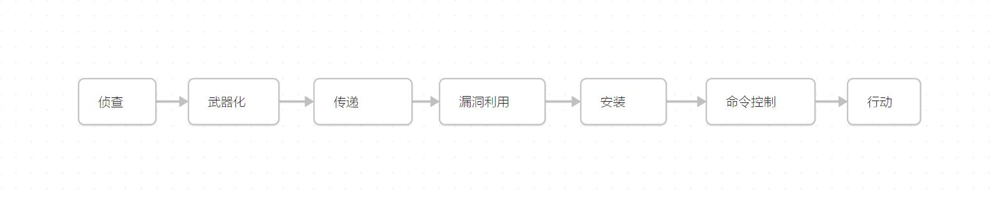

知己知彼，百战不殆    ——孙子

## 暗网

- Tor   洋葱路由：
	Tor利用各类中继点在网络中随机传递用户流量。Tor网站随机提供`.onion`地址，利用匿名分层功能，使web服务所有者匿名。
	网络犯罪通过它建立拍卖会、出售被盗证件、暗杀服务等。
	但是相关部门采用如破坏Tor中继点、监视大量的出入口、利用用户在Tor网络上身份的泄露等手段来打破系统的匿名性。
- Hidden Wiki
	 一个连接热门Tor网站的登录页面，他的地址`.onion`会经常改变。
## 漏洞利用

对手会用很多方法来破坏你的网络，因为你总会有被识别和利用的漏洞。漏洞可以是运行旧软件或配置错误的系统，也可以是非技术性的，如未锁的门或未受教育的用户。

攻击者永远不会停止利用漏洞。他们会通过发送恶意软件、勒索软件、远程访问工具（RAT），也会建立信道以便他们删除数据。

洛克希德-马丁公司的网络杀戮链模型是一个代表网络攻击过程的流行模型：

| 杀戮链条                                | 渗透测试              |
| ----------------------------------- | ----------------- |
| 侦察：识别弱点或漏洞                          | 信息收集、枚举           |
| 武器化：一但发现一个漏洞，攻击者就通过工具进行利用           | 工具使用              |
| 传递：将武器（或工具包）传递给目标                   | 上传工具、Payload，钓鱼   |
| 漏洞利用：通过工具或有效负载（Payload）利用漏洞，进行提权的过程 | 漏洞利用、上传工具、Payload |
| 安装：安装其他有效负载                         | 漏洞利用、提权           |
| 命令控制：通过恶意软件与命令控制基础设施通信，以获取其他命令或下载工具 | 通道及权限维护           |
| 行动：攻击者可进行的任何网络任务（横向移动、提取数据、破坏系统）    | 横向移动、提取数据         |
## 对手

以攻击者的不同目标，将其分为四种不同类型：
- **激进主义和随性者：** 对某个概念执着的网络抗议者，试图表明自己的观点。有时是为了名声，有时是认为自己在对世界产生影响，
- **国家资助的网络战参与者：** 政府支持的网络军队或安全组织，他们技术精湛，资金雄厚。大多数组织对此种攻击都处于不利地位，通常，相关政府不会承认参与其中。
- **有组织的犯罪人员：** 他们通常以赚钱为目的进入计算机世界，当工作无利可图时，就转变为犯罪分子。他们通过漏洞利用工具和垃圾邮件活动。有时这些人不会花时间隐藏身份，因为他们自信自己的行为不太可能引起麻烦。
- **间谍活动人员：** 国家或公司资助的间谍或商业间谍。

攻击方往往比防守方更有优势：
- 不必担心触犯法律，因为他们本质上是现行网络法规的对抗者。
- 充足的资金，有很多资助或非法所得。
- 时间是攻击者的另一个优势，他们可以常时间对目标进行研究，但防御者通常无法集中精力，因为公司开支必须显示其防御服务的价值，否则将失去人力和技术预算。因此导致许多网络犯罪没有制衡。
- 攻击者只需要一次正确的绕过或漏洞利用，而攻击者需要在攻击路径上的每一个环节都做好防护。
## 网络法

略
