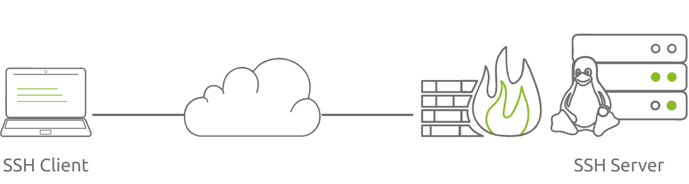
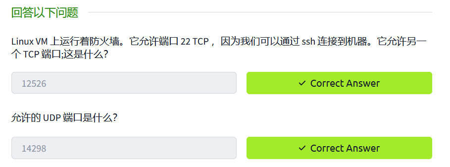

- **a无状态防火墙**
	第一个 Linux 防火墙是数据包过滤防火墙，即无状态防火墙。无状态防火墙可以检查 IP 和 TCP/UDP 标头中的某些字段以决定数据包，但不维护有关正在进行的 TCP 连接的信息。因此，数据包可以操纵一些 TCP 标志，使其看起来好像是正在进行的连接的一部分，并规避某些限制。
- **有状态防火墙**
	当前的 Linux 防火墙是有状态防火墙;它们跟踪正在进行的连接，并根据 IP 和 TCP/UDP 标头中的特定字段以及数据包是否是正在进行的连接的一部分来限制数据包。

## Linux防火墙过滤字段
- 进入防火墙规则的 IP 标头字段包括：
	1. 源 IP 地址
	2. 目标 IP 地址
- 防火墙规则主要关注的 TCP/UDP 标头字段包括：
	3. 源 TCP/UDP 端口
	4. 目标 TCP/UDP 端口

>[!NOTE]
>值得注意的是，Linux防火墙不可能根据进程来允许和拒绝数据包，而是根据端口号来允许和拒绝数据包。如果您希望 Web 浏览器访问 Web，则必须允许相应的端口，例如端口 80 和 443。此限制与 MS Windows 的内置防火墙不同，后者可以限制和允许每个应用程序的流量。

在 Linux 系统上，可以使用 [SELinux](https://github.com/SELinuxProject) 或 [AppArmor](https://www.apparmor.net/) 等解决方案对进程及其网络访问进行更精细的控制。例如，我们可以只允许 `/usr/bin/apache2` 二进制文件使用端口 80 和 443，同时阻止任何其他二进制文件在底层系统上这样做。这两种工具都根据特定进程或二进制文件实施访问控制策略，从而提供了一种更全面的方法来保护 Linux 系统。

## 网络过滤器

`netfilter` 是linux防火墙的核心，其为LInux 内核 2.4.x 及更高版本提供数据包过滤。`netfilter` 需要与前端程序进行配合，比如`iptables`或`nftables` 来管理网络。

在下面示例中，我们使用不同的前端对netfileter进行交互，以允许网络中的任何ssh_Clent
都可以连接到ssh_Server.

### iptables
在开始前，我们要记住以下几个链：
- Input (输入)：此链使用于传入防火墙的数据包
- Output（输出）：此链适应于从防火墙传出的数据包
- Forward（向前）：此链适用于通过系统路由的数据包

假设我们希望能够远程访问系统上的SSH服务器。为何让SSH服务器能够与外部网络通信，我们要做两件事：

- 接受传入到TCP端口22的数据包。
- 接受来自TCP端口22的传出数据包。

让我们将上述两个需求转换为`iptables`命令:
```sh
iptables -A INPUT -p tcp --dport 22 -j ACCEPT
iptables -A OUTPUT -p tcp --sport 22 -j ACCEPT
```

- `-A INPUT` 附加到 INPUT 链，即发往系统的数据包。
- `-p tcp --dport 22` 适用于目标端口 22 的 TCP 协议。
- `-A OUTPUT` 附加到 OUTPUT 链，即离开系统的数据包。
- `-p tcp --sport 22` 适用于源端口 22 的 TCP 协议。
- `-j ACCEPT` 指定目标规则 ACCEPT(允许通过)。
假设您只想允许流量流向本地 SSH 服务器并阻止其他所有内容。在这种情况下，您需要再添加两个规则来设置防火墙的默认行为：

- `iptables -A INPUT -j DROP` 来阻止之前规则中不允许的所有传入流量。
- `iptables -A OUTPUT -j DROP` 来阻止之前规则中不允许的所有传出流量。
简而言之，需要按以下顺序应用以下规则：
```sh
iptables -A INPUT -p tcp --dport 22 -j ACCEPT
iptables -A OUTPUT -p tcp --sport 22 -j ACCEPT
iptables -A INPUT -j DROP
iptables -A OUTPUT -j DROP
```

>[!TIP]
在实践中，您应该在应用新规则之前刷新 （delete） 以前的规则。此操作可以使用 `iptables -F` 实现.

### nftables

Linux 内核3.13 及更高版本支持nftables，它在iptables的基础上增加了各种改进，特别是在扩展性和性能方面。
我们将创建一个简单的nftables配置，允许流量流向本地SSH服务器。

#### 添加表
与 iptables 不同，nftables 开始时没有默认的表或链。在添加规则之前，我们需要添加必要的表和链。首先，我们将创建一个表 `fwfilter`。
```sh
nft add table fwfilter
```

- `add`用于表添加，其他命令包括`delete`删除表 、`list`列出表、`flush`清除表中的所有链和规则。
- `table TABLE_NAME` 用于指定要创建或处理的表的名称。
#### 为表中添加链
在我们新创建的表 `fwfilter` 中，我们将分别为传入和传出数据包添加一个**输入**链和一个**输出**链。
```sh
nft add chain fwfilter fwinput { type filter hook input priority 0 \; }
```

```sh
nft add chain fwfilter fwoutput { type filter hook output priority 0 \; }
```

上述两个命令将两个链添加到表 `fwfilter` 中:
- `fwinput` 是输入链。它是 `filter` 类型，适用于 `input  hook`。
- `fwoutput` 是输出链。它是 `filter` 类型，适用于`output hook` 。
#### 为链中加入规则

接受到本地系统目标端口 22 的 TCP 流量：

```sh
nft add fwfilter fwinput tcp dport 22 accept
```

接受来自本地系统源端口 22 的 TCP 流量:

```sh
nft add fwfilter fwoutput tcp sport 22 accept
```

#### 查看表的内容：

::: code-group
```sh [命令]
sudo nft list table fwfilter
```

```js [fwfilter]
table ip fwfilter {
    chain fwinput {
        type filter hook input priority filter;
        tcp dport 22 accept
    }

    chain fwoutput {
        type filter hook output priority filter;
        tcp sport 22 accept
    }
}
```
:::


>[!TIP]
>更多nftables内容详见：[入门指南 | Nftables HOWTO in Chinese](https://farkasity.gitbooks.io/nftables-howto-zh/content/chapter2/index.html)

### UFW

在对 iptables 和 nftables 进行了概述之后，您可能已经开始形成这样一种印象，即在 Linux 上配置防火墙是一个繁琐且容易出错的过程。我们已经提到过 iptables 就像 netfilter 的前端;但是，我们可以通过为前端提供前端来简化事情！

iptables 的前端示例如下图所示，可以分为：
- 命令行界面 （CLI） 前端，例如 firewalld 和 ufw
- 图形用户界面 （GUI） 前端，例如 fwbuilder

**UFW**  是一个简单的防火墙，如果我们允许`SSH`流量通过，可以通过以下命令简单实现：
```sh
ufw allow 22/tcp
```

可以通过`ufw status` 查看配置

```sh
sudo ufw status
```

## 防火墙策略
在配置防火墙之前，您需要确定防火墙策略。您可能是防火墙策略的决策者，也可能是涵盖防火墙配置的现有安全策略的实施者。这完全取决于您要保护的系统。

我们不会讨论安全策略，因为这超出了本文的范围。我们将提到两种主要方法是：

- 阻止所有内容并允许某些异常。
- 允许所有内容并阻止某些异常。

以上两种方法各有其优缺点。使用一组有限的异常阻止所有内容将提供更严格和更好的安全性;但是，根据情况，它可能会给用户带来不便。
## 回答以下问题



```sh
tryhackme@ip-10-10-135-129:~$ sudo ufw status
Status: active

To                         Action      From
--                         ------      ----
22/tcp                     ALLOW       Anywhere
14298/udp                  ALLOW       Anywhere
12526/tcp                  ALLOW       Anywhere
22/tcp (v6)                ALLOW       Anywhere (v6)
14298/udp (v6)             ALLOW       Anywhere (v6)
12526/tcp (v6)             ALLOW       Anywhere (v6)
```