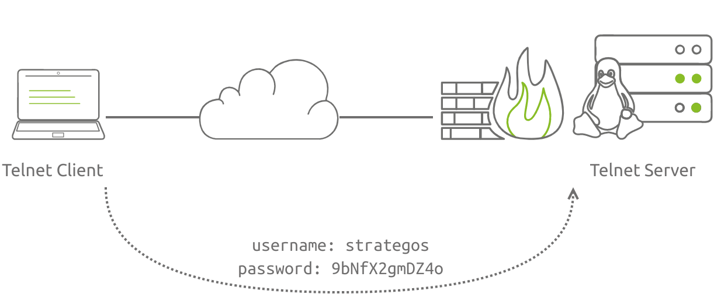
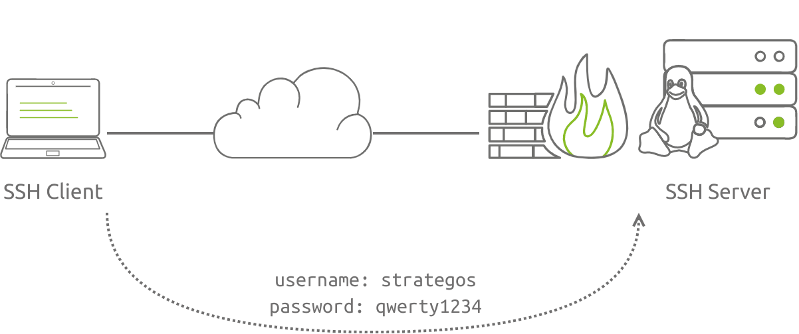
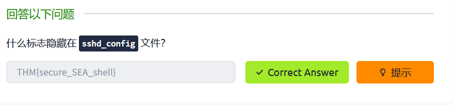

当运维人员不在现场时，提供对系统的远程访问是一种非常方便的方式，但这也意味着您可能成为攻击者的目标，常见攻击包括：
1. 密码探查
2. 密码猜测和暴力破解
3. 利用侦听服务
## 防止密码探查

远程访问可以通过许多不同的协议和服务来实现。尽管所有现代系统都使用加密协议（如 SSH 协议）进行远程访问，但较旧的系统可能仍使用明文协议（如 Telnet 协议）。

在下图中，尽管用户选择了强密码，但该密码以明文形式发送，任何通过网络路径使用数据包捕获工具的人都可以读取该密码。



确保选择加密流量的协议至关重要。 SSH 协议已经存在了二十多年。它经受住了时间的考验。它有许多用途，从安全的远程访问到安全的文件传输。

## 防止密码猜测

当您使用 SSH 设置 Linux 系统以进行远程管理时，您还可以向 所有相关方提供 Linux 机器。许多恶意黑客在 Internet 上搜索侦听 SSH 服务器，并开始猜测登录凭据;通常，他们会尝试 `root` 使用最常见的密码。

下图显示系统使用 SSH 协议来确保加密通信;但是，身份验证依赖于登录凭据。许多用户都想使用弱密码或将同一密码用于其他服务。虽然 `qwerty1234` 不在密码词典中，但它通常出现在前 10 或 20 个最常见的密码中，因此很容易被猜到。



因为您的 SSH 服务器将被配置为一年 365 天、每天 24 小时侦听传入连接，所以攻击者可以在网络上一直尝试一个又一个的密码。您可以使用一些准则：

1. 禁用远程登录方式 `root`;强制以非 root 用户身份登录。
2. 禁用密码验证;改为强制使用公钥验证。

### 禁用root远程
上述准则背后的原因是，您不希望对手能够攻击 `root` 帐户。此外，即使它是一个非 root 帐户，如果密码存在弱点，您也不希望攻击者获得访问权限。
OpenSSH 服务器的配置可以通过 `sshd_config` 文件，通常位于 `/etc/ssh/sshd_config`。您可以通过添加以下行来禁用 root 登录：
```bash [sshd_config]
PermitRootLogin no
```

### 强制使用公钥验证

虽然强密码很难被猜到，但是大多数用户会觉得它不方便，而且不易记住。许多用户都想选择一个容易记的密码，或者多个账户之间使用相同的密码，无论那种方法，都容易被攻击者更容易猜到密码。
因此最好依靠SSH的公钥身份验证来帮助提高远程登录系统的安全性。

 **创建SSH秘钥对**

```bash
ssh-keygen -t rsa
```

**将公钥上传到服务器**

```bash
ssh-copy-id username@server
```


**SSH配置**

```bash [sshd_config]
PubkeyAuthentication yes # 启用公钥身份验证

PasswordAthentication no # 禁用密码身份验证
```

### 回答以下问题



```bash
sudo cat /etc/ssh/sshd_config |grep 'THM'

# THM{secure_SEA_shell}
```