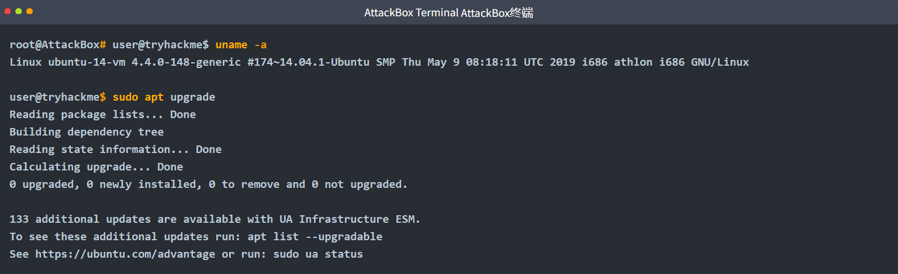

使用最新的安全补丁和错误修复程序更新您的系统至关重要。
您可以使用以下两个命令更新基于Debian的发行版，例如Ubuntu：

1. `apt update`从配置的源下载软件包信息
2. `apt upgrade`从已配置的源安装所有软件包的可用升级

您可以使用以下方法更新RedHat或Fedora系统：

- `dnf update` 在较新版本（Red Hat EnterpriseLinux 8及更高版本）
- `yum update` 旧版本（Red Hat EnterpriseLinux 7及更早版本）

由于我们谈论的是生产系统，因此我们需要选择能够在许多年内继续顺利接收更新的发行版。

## Ubuntu LTS版本

例如，Ubuntu每两年发布一次长期支持（LTS）版本。LTS版本有一个偶数版本号（表示年份），04（4月），例如18.04，20.04和22.04。LTS版本将为您提供基本操作系统的五年安全更新，而无需订阅，如果您支付扩展安全维护（ESM），则另外五年。有关更多信息，您可能需要检查[Ubuntu生命周期和发布节奏](https://ubuntu.com/about/release-cycle)。

使用Ubuntu LTS版本，您可以在前五年内无需订阅即可下载更新。考虑以下带有Ubuntu 14.04的Linux系统。它于2014年发布，其免费支持于2019年4月结束。换句话说，免费更新服务将持续到2019年。在下面的终端中，我们看到如果我们有Ubuntu Pro（仅限Ubuntu）订阅（以前称为Ubuntu Advantage（UA）for Infrastructure），我们可以下载和安装133个额外的更新。



## RedHat发布

Rdhat 企业版 Linux 8和9分三个阶段提供12年的支持：
1. 五年全面支持
2. 五年的维护支持
3. 延长寿命阶段两年
例如，Red Hat 企业版 Linux 9于2022年5月18日发布。它可以从以下更新中受益：

1. 2027全面支持至2027年5月31日
2.  2032维护支持至2032年5月31日.
有关详细信息，请查看[红帽企业Linux生命周期](https://access.redhat.com/support/policy/updates/errata/)。

## 内核更新

更新系统不应该局限于已安装的软件;它应该考虑更新内核。例如，在2016年，发现了一个影响Linux内核的安全漏洞。它允许攻击者通过利用写时复制（COW）机制中的竞争条件来获得对系统的根访问权限，并将其命名为“Dirty COW”。从2.6.22开始的所有Linux内核版本中都存在此漏洞。它已经在大多数主要的Linux发行版中打了补丁，但它仍然是对尚未更新的系统的威胁。

由于Dirty COW是一个严重的漏洞，攻击者可以通过该漏洞获得对Linux系统的根访问权限，因此务必使您的系统（包括其内核）保持最新的安全补丁，以降低被利用的风险。

##  自动更新

既然您有了一个在其整个生命周期中都有安全更新的Linux系统，我们必须确保正确安装了更新，并应用了安全修复程序。

- 随时了解最新的安全新闻，以防影响您系统的漏洞被披露。
- 根据您使用的Linux发行版，考虑配置自动更新。在优先考虑稳定性而不是尖端技术的Linux发行版上自动更新是安全的。

## 回答下面问题

```ad-details
collapse: true
title: 您会使用什么命令更新旧的Red Hat系统？
**答案：** `yum update`
```

```ad-details
collapse: true
title: 您会使用什么命令来更新现代的Fedora系统？
**答案：** `dnf update`
```

```ad-details
collapse: true
title: 更新`Debian`系统需要哪两个命令？（用`&&`连接这两个命令。）
**答案：** `apt update && apt uppdate`
```

```ad-details
collapse: true
title: 您会使用什么命令来更新现代的Fedora系统？
**答案：** `dnf update`
```

```ad-details
collapse: true
title: `yum`代表什么？
**答案：** `Yellowdog Updater, Modified`
```

```ad-details
collapse: true
title: `dnf`代表什么？
**答案：** `Dandified YUM`
```

```ad-details
collapse: true
title: `sources.list`文件中隐藏了什么标志？
**答案：** `THM{not_Advanced_Persistent_Threat}`
```

