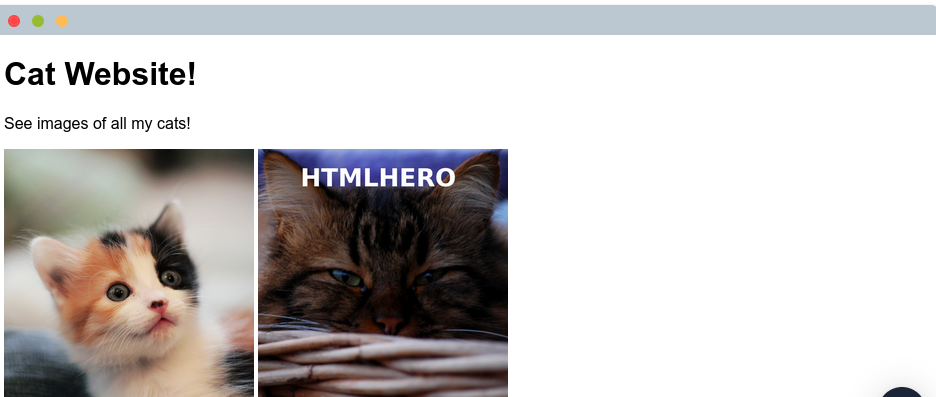
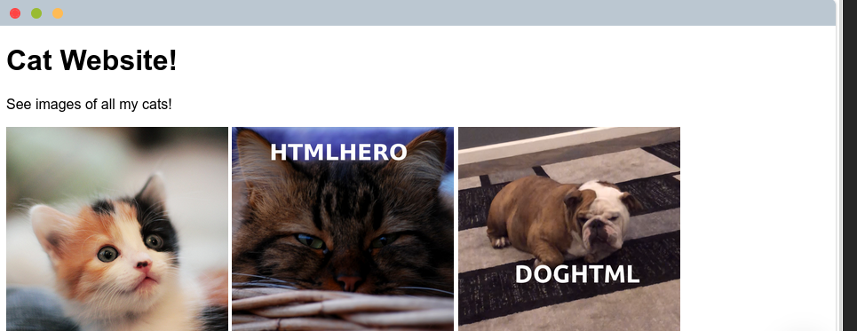
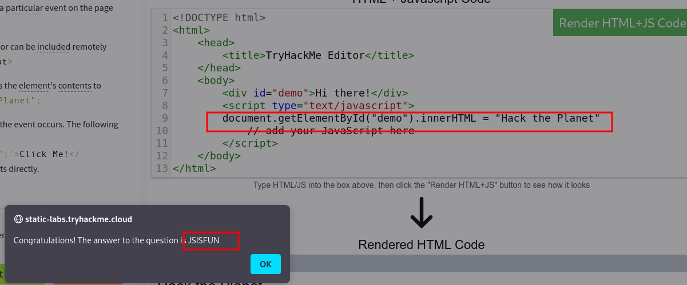
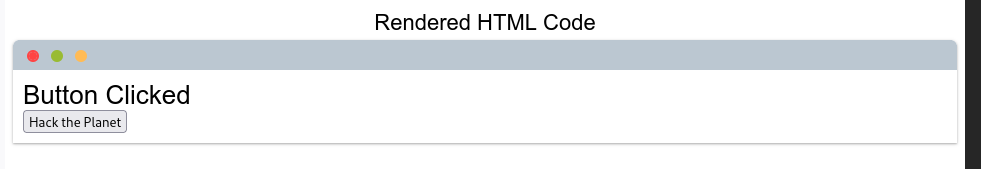

## 网站如何工作？


当您访问网站时，您的浏览器（_如Safari或Google Chrome_）会向Web服务器发出请求，询问您正在访问的页面的相关信息。它将响应您的浏览器用于向您显示页面的数据; Web服务器只是世界上其他地方的专用计算机，用于处理您的请求。

一个网站有两个主要部分组成：
-  前端(Front End): Client-Side 
- 后端(Back End):  Server-Side
在浏览器向Web服务器发出请求时还涉及许多其他过程，但现在，您只需要了解您向服务器发出请求，它会响应浏览器用于向您呈现信息的数据。


```ad-details
collapse: true
title:哪个术语最好地描述了浏览器呈现的Web应用程序的组件？
**答案** `Front End`
```

## HTML

网站主要使用以下工具创建：
- **HTML** 用于构建网站并定义其结构。
- **CSS** 通过添加样式选项使网站看起来漂亮。
- **JavaScript** 使用交互性在页面上实现复杂功能。
**HTML语言**（HTML）是网站编写的语言。元素`Elements`（也称为标记`tags`）是HTML页面的构建块，并告诉浏览器如何显示内容。下面的代码片段显示了一个简单的HTML文档，其结构对于每个网站都是相同的：

```html file:HTML
<!DOCTYPE html>  
	<!--定义页面是一个HTML5文档-->
<html> <!--元素是HTML页面的根元素-->
 	<head> <!--元素包含有关页面的信息（如页面标题）-->
		<title>Page Title</title> <!---->
	</head>
	<body> <!--定义了HTML文档的主体-->
	<h1>Example Heading</h1> <!--定义了一个大标题-->
    <p>Example paragraph..</p> <!--定义了一个段落-->

	</body>
</html>
```

```ad-info
还有许多其他元素`elements`（`tags`）用于不同的目的。例如，有用于按钮（`<button>`）、图像（``）、列表等的标记。

```

`tags`可以包含诸如`class`属性之类的属性，该属性可以用于对元素进行样式化（例如，使标签具有不同的颜色）`<p class="bold-text">`，或者`src`属性，该属性在图像上用于指定图像的位置``。元素可以具有多个属性，每个属性具有其自己独特的目的，例如，`<p attribute1="value1" attribute2="value2">`.

元素也可以有一个id属性（`<p id="example">`），它对于元素是唯一的。与class属性不同，多个元素可以使用同一个类，一个元素必须有不同的id来唯一地标识它们。元素id用于样式化并由JavaScript标识。

您可以通过右键单击并选择**View Page Source**(Chrome、Firefox) *或者*   **Show Page Source**(Safari)查看任何网站的HTML。

### 回答以下问题

````ad-details
collapse:true
title: 🐱网页上的一个图像是坏的-修复它，图像将揭示隐藏的文本答案！
**答案** `HTMLHERO`
```html hl:10
<!DOCTYPE html>
<html>
    <head>
        <title>TryHackMe HTML Editor</title>
    </head>
    <body>
        <h1>Cat Website!</h1>
        <p>See images of all my cats!</p>
        
        
        <!-- Add dog image here -->
    </body>
</html>
```


````


````ad-details
collapse:true
title: 通过在第11行添加另一个(``)标签来添加一个狗的图像。狗图像的位置是`img/dog-1.png`。狗图片中的文字是什么？
**答案** `DOGHTML`
```html hl:11
<!DOCTYPE html>
<html>
    <head>
        <title>TryHackMe HTML Editor</title>
    </head>
    <body>
        <h1>Cat Website!</h1>
        <p>See images of all my cats!</p>
        
        
        
    </body>
</html>
```

````


## JavaScript（JS）

JavaScript（JS）是世界上最流行的编码语言之一，它将页面渲染成交互式（**动态网页**）。

HTML用于创建网站结构和内容，而JavaScript用于控制网页的功能-如果没有JavaScript，页面将没有交互元素，并且始终是静态的。

JS可以实时动态更新页面，当页面上发生特定事件时（例如当用户单击按钮时）或显示移动动画时，提供更改按钮样式的功能。

```ad-hint
JavaScript被添加到页面源代码中，可以在`<script>`标签中加载，也可以通过src属性远程包含：`<script src="/location/of/javascript_file.js"></script>`
```


以下 JavaScript 代码会在页面上查找一个 ID 为 “demo” 的 HTML 元素，并将该元素的内容更改为 “Hack the Planet”：


```javascript file:javascript
document.getElementById("demo").innerHTML = "Hack the Planet";
```


HTML 元素也可以有诸如 “onclick”（点击时）或 “onhover”（鼠标悬停时）之类的事件，当这些事件发生时会执行 JavaScript 代码。以下代码会将 ID 为 “demo” 的元素的文本更改为 “Button Clicked”：

```html file:HTML
<button onclick='document.getElementById("demo").innerHTML = "Button Clicked";'>Click Me!</button>
```

——“onclick” 事件也可以在 JavaScript 脚本标签内部定义，而不直接在元素上定义。

###  回答以下问题


````ad-details
collapse:true
title: 点击此任务上的 "View Site" 按钮。在右侧添加 JavaScript 代码，将 “demo” 元素的内容更改为 “Hack the Planet”。
**答案** `JSISFUN`

  

````

````ad-details
collapse:true
title: 在右侧的编辑器中添加此任务中提供的按钮 HTML 代码，该代码能在按钮被点击时将（元素`element`）的文本更改为 “Button Clicked”，通过点击 “渲染 HTML + JS 代码” 按钮来更新代码，然后再点击该按钮。

```html file:html
<!DOCTYPE html>
<html>
    <head>
        <title>TryHackMe Editor</title>
    </head>
    <body>
        <div id="demo">Hi there!</div>
        <script type="text/javascript">
        document.getElementById("demo").innerHTML = "Hack the Planet";
            // add your JavaScript here
        </script>
        <button onclick='document.getElementById("demo").innerHTML = "Button Clicked";'>Hack the Planet</button>
    </body>
</html>
```

````


