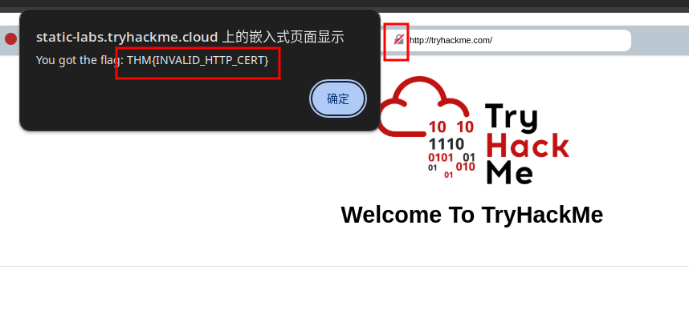

## 什么是HTTP(S)

### 什么是HTTP

HTTP（HyperText Transfer Protocol，超文本传输协议）是一种用于在网络上传输超文本（如HTML）的应用层协议。它是万维网（WWW）数据通信的基础，主要用于客户端（如浏览器）与服务器之间的通信。
### 什么是HTTPS
HTTPS（HyperText Transfer Protocol Secure，超文本传输安全协议）是HTTP的安全版本，通过加密技术保护数据传输的隐私和完整性。它在HTTP的基础上加入了SSL/TLS协议，确保数据在传输过程中不被窃取或篡改。

```ad-details 
collapse: true
title:HTTP 代表什么
**答案** `HyperText Transfer Protocol`
```

```ad-details
collapse: true
title:HTTPS 中的`S`代表什么
**答案** `Secure`
```

```ad-details
collapse:true
title:   在右边的模拟网页上有一个问题，一旦你找到它，点击它。flag是什么？
**答案** `THM{INVALID_HTTP_CERT}`


```
