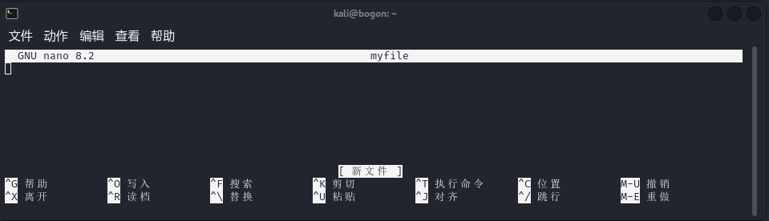
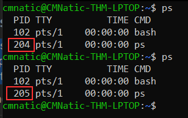
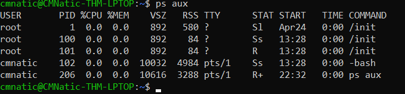
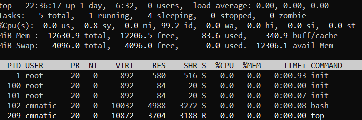

## 文本编辑器

### nano

开始使用Nano很容易！要使用nano创建或编辑文件，我们只需使用`nano filename` --将“filename”替换为您希望编辑的文件的名称。

```bash file:'nano' 
nano myfile
```

进入nano 后会显示以下界面:



### Vim

Vim是一个更高级的文本编辑器。虽然您不需要了解所有高级功能，但提及它对于提高您的Linux技能很有帮助。
Vim的一些好处，尽管需要更长的时间来熟悉，包括：
- 可定制：您可以修改键盘快捷键
- 高亮：如果您正在编写或维护代码，这很有用，使其成为软件开发人员的热门选择
- 有很多资源，如[备忘录](https://vim.rtorr.com/)，教程和排序可供您使用。
TryHackMe有一个[展示Vim的房间，](https://tryhackme.com/room/toolboxvim)如果你想了解更多关于这个编辑器的信息！

## 一般实用工具

### 下载文

:::tabs

@tab wget

```sh
wget https://assets.tryhackme.com/additional/linux-fundamentals/part3/myfile.txt
```

@tab curl

```bash
curl http://example.com/file.txt -o file.txt
```

:::
### 主机间文件传输（SCP）
`SCP`就是一种安全复制文件的方法。与常规cp命令不同，此命令允许您使用SSH协议在两台计算机之间传输文件，以提供身份验证和加密。
`SCP`可以在源和目的主机间工作，SCP允许您：
- 将文件目录从当前系统复制到远程系统
-  将文件目录从远程系统复制到当前系统
前提是我们知道您当前系统上的用户和远程系统上的用户的用户名和密码。例如，让我们将一个示例文件从我们的机器复制到远程机器，需要知道以下参数：


| **参数**            | **值**           |
| ----------------- | --------------- |
| 远程系统的IP地址         | 192.168.1.30    |
| 远程系统上的用户          | ubuntu          |
| 本地系统上的文件名         | important.txt   |
| 我们希望在远程系统上存储文件的名称 | transferred.txt |
有了这些信息，让我们制作我们的`scp`命令（记住SCP的格式只是源和目的地）：

```sh file:'scp'
scp important.txt ubuntu@192.168.1.30:/home/ubuntu/transferred.txt
```

>[!TIP]
>当然也可以将远程主机的文件 拷贝到本地，我们只需将文件路径顺序倒过来

### 启用本地web,提供下载连接

```sh file:web
python3 -m http.server
```

## 进程

进程（Processes）是在您的计算机上运行的程序。它们由内核管理，其中每个进程都有一个与其关联的ID，也称为其PID。PID按进程开始的顺序递增。即，第60个进程的PID为60。

### 查看进程

####  **PS**

我们可以使用`ps`命令来提供一个正在运行的进程列表，内容包括当前用户的会话和一些附加信息，如它的状态码，正在运行的会话，它使用的CPU的使用时间，以及正在执行的实际程序或命令的名称：

请注意，在上面的屏幕截图中，第二个进程ps的PID为204，然后在它下面的命令中，它被递增到205。
要查看其他用户运行的进程以及那些不从会话运行的进程（即系统进程），我们需要为`ps`命令提供**aux**，如下所示：`ps aux`


####  **TOP**
另一个非常有用的命令是top命令; top为您提供有关系统上运行的进程的实时统计信息，而不是一次性视图。这些统计信息将每10秒刷新一次，但在您使用箭头键浏览各行时也会刷新。另一个深入了解系统的好命令是通过`top`命令。


###  进程管理

#### KILL
`kill` 用来终止进程，并在终止的过程中，向进程发送信号
>- SIGTERM -终止进程，但允许它事先执行一些清理任务
>- SIGKILL -终止进程-不做任何事后清理
>- SIGSTOP 停止/挂起进程

#### **命名空间**

操作系统（OS）使用命名空间来最终将计算机上可用的资源划分给（例如CPU、RAM和优先级）进程。
命名空间能够实现进程间的隔离：只有同一命名空间的进行才能互相访问。
PID为 0 , 的进程是在系统引导时启动的进程，例如：systemd,它提供一种在系统和用户之间管理进程的方法。

**启动服务**

```bash file:systemctl
systemctl [option] [server]
```

>[!TIP] 提示
>- 在启动引导程序时启动服务 : `enable`
>- 启动服务`start`
>- 停止服务`stop`
>- 禁用服务`disable`
>- 重新启动服务： `restart`

#### 进程的前后台切换


一般运行程序，默认是在前台运行，运行后，当前terminal 会被占用，无法进行其他操作

```bash title:echo
echo "Hello world!"
```

- 想要让以上命令在运行后进程，需要在运行的命令后面加 `&`

```bash file:echo
echo "Hello world!" &
```

- 也可以通过 `Ctrl + z` 暂停进程

- `fg`： 当在当前terminal 暂停了一个进程时，可以用`fg`重新回到进程运行状态，只能回到最近暂停的一个。


## 定时任务

`Crontabs` 是一个在`boot`启动时启动的进程，负责管理`cron`作业
- `crontabs` 文件保存在 `/var/spool/cron/crontabs`文件下
- 也可以以命令行的形式，管理`cron`

```bash file:crontab
crontab -l # 查看当前用户的定时任务
crontab -e # 创建定时任务（默认用nano编辑文本）
```

**cron** 表达式是一个字符串，该字符串由 `6` 个空格分为 `7` 个域，每一个域代表一个时间单位。格式如下：
```javascript file:cron
[秒] [分] [时] [日] [月] [周] [年] [命令]
```

**通常定义 “年” 的部分可以省略，实际常用的由 前六部分组成**

```bash file:cron
0 */12 * * * cp -R /home/cmnatic/Documents /var/backups/
```

设置每次重启都会执行的任务会用到：`@reboot`

```bash file:cron
@reboot /var/opt/processes.sh
```

### cron 中的参数与通配符

| 域   | 是否必填 | 值以及范围          | 通配符           |
| --- | ---- | -------------- | ------------- |
| 秒   | 是    | 0-59           | , - * /       |
| 分   | 是    | 0-59           | , - * /       |
| 时   | 是    | 0-23           | , - * /       |
| 日   | 是    | 1-31           | , - * ? / L W |
| 月   | 是    | 1-12 或 JAN-DEC | , - * /       |
| 周   | 是    | 1-7 或 SUN-SAT  | , - * ? / L # |
| 年   | 否    | 1970-2099      | , - * /       |

- `,` 多个单值连接（英文逗号），如果我们在 “分” 这个域中定义为 `8,12,35` ，则表示分别在第 8 分，第 12 分 第 35 分执行该定时任务。
- `-` 区间连续(几至几)，如果我们在 “时” 这个域中定义 `1-6`，则表示在 1 到 6 点之间每小时都触发一次，用 `,` 表示 `1,2,3,4,5,6`。
- `*` 表示所有值，可解读为 “每”。如果在“日”这个域中设置 `*`,表示每一天都会触发。
- `?` 表示不指定值。使用的场景为不需要关心当前设置这个字段的值。例如:要在每月的 8 号触发一个操作，但不关心是周几，我们可以这么设置 `0 0 0 8 * ?
- `/`  在 “秒” 上定义 `5/10` 表示从 第 5 秒开始 每 10 秒执行一次，而在 “分” 上则表示从 第 5 秒开始 每 10 分钟执行一次。
- `L` 表示英文中的**LAST** 的意思，只能在 “日”和“周”中使用。在“日”中设置，表示当月的最后一天。在“周”上表示周六，相当于”7”或”SAT”。如果在”L”前加上数字，则表示该数据的最后一个。例如在“周”中设置”7L”这样的格式,则表示“本月最后一个周六”。
- `W` 表示离指定日期的最近那个工作日(周一至周五)触发，只能在 “日” 中使用且只能用在具体的数字之后。若在“日”上设置”15W”，表示离每月 15 号最近的那个工作日触发。假如 15 号正好是周六，则找最近的周五(14 号)触发, 如果 15 号是周未，则找最近的下周一(16 号)触发.如果 15 号正好在工作日(周一至周五)，则就在该天触发。如果是 “1W” 就只能往本月的下一个最近的工作日推不能跨月往上一个月推。

- `#` 表示每月的第几个周几，只能作用于 “周” 。例如 ”2#3” 表示在每月的第三个周二。

##  通过日志维护系统

- fail2ban： 一个防火墙，可以用于监视和阻止暴力破解
- ufw：ubuntu系统的防火墙，基于iptables的简化工具防
- access.log ：web服务器的访问日志
- error.log ：web服务器的错误日志
## Linux 工具或实用程序练习

在其他一些专门用于Linux工具或实用程序的TryHackMe房间中继续学习：
- Bash脚本-[https://tryhackme.com/room/bashscripting](https://tryhackme.com/room/bashscripting)
- 正则表达式-[https：//tryhackme.com/room/catregex](https://tryhackme.com/room/catregex)