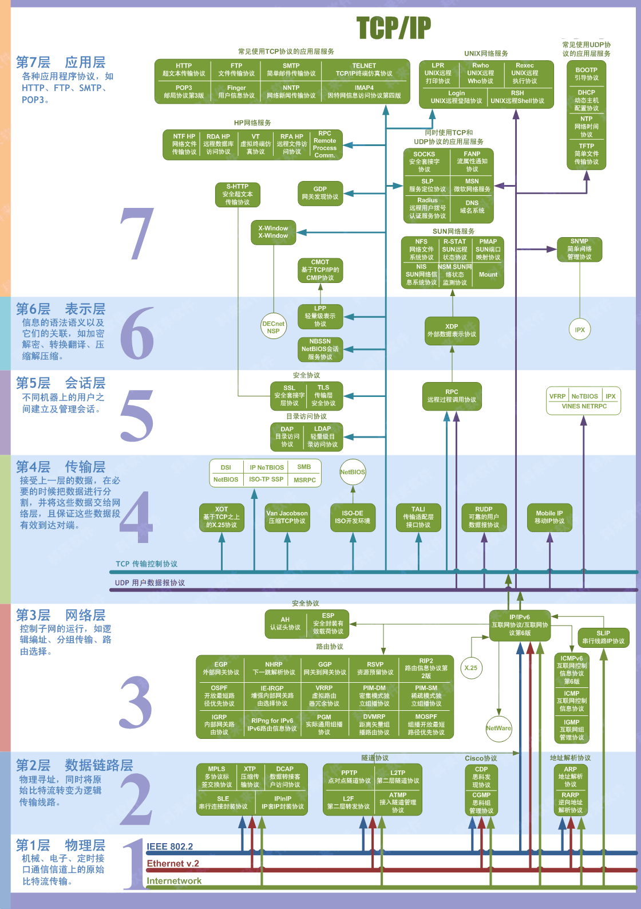

## OSI 七层模型



## TCP/IP 协议


## PING 命令

```ad-details
collapse: true
title: 什么参数可以让你改变发送`ping`请求的时间间隔？
**答案：** `-i`
```

```ad-details
collapse: true
title: 哪种交换机允许您将请求限制为IPv4？
**答案：** `-4`
```

```ad-details
collapse: true
title:哪个参数会提供更详细的输出？ 
**答案：** `-v`
```

## Traceroute 命令

```ad-details
collapse: true
title: 使用Traceroute时，您将使用哪个参数指定接口？
**答案：** `-i`
```


```ad-details
collapse: true
title: 如果您想在跟踪路由时使用TCP SYN请求，您会使用哪个参数？
**答案：** `-T`
```


```ad-details
collapse: true
title: 默认情况下，traceroute将在**TCP/IP**模型的哪一层上运行（Windows）？
**答案：** `Internet`
```

## WHOIS

查询域名工具，也可以在浏览器上搜索🔍`whois`网站进行查询。
> [!IMPORTANT]
> 在进行whois 查询时应重点关注以下字段：
>- `Registered`： 注册
>- `Tech` : 技术
>- `Admin`: 管理

## Dig

Dig允许我们手动查询我们选择的递归DNS服务器，以获取有关域的信息：

```bash file:dig
dig <doman-name> @<DNS-server-IP>
```

**示例:**

  ```shell file:dig
dig www.baidu.com @223.5.5.5
```

## 总结

到此网络入门知识就介绍结束了。

> [!TIP]
> 
> 如果您想扩展您的网络理论知识，[Steve McQuerry的CISCO自学指南](https://www.amazon.co.uk/Interconnecting-Cisco-Network-Devices-ICND1/dp/1587054620/ref=sr_1_1?keywords=Interconnecting+Cisco+Network+Devices%2C+Part+1&qid=1583683766&sr=8-1)是一个很好的工作资源。
