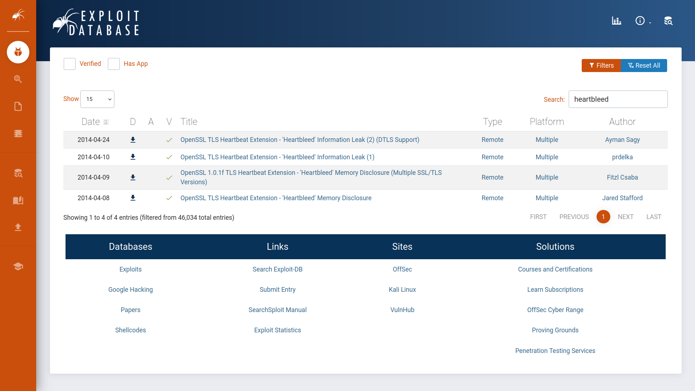
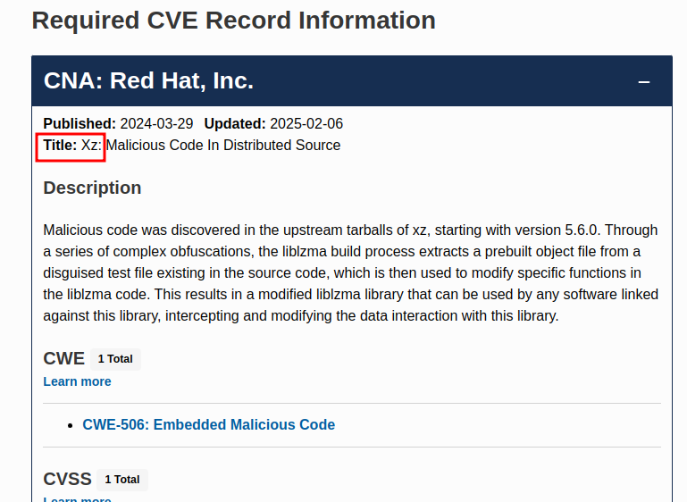
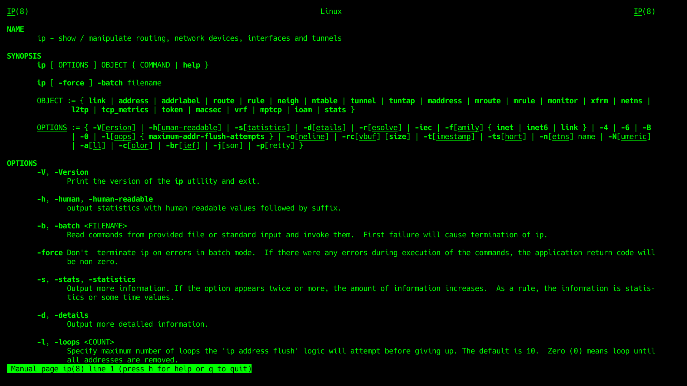
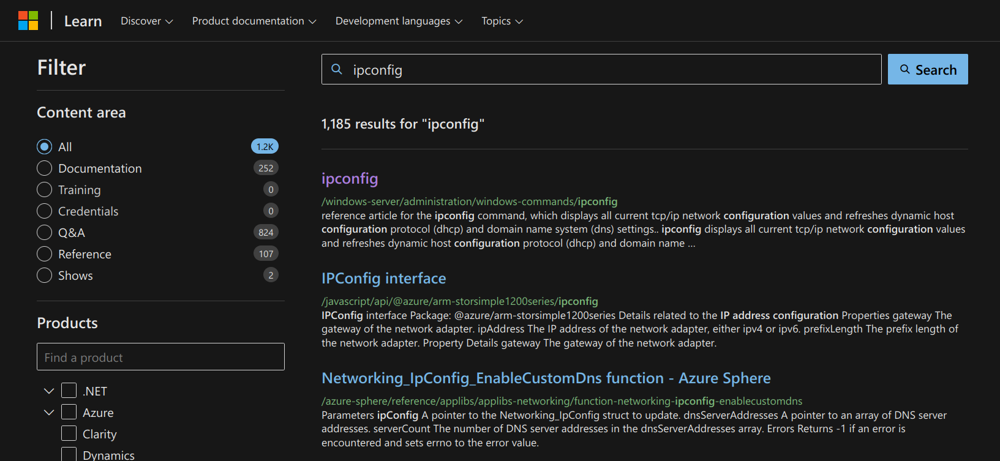
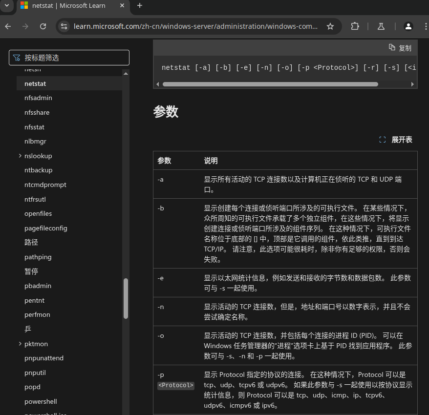

## 介绍

### 学习目标

- 评估信息来源
- 高效使用搜索引擎
- 探索专业搜索引擎
- 阅读技术文档
- 善用社交每天
- 查看新闻媒体

## 搜索结构评估

在互联网上每个人都能以博客文章或社交媒体、帖子等，甚至可以编辑公共的wiki页面，这种能力使任何人都可以提出他们毫无根据的主张。

作为读者，我们需要对搜索到的信息进行评估，做信息评估需要注意以下几点：
- 来源（Source） ：权威性。
- 证据和推理（Evidence and reasoning）： 可信证据和逻辑推理支持。
- 客观性和偏见（Objectivity and bias）：是否公正、理性，翻译多种观点。
- 确证和一致性（Corroboration and consistency）：通过其他搜索到的信息、渠道来验证搜索到的信息。

### 回答问题

```ad-details
collapse: true
title: 如何称呼被视为虚假或欺诈的加密方法或产品？

答案：`Snake oil`

本题用中文搜索是搜索不到的，需要搜索原有英文问题`What do you call a cryptographic method or product considered bogus or fraudulent?`

搜索完成后搜索引擎会列出搜索结果：其中有一个网站，正是介绍这个知识点：
[https://cryptography.fandom.com/wiki/Snake_oil_(cryptography)](https://cryptography.fandom.com/wiki/Snake_oil_(cryptography))

- `Snake oil` : 直译为蛇油，早期美国街头有人卖蛇油骗人，声称包治百病（相当于卖大力丸、脑白金之类的），这里用来比喻假的“加密方法或产品”
```

```ad-details
collapse: true
title: 在linux 系统中替换`netstat`的命令名称是什么？
**答案：** `ss`
```

##  搜索引擎

并不是每个人都尝试利用 Internet 搜索引擎的全部功能。几乎每个 Internet 搜索引擎都允许您进行高级搜索。请考虑以下示例：

- [Google ](https://www.google.com/advanced_search)
- [Bing](https://support.microsoft.com/en-us/topic/advanced-search-options-b92e25f1-0085-4271-bdf9-14aaea720930)
- [DuckDuckGo](https://duckduckgo.com/duckduckgo-help-pages/results/syntax/)

下面介绍谷歌指出的搜索运算符：

- **"exact phrase"** ：双引号表示您正在查找包含确切单词或短语的页面。例如，人们可能会搜索 `"passive reconnaissance"` 来获取包含此确切短语的页面。
- **site** ：此运算符允许您指定要将搜索限制到的域名。例如，我们可以使用 `site:tryhackme.com success stories`在 TryHackMe 上搜索成功案例。

- **-** ：减号允许您省略包含特定单词或短语的搜索结果。例如，您可能对了解金字塔感兴趣，但不想查看旅游网站;一种方法是搜索 `pyramids -tourism` 或 `-tourism pyramids`。
- **filetype** ： 此搜索运算符对于查找文件而不是网页是必不可少的。您可以使用 Google 搜索的一些文件类型是可移植文档格式 （PDF）、Microsoft Word 文档 （DOC）、Microsoft Excel 电子表格 （XLS） 和 Microsoft PowerPoint 演示文稿 （PPT）。例如，要查找网络安全演示文稿，请尝试搜索 `filetype:ppt cyber security`。

您可以在此[高级搜索运算符列表中](https://github.com/cipher387/Advanced-search-operators-list)查看各种搜索引擎中的更高级控件，您可以找到您喜欢使用的搜索引擎，并了解支持的运算符号。

### 回答问题

```ad-details
collapse:true
title：您如何将 Google 搜索限制为包含术语 **cyber warfare report** 的 PDF 文件？
**答案：** `filetype:pdf cyber warfare report`
```

```ad-details
collapse: true
title: Linux 命令 `ss` 代表什么短语
**答案** ：`Socket Statistic`

- Socket： 一般称为套接字
- Statistic ：统计
```

##  专业搜索引擎

您熟悉 Internet 搜索引擎;但是，您对专业搜索引擎熟悉多少？我们指的是用于查找特定类型结果的搜索引擎。

### Shodan
让我们从 [Shodan](https://www.shodan.io/) 开始，这是一个用于连接到 Internet 的设备的搜索引擎。它允许您搜索特定类型和版本的服务器、网络设备、工业控制系统和 IoT 设备。您可能希望查看仍有多少服务器仍在运行 Apache 2.4.1 以及各个国家/地区的分布情况。要找到答案，我们可以搜索 `apache 2.4.1`，它将返回标头中包含字符串“apache 2.4.1”的服务器列表。


考虑访问 Shodan [Search Query Examples](https://www.shodan.io/search/examples) 了解更多示例。此外，如果您有订阅，您可以查看 [Shodan 趋势](https://trends.shodan.io/)以获取历史见解。

### Censys

[Censys](https://search.censys.io/) 专注于连接 Internet 的主机、网站、证书和其他 Internet 资产。它的一些用例包括枚举正在使用的域、审计开放端口和服务以及发现网络中的流氓资产。您可能需要检查 [Censys Search Use Cases](https://support.censys.io/hc/en-us/articles/20720064229140-Censys-Search-Use-Cases)。


### VirusTotal

[VirusTotal](https://www.virustotal.com/) 是一个在线网站，它使用多个防病毒引擎为文件提供病毒扫描服务。它允许用户上传文件或提供 URL，以便在一次工作中针对众多防病毒引擎和网站扫描程序对其进行扫描。他们甚至可以输入文件哈希值来检查以前上传的文件的结果。

下面的屏幕截图显示了根据 67 个防病毒引擎检查提交的文件的结果。此外，您可以查看社区的评论以获得更多见解。有时，文件可能会被标记为病毒或特洛伊木马程序;但是，由于各种原因，这可能不准确，这时社区成员可以提供更深入的解释。


### Have I Been Pwned

[Have I Been Pwned](https://haveibeenpwned.com/) （HIBP） 只做一件事;它会告诉您电子邮件地址是否出现在数据泄露事件中。在泄露的数据中找到一个人的电子邮件表明私人信息泄露，更重要的是，密码泄露。许多用户在多个平台上使用相同的密码，如果一个平台被泄露，他们在其他平台上的密码也会暴露。事实上，密码通常以加密格式存储;但是，许多密码并不那么复杂，可以使用各种攻击来恢复。


### 回答问题

```ad-details
collapse: true
title: 拥有**lighttpd**服务器最多的国家/地区是哪个？

**答案** ：`United States`

使用shodan搜索引擎进行搜索，左侧会显示全球统计结果。
```

```ad-details
collapse: true
title: 哈希值为`2de70ca737c1f4602517c555ddd54165432cf231ffc0e21fb2e23b9dd14e7fb4`的文件被**BitDefenderFalx**标记为什么？

**答案**： `Android.Riskware.Agent.LHH`


BitDefenderFalx 是一个杀毒引擎，题中给出某个文件的hash值，这是要搜索一个hash（文件）的安全性，因此需要使用 VirusTotal 搜索。

- 通过 VirusTotal 搜索给出的hash值
	
- 找到答案
	

```
## CVE

我们可以将 Common Vulnerabilities and Exposures （CVE） 程序视为漏洞字典。它为软件和硬件产品中的漏洞和安全问题提供标准化标识符。每个漏洞都分配有一个采用标准化格式（如 `CVE-2024-29988`）的 CVE ID。此唯一标识符 （CVE ID） 可确保从安全研究人员到供应商和 IT 专业人员的每个人都引用相同的漏洞，在本例中为 [CVE-2024-29988](https://nvd.nist.gov/vuln/detail/CVE-2024-29988)。

MITRE Corporation 维护 CVE 系统。有关更多信息和搜索现有 CVE，请访问 [CVE 计划](https://www.cve.org/) Web 站点。或者，访问[国家漏洞数据库](https://nvd.nist.gov/) （NVD） 网站。下面的屏幕截图显示了 CVE-2014-0160，也称为 Heartbleed。

**当然中国也有自己的国家漏洞库：[CNNVD](https://www.cnnvd.org.cn/home/childHome)**

## Exploit Database (漏洞利用数据库)

作为红队，想要利用易受攻击的程序来验证系统的安全性时，我们可能需要找到一个有效的漏洞利用代码。

一种资源是 [Exploit Database](https://www.exploit-db.com/)。漏洞利用数据库列出了来自不同作者的漏洞利用代码;其中一些漏洞利用代码已经过测试并标记为已验证。


另一种是[GitHub](https://github.com/) 是一个基于 Web 的软件开发平台，包含许多与 CVE 相关的工具，以及概念验证 （PoC） 和漏洞利用代码。要演示此想法，请查看下面的 GitHub 上与 Heartbleed 漏洞相关的搜索结果的屏幕截图。

### 回答问题

```ad-details
collapse: true
title: CVE-2024-3094 是什么实用程序产生的？

**答案：** `xz`

可以在cve官网搜索：https://www.cve.org/



```

## Technical Documentation (技术文档)

我们需要获得的另一项技能是查找官方文件。我们将介绍一些官方文档页面的示例。

### Linux Manual Pages (Linux 手册页)

在互联网普及前，如何通过命令获取 Linux 或类 Unix 系统的帮助？答案是查阅手册页（man pages）。这类系统为每个命令、系统调用、库函数及配置文件均内置了手册页，输入 `man [名称]` 即可访问对应文档。

假设我们想检查命令 `ip` 的手册页。我们发出命令 `man ip`。下面的屏幕截图显示了我们收到的页面。您可能希望启动 AttackBox 并在终端上运行 `man ip`。按 `q` 退出。



如果您更喜欢在 Web 浏览器中阅读 `ip` 的手册页，只需在您最喜欢的搜索引擎中输入 `man ip` 即可。[此页面](https://linux.die.net/man/8/ip)可能位于结果的顶部。

**AttackBox** 是一个可从浏览器访问的 Linux 系统。单击 **Start AttackBox（启动 AttackBox**）按钮将在分屏中显示 AttackBox，从而可以方便地在同一浏览器窗口中阅读任务文本和应用说明。如果您隐藏了 AttackBox 窗口，您可以通过单击顶部的蓝色 Show Split View 按钮再次显示它。在此任务中，您可以启动 AttackBox 并使用它来尝试 Linux 命令，例如 `man`。

###  Windows

Microsoft 为其产品提供了官方[技术文档](https://learn.microsoft.com/)页面。下面的屏幕截图显示了命令 `ipconfig` 的搜索结果。



### 产品文档

每个流行的产品都应该有组织良好的文档。本文档提供了有关产品特性和功能的官方可靠信息来源。示例包括 [Snort 官方文档](https://www.snort.org/documents)、[Apache HTTP 服务器文档](https://httpd.apache.org/docs/)、[PHP 文档](https://www.php.net/manual/en/index.php)和 [Node.js 文档](https://nodejs.org/docs/latest/api/)。查看官方文档总是有益的，因为它是最新的并提供最完整的产品信息。

### 回答问题

```ad-details
collapse: true
title: Linux 命令 `cat` 代表什么？

**答案：** `Concatenate`

使用 `man cat` 查看，手册首页会出现：`cat - concatenate files and print on the standard output` 意思是： `连接文件并在标准输出上打印`
```

```ad-details
collapse: true
title: MS Windows 中，显示与“每个活动连接和侦听端口关联的可执行文件“的`netstat`参数是什么？
**答案：** `-b`

```


## Social Media (社交媒体)

对于红队来说，社交媒体的作用在于它可以让你与你感兴趣的公司和人建立联系。此外社交媒体为网络安全专业人士提供了丰富的信息，以供他们搜索信息。

出于保护公司的角度，你应该确保员工不会在社交媒体上过度分享。例如，他们的社交媒体可能会泄漏他们秘密问题的答案，如：“你小时候上过哪所学校？”此类可能用于重置秘密的信息。

此外，作为网络安全专业人士，您需要随时了解新的网络安全趋势、技术和产品。适当的渠道和社交媒体可以为增长您的技术专业知识提供合适的环境。

另外除了社交媒体，新闻网站可以提供有价值的网络安全新闻。尝试不同，找到你喜欢的渠道。

### 回答问题

```ad-details
collapse: true
title: 您受雇评估特定公司的安全性。您会使用哪个流行的社交媒体网站来了解他们其中一位员工的技术背景？

**答案：** `LinkedIn`

LinkedIn： 中文名“领英”，LinkedIn是一个美国商业和就业导向的社交网络。上面有数以百万计的岗位和人员简历，题目中问“员工的**技术背景**” 所以可以尝试在`LinkedIn`中搜索。

*当然如果在国内可以尝试从 Boss、智联或其他渠道搜索*
```


```ad-details
collapse: true
title: 继续前面的场景，你试图找到这个秘密问题的答案，“你小时候上了哪所学校？您会考虑查看哪个社交媒体网站以找到此类秘密问题的答案？

**答案：** `Facebook`


```


