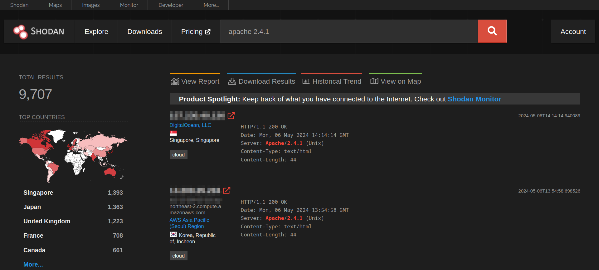
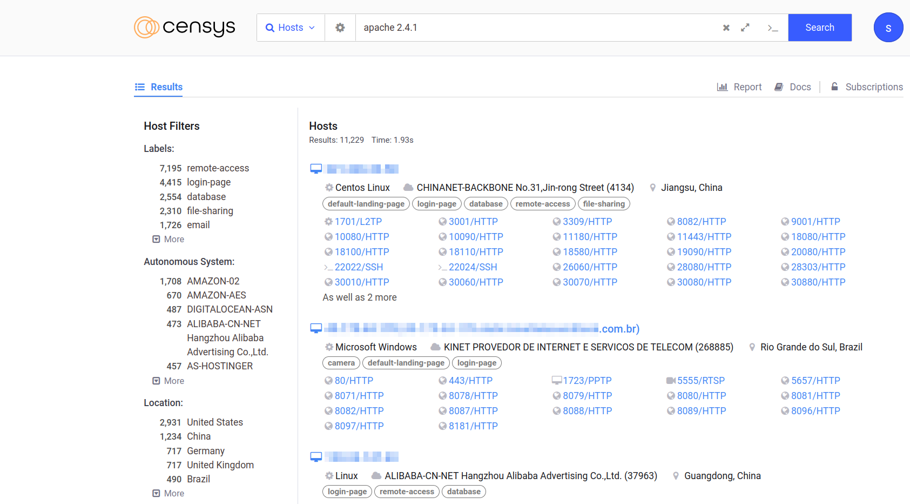
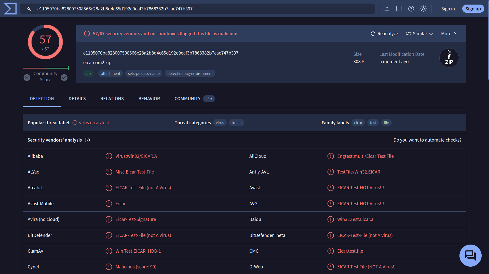
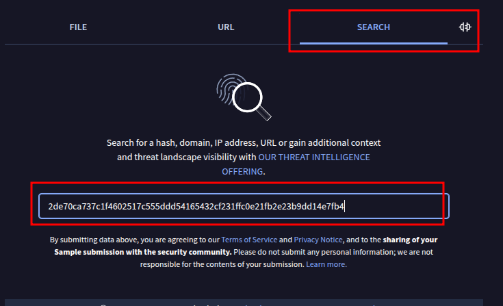
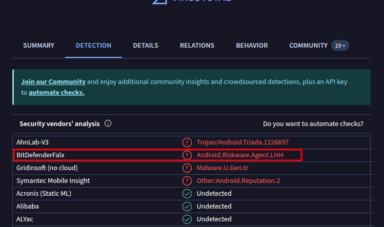

## 介绍

### 学习目标

- 评估信息来源
- 高效使用搜索引擎
- 探索专业搜索引擎
- 阅读技术文档
- 善用社交每天
- 查看新闻媒体

## 搜索结构评估

在互联网上每个人都能以博客文章或社交媒体、帖子等，甚至可以编辑公共的wiki页面，这种能力使任何人都可以提出他们毫无根据的主张。

作为读者，我们需要对搜索到的信息进行评估，做信息评估需要注意以下几点：
- 来源（Source） ：权威性。
- 证据和推理（Evidence and reasoning）： 可信证据和逻辑推理支持。
- 客观性和偏见（Objectivity and bias）：是否公正、理性，翻译多种观点。
- 确证和一致性（Corroboration and consistency）：通过其他搜索到的信息、渠道来验证搜索到的信息。

### 回答问题

```ad-details
collapse: true
title: 如何称呼被视为虚假或欺诈的加密方法或产品？

答案：`Snake oil`

本题用中文搜索是搜索不到的，需要搜索原有英文问题`What do you call a cryptographic method or product considered bogus or fraudulent?`

搜索完成后搜索引擎会列出搜索结果：其中有一个网站，正是介绍这个知识点：
[https://cryptography.fandom.com/wiki/Snake_oil_(cryptography)](https://cryptography.fandom.com/wiki/Snake_oil_(cryptography))

- `Snake oil` : 直译为蛇油，早期美国街头有人卖蛇油骗人，声称包治百病（相当于卖大力丸、脑白金之类的），这里用来比喻假的“加密方法或产品”
```

```ad-details
collapse: true
title: 在linux 系统中替换`netstat`的命令名称是什么？
**答案：** `ss`
```

##  搜索引擎

并不是每个人都尝试利用 Internet 搜索引擎的全部功能。几乎每个 Internet 搜索引擎都允许您进行高级搜索。请考虑以下示例：

- [Google ](https://www.google.com/advanced_search)
- [Bing](https://support.microsoft.com/en-us/topic/advanced-search-options-b92e25f1-0085-4271-bdf9-14aaea720930)
- [DuckDuckGo](https://duckduckgo.com/duckduckgo-help-pages/results/syntax/)

下面介绍谷歌指出的搜索运算符：

- **"exact phrase"** ：双引号表示您正在查找包含确切单词或短语的页面。例如，人们可能会搜索 `"passive reconnaissance"` 来获取包含此确切短语的页面。
- **site** ：此运算符允许您指定要将搜索限制到的域名。例如，我们可以使用 `site:tryhackme.com success stories`在 TryHackMe 上搜索成功案例。

- **-** ：减号允许您省略包含特定单词或短语的搜索结果。例如，您可能对了解金字塔感兴趣，但不想查看旅游网站;一种方法是搜索 `pyramids -tourism` 或 `-tourism pyramids`。
- **filetype** ： 此搜索运算符对于查找文件而不是网页是必不可少的。您可以使用 Google 搜索的一些文件类型是可移植文档格式 （PDF）、Microsoft Word 文档 （DOC）、Microsoft Excel 电子表格 （XLS） 和 Microsoft PowerPoint 演示文稿 （PPT）。例如，要查找网络安全演示文稿，请尝试搜索 `filetype:ppt cyber security`。

您可以在此[高级搜索运算符列表中](https://github.com/cipher387/Advanced-search-operators-list)查看各种搜索引擎中的更高级控件，您可以找到您喜欢使用的搜索引擎，并了解支持的运算符号。

### 回答问题

```ad-details
collapse:true
title：您如何将 Google 搜索限制为包含术语 **cyber warfare report** 的 PDF 文件？
**答案：** `filetype:pdf cyber warfare report`
```

```ad-details
collapse: true
title: Linux 命令 `ss` 代表什么短语
**答案** ：`Socket Statistic`

- Socket： 一般称为套接字
- Statistic ：统计
```

##  专业搜索引擎

您熟悉 Internet 搜索引擎;但是，您对专业搜索引擎熟悉多少？我们指的是用于查找特定类型结果的搜索引擎。

### Shodan
让我们从 [Shodan](https://www.shodan.io/) 开始，这是一个用于连接到 Internet 的设备的搜索引擎。它允许您搜索特定类型和版本的服务器、网络设备、工业控制系统和 IoT 设备。您可能希望查看仍有多少服务器仍在运行 Apache 2.4.1 以及各个国家/地区的分布情况。要找到答案，我们可以搜索 `apache 2.4.1`，它将返回标头中包含字符串“apache 2.4.1”的服务器列表。



考虑访问 Shodan [Search Query Examples](https://www.shodan.io/search/examples) 了解更多示例。此外，如果您有订阅，您可以查看 [Shodan 趋势](https://trends.shodan.io/)以获取历史见解。

### Censys

[Censys](https://search.censys.io/) 专注于连接 Internet 的主机、网站、证书和其他 Internet 资产。它的一些用例包括枚举正在使用的域、审计开放端口和服务以及发现网络中的流氓资产。您可能需要检查 [Censys Search Use Cases](https://support.censys.io/hc/en-us/articles/20720064229140-Censys-Search-Use-Cases)。



### VirusTotal

[VirusTotal](https://www.virustotal.com/) 是一个在线网站，它使用多个防病毒引擎为文件提供病毒扫描服务。它允许用户上传文件或提供 URL，以便在一次工作中针对众多防病毒引擎和网站扫描程序对其进行扫描。他们甚至可以输入文件哈希值来检查以前上传的文件的结果。

下面的屏幕截图显示了根据 67 个防病毒引擎检查提交的文件的结果。此外，您可以查看社区的评论以获得更多见解。有时，文件可能会被标记为病毒或特洛伊木马程序;但是，由于各种原因，这可能不准确，这时社区成员可以提供更深入的解释。


### Have I Been Pwned

[Have I Been Pwned](https://haveibeenpwned.com/) （HIBP） 只做一件事;它会告诉您电子邮件地址是否出现在数据泄露事件中。在泄露的数据中找到一个人的电子邮件表明私人信息泄露，更重要的是，密码泄露。许多用户在多个平台上使用相同的密码，如果一个平台被泄露，他们在其他平台上的密码也会暴露。事实上，密码通常以加密格式存储;但是，许多密码并不那么复杂，可以使用各种攻击来恢复。


### 回答问题

```ad-details
collapse: true
title: 拥有**lighttpd**服务器最多的国家/地区是哪个？

**答案** ：`United States`

使用shodan搜索引擎进行搜索，左侧会显示全球统计结果。
```

collaes: true
title : 哈希值为`2de70ca737c1f4602517c555ddd54165432cf231ffc0e21fb2e23b9dd14e7fb4`的文件被**BitDefenderFalx**标记为什么？

**答案**： `Android.Riskware.Agent.LHH`


BitDefenderFalx 是一个杀毒引擎，题中给出某个文件的hash值，这是要搜索一个hash（文件）的安全性，因此需要使用 VirusTotal 搜索。

- 通过 VirusTotal 搜索给出的hash值
	
- 找到答案
	

```