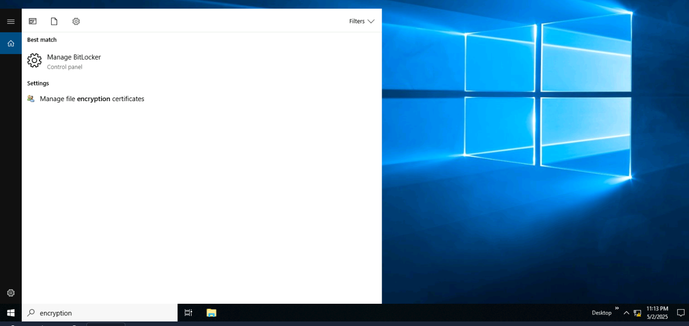
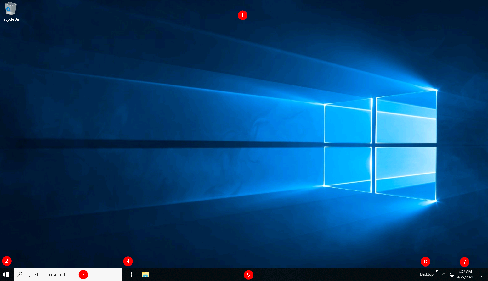
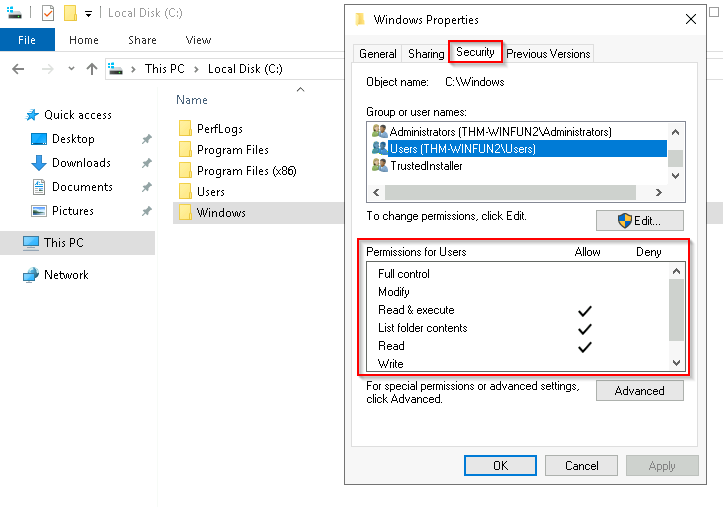
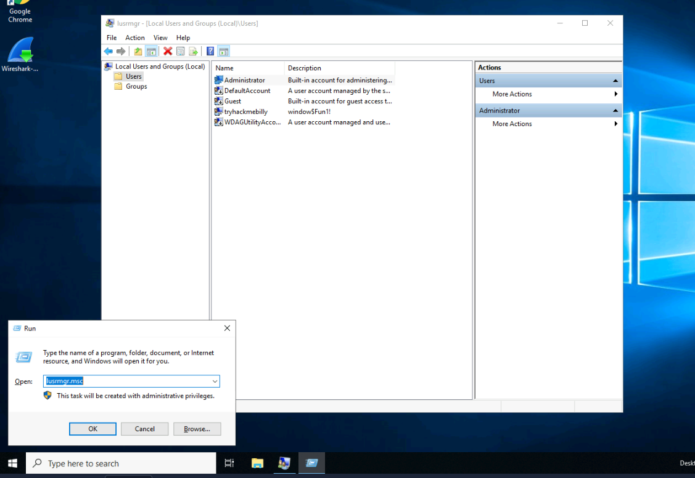
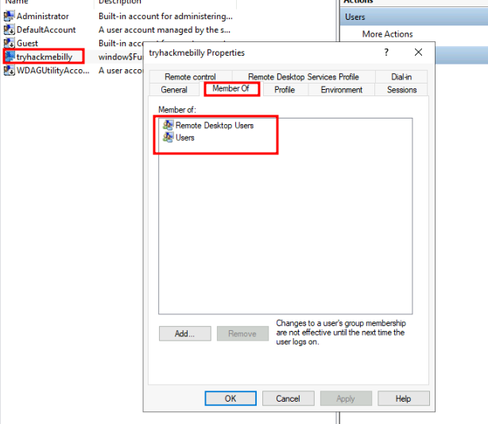
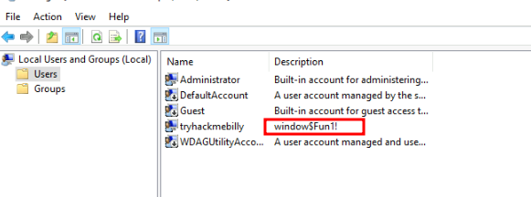
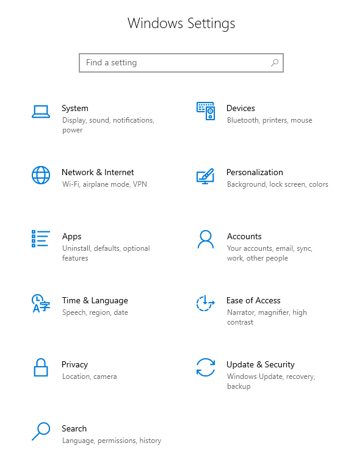
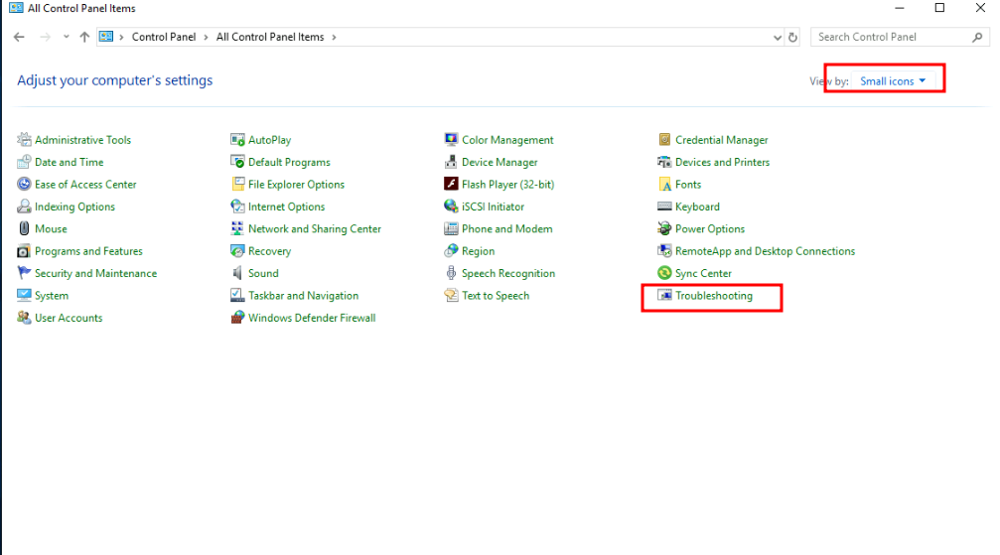

Windows  operating system（OS：操作系统） 是一个复杂的产品，包含系统文件、实用程序、设置、功能等。

## Windows 版本

Windows 操作系统历史悠久，可追溯到 1985 年，目前无论是在家庭使用还是企业网络中，它都是主流操作系统。正因如此，Windows 一直是黑客和恶意软件编写者攻击的目标。

Windows XP 是 Windows 的一个流行版本，并且运行了很长时间。微软发布了 Windows Vista，这是对 Windows 操作系统的一次彻底革新。Windows Vista 存在许多问题，并且没有受到 Windows 用户的欢迎，因此很快就被淘汰了。

当微软宣布 Windows XP 的停产日期时，许多客户陷入恐慌。企业、医院等纷纷在众多硬件和设备上测试下一个可行的 Windows 版本——Windows 7。供应商必须争分夺秒地确保他们的产品能够兼容 Windows 7。如果做不到，客户就不得不违反协议，寻找其他供应商将其产品升级到 Windows 7 兼容版本。这对许多人来说简直是一场噩梦，微软也注意到了这一点。

Windows 7 一经发布便迅速被标注了支持终止日期。Windows 8.x 也像 Vista 一样，很快就销声匿迹了。

[随后Windows 10](https://www.microsoft.com/en-us/windows/features?activetab=NewPopular)诞生，这是当前适用于台式电脑的 Windows 操作系统版本。

Windows 10 有两种版本：家庭版和专业版。您可以点击[此处](https://www.microsoft.com/en-us/windows/compare-windows-10-home-vs-pro)了解家庭版和专业版之间的区别。 

虽然我们没有谈论服务器，但当前用于服务器的 Windows 操作系统版本是  [Windows Server 2019](https://www.microsoft.com/en-us/windows-server)。

许多批评家喜欢抨击微软，但微软在推出每个新版本的 Windows 时都已在可用性和安全性方面取得了长足的进步。

**注意：所连接的**VM的 Windows 版本是 Windows Server 2019 Standard，如**系统信息**中所示   。

**更新**：截至 2021 年 6 月，微软[在此处](https://docs.microsoft.com/en-us/lifecycle/products/windows-10-home-and-pro?ranMID=24542&ranEAID=kXQk6*ivFEQ&ranSiteID=kXQk6.ivFEQ-M28j3qbUhtM2JFCT2wmhOA&epi=kXQk6.ivFEQ-M28j3qbUhtM2JFCT2wmhOA&irgwc=1&OCID=AID2000142_aff_7593_1243925&tduid=%28ir__uszrgcddyskfqz3fkk0sohz3wv2xuurc01kgzkod00%29%287593%29%281243925%29%28kXQk6.ivFEQ-M28j3qbUhtM2JFCT2wmhOA%29%28%29&irclickid=_uszrgcddyskfqz3fkk0sohz3wv2xuurc01kgzkod00&ranMID=24542&ranEAID=kXQk6*ivFEQ&ranSiteID=kXQk6.ivFEQ-4cKUPfbv9lM_IR2EX7K_hw&epi=kXQk6.ivFEQ-4cKUPfbv9lM_IR2EX7K_hw&irgwc=1&OCID=AID2000142_aff_7593_1243925&tduid=%28ir__feexvhocigkfqna9kk0sohznb32xutanagupypus00%29%287593%29%281243925%29%28kXQk6.ivFEQ-4cKUPfbv9lM_IR2EX7K_hw%29%28%29&irclickid=_feexvhocigkfqna9kk0sohznb32xutanagupypus00)宣布了 Windows 10 的退役日期。 

“_微软将继续支持至少一个 Windows 10 半年频道，直到 2025 年 10 月 14 日_”。

自 2021 年 10 月 5 日起，Windows 11 已成为面向最终用户的 Windows 操作系统。点击[此处，](https://www.microsoft.com/en-us/windows?wa=wsignin1.0)了解更多关于 Windows 11 的信息。

```ad-details
collapse: true
title: 您可以在 Pro 上启用哪些加密（`encryption`），而您无法在 Home 中启用？
**答案**：`BitLocker`



```

### **桌面**

Windows 桌面，又名图形用户界面或简称 GUI，是您登录 Windows 10 机器后欢迎您的屏幕。

传统上，您需要先通过登录屏幕。在登录屏幕中，您需要输入有效的帐户凭据;通常是在该特定系统或Active Directory环境（如果是已加入域的机器）中预先存在的Windows账户的用户名和密码。


上面的屏幕截图是典型 Windows 桌面的示例。下面简要介绍了构成 GUI 的每个组件。

1. The Desktop 桌面
2. Start Menu 开始菜单
3. Search Box (Cortana) 搜索框 （Cortana）
4. Task View 任务视图
5. Taskbar 任务栏
6. Toolbars 工具栏
7. Notification Area 通知区域

桌面是您拥有程序、文件夹、文件等快捷方式的地方。这些图标要么组织得很好，要么按字母顺序排序，要么随机分散，在桌面上没有特定的组织。无论哪种情况，这些项目通常都放在桌面上以便快速访问。

桌面的外观可以根据您的喜好进行更改。右键单击桌面上的任意位置，将出现一个上下文菜单。此菜单将允许您更改桌面图标的大小、指定它们的排列方式、将项目复制/粘贴到桌面以及创建新项目，例如文件夹、快捷方式或文本文档。

在 **Display settings （显示设置**） 下，您可以更改屏幕的分辨率和方向。如果您有多个计算机屏幕，您可以在此处对多屏幕设置进行配置。

您还可以通过选择 **Personalize** 来更改壁纸。


### **开始菜单**
在早期版本的 Windows 中，**“开始**”一词显示在桌面 GUI 的左下角。在现代版本的 Windows（例如 Windows 10）中，“开始”一词不再出现，而是显示 Windows 徽标。尽管“开始”菜单的外观发生了变化，但其总体用途是相同的。


## 文件系统

现代版本的 Windows 中使用的文件系统是 **新技术文件系统** 或简称 [NTFS](https://docs.microsoft.com/en-us/windows-server/storage/file-server/ntfs-overview) 。在 NTFS 之前，有 **FAT16/FAT32**（文件分配表）和 **HPFS**（高性能文件系统）。

您仍然可以看到目前正在使用的 FAT 分区。例如，您通常会在 USB 设备、MicroSD 卡等中看到 FAT 分区。 但传统个人 Windows 电脑及服务器多不用。

NTFS 解决了以前文件系统的许多限制;如：

- 支持大于 4GB 的文件
- 设置文件夹和文件的特定权限
- 文件夹和文件压缩
- 文件系统加密   ( [Encryption File System](https://docs.microsoft.com/en-us/windows/win32/fileio/file-encryption) or **EFS** )

### 文件或文件夹权限

您可以[在此处](https://docs.microsoft.com/en-us/troubleshoot/windows-client/backup-and-storage/fat-hpfs-and-ntfs-file-systems)阅读有关 FAT、HPFS 和 NTFS 的 Microsoft 官方文档。 让我们简要谈谈特定于 NTFS 的一些功能。在 NTFS 卷上，您可以设置授予或拒绝访问文件和文件夹的权限。
权限包括：

- **Full control 完全控制**
	- **文件夹**：允许对文件和子文件夹进行读取、写入、更改和删除操作。 
	- **文件**：允许对文件进行读取、写入、更改和删除操作。
	
- **Modify 修改**
	- **文件夹**：允许读取和写入文件及子文件夹，还能删除文件夹。
	- **文件**：允许读取和写入文件，还能删除文件。
	
- **Read & Execute 读取和执行**
	- **文件夹**：允许查看和列出文件及子文件夹，还能执行文件，该权限会被文件和文件夹继承。
	- **文件**：允许查看和访问文件内容，还能执行文件。
	
- **List folder contents 列出文件夹内容**
	- **文件夹**：允许查看和列出文件及子文件夹，还能执行文件，该权限仅被文件夹继承。
	- **文件**：不适用（N/A）。

- **Read 读**
	- **文件夹**：允许查看和列出文件及子文件夹。
	- **文件**：允许查看或访问文件内容。

- **Write 写**
	- **文件夹**：允许添加文件和子文件夹。
	- **文件**：允许向文件写入内容。

### 如何查看文件或文件夹权限？

- 右键单击要检查权限的文件或文件夹。
- 从上下文菜单中，选择 `Properties<br />` ）。
- 在 Properties 中，单击 `Security<br />` 选项卡。
- I在 `Group or user names<br />` ） 列表中，选择要查看其权限的用户、计算机或组。

在下图中，您可以看到 Windows 文件夹的 `Users<br />` 组的权限。



### 备用数据流（ADS）
  
NTFS 的另一个功能是 **备用数据流** （ **ADS** ）。备用数据流 （ADS） 是特定于 Windows NTFS（新技术文件系统）的文件属性。

每个文件至少有一个数据流 （ `$DATA<br />` ），并且 ADS 允许文件包含多个数据流。Windows [Explorer](https://support.microsoft.com/en-us/windows/what-s-changed-in-file-explorer-ef370130-1cca-9dc5-e0df-2f7416fe1cb1) 本身不会向用户显示 ADS。有第三方可执行文件可用于查看此数据，但 [Powershell](https://docs.microsoft.com/en-us/powershell/scripting/overview?view=powershell-7.1) 使您能够查看文件的 ADS。

从安全角度来看，恶意软件编写者使用 ADS 来隐藏数据。但并非所有它的使用都是恶意的。例如，当您从 Internet 下载文件时，会向 ADS 写入标识符，以标识该文件是从 Internet 下载的。要了解有关 ADS 的更多信息，请在此处参阅 [MalwareBytes 的](https://blog.malwarebytes.com/101/2015/07/introduction-to-alternate-data-streams/)以下链接。


```ad-details
collapse: true
title:  NTFS 是什么意思？
**答案**：`New Technology File System`

```

## Windows\System32 文件夹

Windows 文件夹（`C:\Windows` ）传统上被称为包含 Windows 操作系统的文件夹。 

该文件夹不一定非要位于 C 盘。它可以位于任何其他驱动器，并且严格来说也可以位于其他文件夹中。

这时，环境变量（更具体地说是系统环境变量）就会发挥作用。虽然我们还没有讨论过，但 Windows 目录的系统环境变量是`%windir%` 。

根据[Microsoft 的说法](https://docs.microsoft.com/en-us/powershell/module/microsoft.powershell.core/about/about_environment_variables?view=powershell-7.1)，“_环境变量存储有关操作系统环境的信息。此信息包括操作系统路径、操作系统使用的处理器数量以及临时文件夹的位置等详细信息_”。

“Windows”文件夹中有许多文件夹。请参阅下文。


众多文件夹之一是**System32**。 


System32 文件夹包含对操作系统至关重要的重要文件。

与此文件夹交互时务必格外小心。意外删除 System32 中的任何文件或文件夹都可能导致 Windows操作系统无法运行。点击[此处](https://www.howtogeek.com/346997/what-is-the-system32-directory-and-why-you-shouldnt-delete-it/)了解更多关于此操作的信息。 

**注意**：Windows 基础知识系列中介绍的许多工具都位于 System32 文件夹中。 


```ad-details
collapse: true
title:  Windows 文件夹的系统变量是什么？
**答案**：`%windir%`

```

## 用户帐户、配置文件和权限

在典型的本地 Windows 系统上，用户帐户可以分为以下两种类型：**管理员**和 **标准用户**。 

用户帐户类型将决定用户可以在特定 Windows 系统上执行哪些操作。 

- 管理员可以对系统进行更改：添加用户、删除用户、修改组、修改系统设置等。 
- 标准用户只能更改属于用户的文件夹/文件，而不能执行系统级更改，例如安装程序。

您当前以管理员身份登录。有几种方法可以确定系统中存在哪些用户帐户。 

一种方法是单击`Start Menu`并输入`Other User`。应该会出现 的快捷方式 `System Settings > Other users`。 

  

点击后，将出现“设置”窗口。如下所示。

  

**由于您是管理员，因此您会看到“将其他人添加到此电脑”的**选项。

**注意**：标准用户不会看到此选项。  

点击本地用户帐户。应该会出现更多选项：**更改帐户类型**和**删除**。 

  

点击更改账户类型。下拉框中的值（点击下拉菜单时高亮显示的值）即为当前账户类型。 


创建用户帐户时，会为该用户创建一个配置文件。每个用户配置文件文件夹位于 C:\Users。

例如，用户帐户 Max 的用户配置文件文件夹为 C:\Users\Max。

用户配置文件的创建是在首次登录时完成的。新用户帐户首次登录本地系统时，他们会在登录屏幕上看到几条消息。其中一条消息“用户配置文件服务”会在登录屏幕上停留一段时间，用于创建用户配置文件。见下文。

 

一旦登录，用户将再次看到类似下面的对话框，表明配置文件正在创建中。

  

每个用户配置文件都有相同的文件夹；其中一些是：

- 桌面
- 文件
- 下载
- 音乐
- 图片

访问此信息的另一种方法是使用 **本地用户和组管理**。 

右键单击“开始”菜单，然后点击**“运行”**。输入`lusrmgr.msc`。参见下文。

  

**注意**：运行对话框允许我们快速打开项目。 

返回 lusrmgr，您应该看到两个文件夹：**Users**和**Groups**。 

如果您单击“群组”，您将看到所有本地群组的名称以及每个群组的简短描述。 

每个组都设置了相应的权限，管理员会将用户分配/添加到组中。当用户被分配到某个组时，该用户将继承该组的权限。一个用户可以被分配到多个组。

**注意**：如果您单击**“其他用户”**中的**“将其他人添加到此电脑”**，它将打开**“本地用户和管理”**。

### 回答以下问题


```ad-details
collapse: true
title:  其他用户帐户的名称是什么？  
**答案**：`tryhackmebilly`



```

```ad-details
collapse: true
title: 该用户属于哪些群组？
**答案**：`Remote Desktop Users,Users`

```

```ad-details
collapse: true
title:  哪个内置帐户可用于访客访问计算机？
**答案**：`Guest`

```

```ad-details
collapse: true
title:  账户描述是什么？
**答案**：`window$Fun1!`



```

##  用户账户控制（UAC）

大多数家庭用户都以本地管理员身份登录 Windows 系统。记住，根据上一个任务，任何具有管理员帐户类型的用户都可以对系统进行更改。

用户无需在系统上以高权限（提升权限）运行不需要此类权限的任务，例如浏览互联网、处理 Word 文档等。这种提升的权限会增加系统被入侵的风险，因为它使恶意软件更容易感染系统。因此，由于用户帐户可以更改系统，恶意软件将在登录用户的上下文中运行。

为了保护拥有此类权限的本地用户，微软引入了**用户帐户控制**（UAC）。这一概念最初是在短暂的[Windows Vista](https://en.wikipedia.org/wiki/Windows_Vista)中引入的 ，并在随后的 Windows 版本中延续下来。

**注意**：UAC（默认）不适用于内置本地管理员帐户。 

UAC如何工作？当具有管理员帐户类型的用户登录系统时，当前会话不会以提升的权限运行。当需要执行需要更高级别权限的操作时，系统会提示用户确认是否允许该操作运行。 

让我们看看您当前登录的帐户（内置管理员帐户）上的程序 - 右键单击​​以查看其属性。

在“安全”选项卡中，我们可以看到用户/组及其对此文件的权限。请注意，标准用户未列出。 


以标准用户身份登录并尝试安装此程序。为此，您可以以标准用户帐户的身份远程桌面登录到计算机。 

**注意**：您拥有标准用户的用户名和密码。可在 中查看`lusrmgr.msc` 。

在安装程序之前，请注意图标。你发现区别了吗？当你以标准用户身份登录时，盾牌图标会出现在程序的默认图标上。见下文。


这个盾牌图标表示UAC将提示允许更高级别的权限来安装该程序。


双击该程序，您将看到UAC提示。请注意，内置管理员帐户已设置为用户名，并提示输入帐户密码。见下文。


一段时间后，如果没有输入密码，UAC提示就会消失，并且程序不会安装。 

此功能可降低恶意软件成功入侵您系统的可能性。您可以点击此处了解更多关于[UAC 的信息。](https://docs.microsoft.com/en-us/windows/security/identity-protection/user-account-control/how-user-account-control-works)

### 回答以下问题

```ad-details
collapse: true
title:  UAC 是什么意思？
**答案**：`User Account Control`

```


## 设置控制面版

在 Windows 系统上，进行更改的主要位置是“设置”菜单和“控制面板”。长期以来，控制面板一直是进行系统更改的首选位置，例如添加打印机、卸载程序等。这两个菜单有相似之处，也有不同之处。以下是各自的截图。

**设置**：


**控制面板**： 


**注意**：您个人设备上的 Windows 版本中的“设置”图标可能会有所不同。 

两者都可以从“开始”菜单访问。见下文。


控制面板是您可以访问更复杂设置和执行更复杂操作的菜单。在某些情况下，您可以从“设置”开始，然后最终进入“控制面板”。

例如，在“设置”中，点击**“网络和 Internet”**。然后点击**“更改适配器选项”**。 


请注意，弹出的下一个窗口来自控制面板。 


如果您不清楚要打开哪个来更改设置，请使用“开始”菜单并搜索它。 

在下面的例子中，搜索的是“壁纸”。请注意，返回的结果很少。 


如果我们点击“最佳匹配”，则会出现一个“设置”菜单窗口来更改壁纸。 


### 回答以下问题
```ad-details
collapse: true
title: 在“控制面板”中，将视图更改为 **“小图标”** 。 “控制面板” 视图中的最后一个设置是什么？

**答案：** `Windows Defender Firewall`

实际上在官网给出的实验机器上，控制面面板视图选择小图标，最后一个不是`Windows Defender Firewall`，该答案是从网上搜索得到的。



```


## 任务管理器

本模块将涉及的最后一个主题是**任务管理器**。

任务管理器提供系统上当前正在运行的应用程序和进程的信息。此外，它还提供其他信息，例如CPU和RAM 的利用率，这些信息属于**“性能”**部分。 

您可以通过右键单击任务栏来访问任务管理器。 

  

任务管理器将以简单视图打开，并且不会显示太多信息。 

  

单击`More details`，视图就会改变。

  

您可以参考此[博客文章](https://www.howtogeek.com/405806/windows-task-manager-the-complete-guide/)以获取有关任务管理器的更多详细信息。

如果您希望了解有关核心 Windows 进程以及每个进程负责的内容的更多信息，请访问[核心 Windows 进程室](https://tryhackme.com/jr/btwindowsinternals)。

### 回答以下问题

```ad-details
collapse: true
title: 打开任务管理器的键盘快捷键是什么？
**答案：** `Ctrl + Shift + Esc`
```

