## 介绍

我们将继续探索 Windows 操作系统的旅程。 

在[Windows_基础-01](Windows_基础-01.md)中，我们介绍了桌面、文件系统、用户帐户控制、控制面板、设置和任务管理器。 

本模块将尝试概述 Windows 操作系统中可用的其他一些实用程序以及访问这些实用程序的不同方法。

## 系统配置

系统**配置**实用程序（`MSConfig`）用于高级故障排除，其主要目的是帮助诊断启动问题。

有关系统配置实用程序的更多信息，[请参阅此处](https://docs.microsoft.com/en-us/troubleshoot/windows-client/performance/system-configuration-utility-troubleshoot-configuration-errors)内容。

有几种方法可以启动 System Configuration。一种方法是从 （`Start`） **开始** 菜单。

*注意：您需要本地管理员权限才能打开此实用程序。*

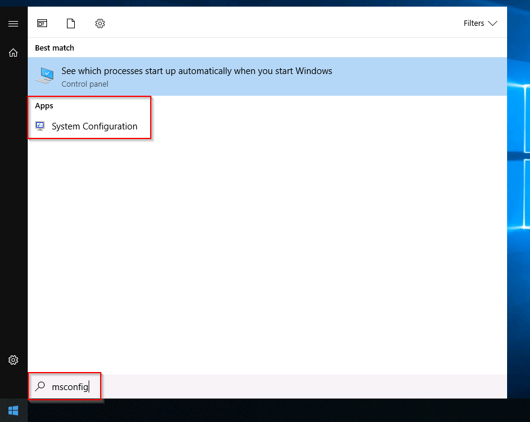

该实用程序顶部有五个选项卡。以下是每个选项卡的名称。我们将在本任务中简要介绍每个选项卡。 

1. 常规(`General`)
2. 引导(`Boot`)
3. 服务(`Services`)
4. 启动(`Statup`)
5. 工具(`Tools`)

  


1. 在 **“常规(`General`)”**  选项卡中，我们可以选择 Windows 启动时加载的设备和服务。选项包括：**正常(Normal)**、**诊断(Diagnostic)** 或 **选择性（Selective）**。 
	
	在 **“启动”** 选项卡中，我们可以为操作系统定义各种启动选项。 
	  

2.**“服务”** 选项卡列出了系统配置的所有服务，无论其状态如何（正在运行或已停止）。服务是一种在后台运行的特殊应用程序。  
	  
3. 在 **“启动”** 选项卡中，你不会在附加的虚拟机中看到任何有用的信息。下面是我本地计算机上 **MSConfig**启动选项卡的屏幕截图。
	  

如您所见，Microsoft 建议使用**任务管理器 (** `taskmgr`**)** 来管理（启用/禁用）启动项。系统配置实用程序**并非**启动管理程序。 

**注意**：如果您打开官网给出的实验虚拟机的任务管理器，您会注意到任务管理器没有显示启动选项卡。 

“工具”选项卡中列出了各种实用程序（工具），我们可以运行它们来进一步配置操作系统。每个工具都有简短的描述，以便于我们了解其用途。 

  

注意 **“选定命令（Selected command）”** 部分。此文本框中的信息会根据工具的不同而变化。

要运行**工具（tool）**，我们可以使用命令通过运行提示符、命令提示符或单击`Launch`按钮来启动该工具。

### 回答以下问题

```ad-details
collapse: true
title: 将 `Systems Internals` 列为制造商的服务名称是什么？
**答案：** `PsShutdown`

⚠️注意： 先对`Manufacturer`进行排序，会更容易寻找

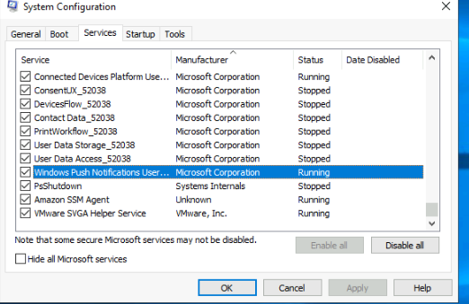
```

```ad-details
collapse: true
title: Windows 许可证(license)注册给谁？

**答案：** `Windows User`

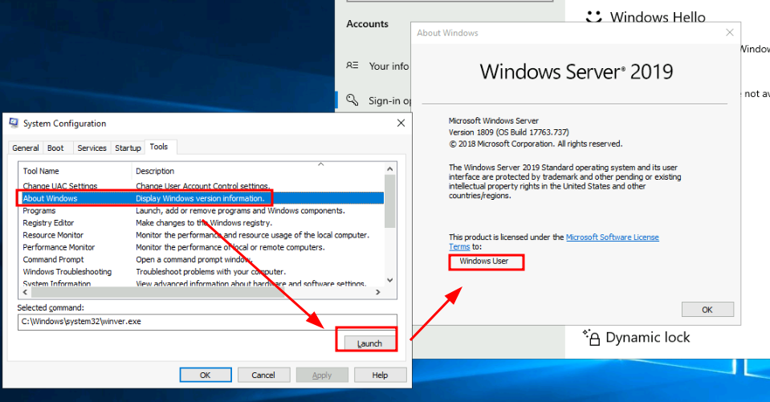
```

```ad-details
collapse: true
title:  `Windows Troubleshooting` （Windows 故障排除）的命令是什么？

**答案：** `C:\Windows\System32\control.exe /name Microsoft.Troubleshooting`

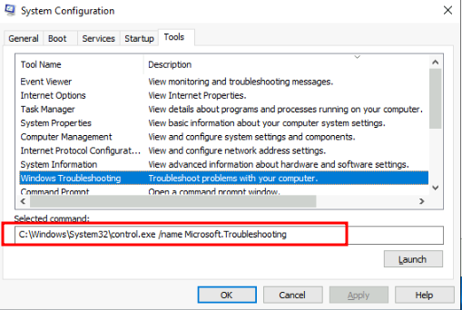
```

```ad-details
collapse: true
title: 什么命令可以打开控制面板(Control Panel)？（答案是.exe 文件名，而非完整路径）

**答案：** `control.exe`
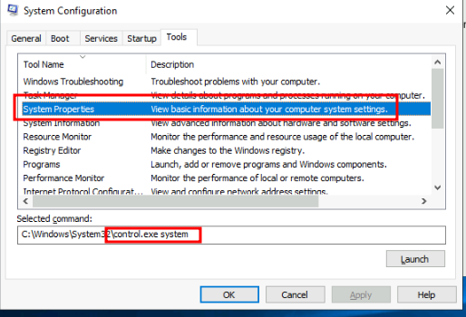
```


## 更改 UAC 设置

**我们将继续使用可通过系统配置**面板获取的工具。  

[Windows Fundamentals 1](https://tryhackme.com/room/windowsfundamentals1xbx)中详细介绍了**用户帐户控制**( UAC ) 。 [](https://tryhackme.com/room/windowsfundamentals1xbx)

UAC设置可以更改，甚至完全关闭（不推荐）。

您可以移动滑块来查看该设置将如何改变UAC设置以及 Microsoft 对该设置的立场。


### 回答以下问题

```ad-details
collapse: true
title: 打开用户帐户控制设置的命令是什么？（答案是.exe文件的名称，而不是完整路径）

**答案：** `UserAccountControlSettings.exe`

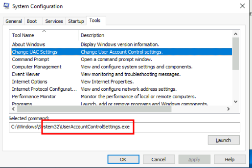
```

## 计算机管理

我们将继续使用可通过系统配置面板获取的工具 。

**计算机管理**（）`compmgmt`实用 程序有三个主要部分： 系统工具、 存储以及 服务和应用程序。


### 系统工具

#### 计划任务

让我们从**任务计划程序**开始。根据微软的说法，使用任务计划程序，我们可以创建和管理常见任务，这些任务将在我们指定的时间自动执行。

任务可以运行应用程序、脚本等，并且可以配置任务在任意时间点运行。任务可以在登录或注销时运行。还可以配置任务按特定计划运行，例如每五分钟运行一次。

要创建基本任务，请单击**“操作”**（右窗格）`Create Basic Task`下的。


#### 事件查看器

事件查看器允许我们查看计算机上发生的事件。这些事件记录可以被视为审计线索，用于了解计算机系统的活动。这些信息通常用于诊断问题和调查在系统上执行的操作。 


事件查看器有三个窗格。

1. 左侧窗格提供了事件日志提供程序的层次树列表。（如上图所示）
2. 中间的窗格将显示特定于所选提供商的事件的概述和摘要。
3. 右侧的窗格是操作窗格。

可以记录五种类型的事件。以下表格来自 [docs.microsoft.com](https://docs.microsoft.com/en-us/windows/win32/eventlog/event-types)  ，对每种事件进行了简要说明。

| Event Type    | Description                                                                                      |
| ------------- | ------------------------------------------------------------------------------------------------ |
| Error         | 错误：指示存在重大问题的事件，如数据丢失或功能失效。例如，若某项服务在启动时无法加载，则会记录一条错误事件                                            |
| Warning       | 告警：该类事件虽然并不严重，但可能会带来潜在的问题。例如，磁盘空间不足时，将记录Warning事件，如果应用程序可以从事件中恢复而不会丢失功能或数据，则它通常可以将此事件分类为Warning. |
| Information   | 信息：用于描述应用程序、驱动程序或服务成功运行的事件。例如，网络驱动程序成功加载时，适合记录一条information事件，请注意，桌面应用程序通常不宜在每次启动时都记录一个事件。       |
| Success Audit | 审核成功的安全访问尝试事件。例如：用户成功尝试登陆系统时，将记录为Success Audit 事件。                                               |
| Failure Audit | 记录经过审核的失败安全访问尝试的事件。例如，如果用户尝试访问网络驱动器但失败了，该尝试记录为Failure Audit事件                                    |

标准日志在Windows 日志下可见 。下面是来自[docs.microsoft.com](https://docs.microsoft.com/en-us/windows/win32/eventlog/eventlog-key)的表格，  其中简要介绍了每个日志。

| Log         | Description                                                               |
| ----------- | ------------------------------------------------------------------------- |
| Application | 包含由应用程序记录的事件。例如，数据库应用程序可能会记录文件错误。由应用程序开发者决定记录哪些事件。                        |
| Security    | 包含有效和无效的登录尝试等事件，以及与资源使用相关的事件，如创建、打开或删除文件或其他对象。管理员可以启动审核功能，以便在安全日志中记录事件。   |
| System      | 包含由系统组件记录的事件，例如驱动程序或其他系统组件在启动期间加载失败的事件。                                   |
| CustomLog   | 包含由创建自定义日志的应用程序记录的事件。使用自定义日志可使应用程序控制日志大小，或出于安全目的附加访问控制列表（ACL），而不影响其他应用程序。 |
有关事件查看器和事件日志的更多信息，请参阅[ Windows 事件日志](https://tryhackme.com/room/windowseventlogs)

#### 共享文件夹
**在共享文件夹**中，您将看到其他人可以连接的共享和文件夹的完整列表。 


在上图中，共享下是 Windows 的默认共享 `C$`，以及 Windows 创建的默认远程管理共享，例如 `ADMIN$`。 

与 Windows 中的任何对象一样，您可以**右键单击文件夹**来查看其属性，例如权限（谁可以访问共享资源）。 

在 **“Sessions”** 下，您将看到当前连接到共享的用户列表。在此虚拟机中，您将看不到任何连接到共享的用户。

已连接用户访问的所有文件夹或文件将在 **“Open Files（打开文件）”** 下列出。

您应该熟悉 [Windows_基础-01](Windows_基础-01.md) **本地用户和组** 部分，（运行`lusrmgr.msc`可以打开）。

在 **“Performance（性能）”** 中，您将看到一个名为 **“性能监视器**” ( `perfmon`) 的实用程序。

`Perfmon` 用于实时或从日志文件查看性能数据。此实用程序可用于排除本地或远程计算机系统的性能问题。
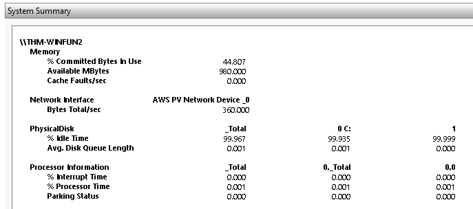

#### 设备管理器

**设备管理器（Device Manager）** 允许我们查看和配置硬件，例如禁用连接到计算机的任何硬件。

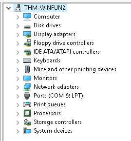

### 存储 

存储（Storage）下方是**Windows Server 备份**和**磁盘管理**。本部分我们仅讨论磁盘管理。

**注意**：由于虚拟机是 Windows Server 操作系统，因此可以使用一些在 Windows 10 中通常看不到的实用程序。  


磁盘管理是 Windows 中的系统实用程序，可让您执行高级存储任务。  一些任务包括：

- 设置新驱动器
- 扩展分区
- 缩小分区
- 分配或更改驱动器号（例如 E:） 

### 服务和应用程序


回想一下上一个任务； 服务是一种在后台运行的特殊应用程序。在这里，除了启用和禁用服务之外，您还可以执行其他操作，例如查看服务的属性。 


WMI控制配置和控制**Windows 管理规范**( WMI ) 服务。

根据维基百科，“ *WMI允许使用脚本语言（例如 VBScript 或 Windows PowerShell）在本地和远程管理 Microsoft Windows 个人计算机和服务器。Microsoft 还为WMI提供了一个名为 Windows 管理规范命令行 (WMIC) 的命令行界面。*”

**注意**：Windows 10 版本 21H1 中已弃用 WMIC 工具。Windows PowerShell取代了此WMI工具。

### 回答以下问题

```ad-details
collapse: true
title: 打开计算机管理的命令是什么？（答案是.msc 文件的名称，而不是完整路径）

**答案：** `compmgmt.msc`

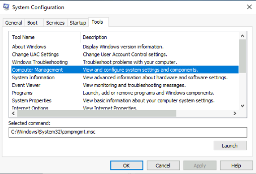
```

```ad-details
collapse: true
title:  GoogleUpdateTaskMachineUA 任务配置为每天什么时间运行？

**答案：** `6:15 AM`

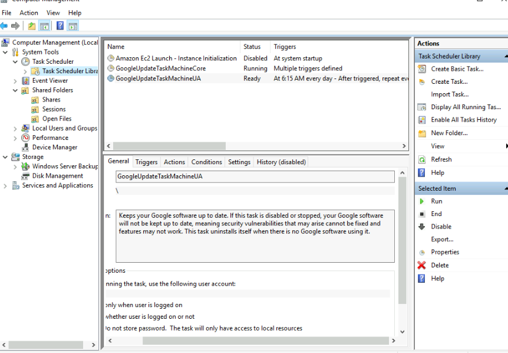

```

```ad-details
collapse: true
title: 共享的隐藏文件夹的名称是什么？

**答案：** `sh4r3dF0Ld3r`


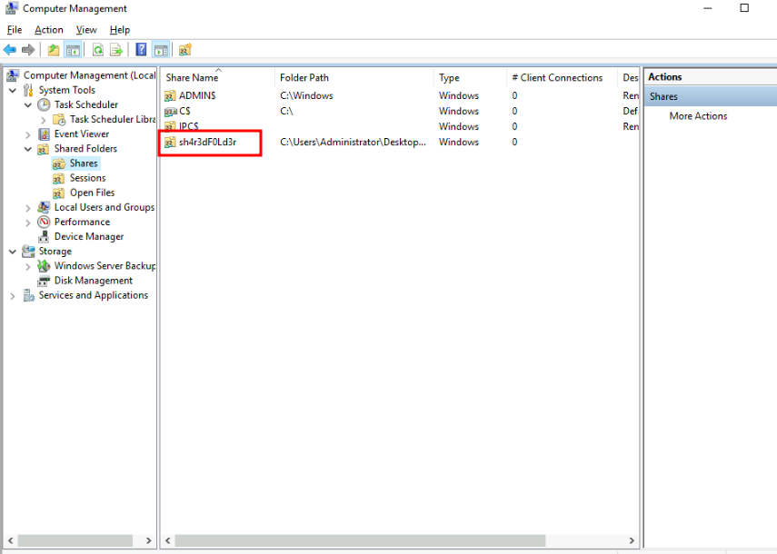

```

## 系统信息

## 资源监视器


## 命令提示符

## 注册表编辑器

## 结论