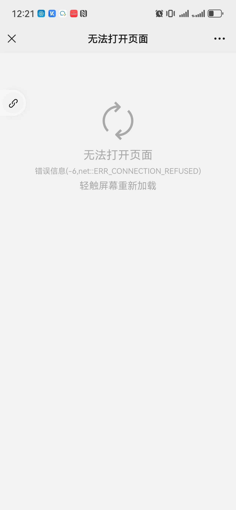

涉及应用系统： 微信小程序OA入口

对外业务地址：
- `oa.pgyy.com:80` （IP：`114.255.98.205`）
- `oa.pgyy.com:81` （IP：`114.255.98.205`） 
## 故障现象：
- 通过微信小程序OA入口无法正常访问业务
- `telnet 80、81` 端口，可以正常连接
- 浏览器访问`http://oa.pgyy.com:80` 或`http://114.255.98.205:80` 显示正常的测试页面
- 浏览器访问`http://oa.pgyy.com:81` 或`http://114.255.98.205:81` 无法访问网站
- 命令行 `curl http://oa.pgyy.com:81` 或`curl http://114.255.98.205:81` 返回正常`html`代码
## 微信小程序故障截图：

