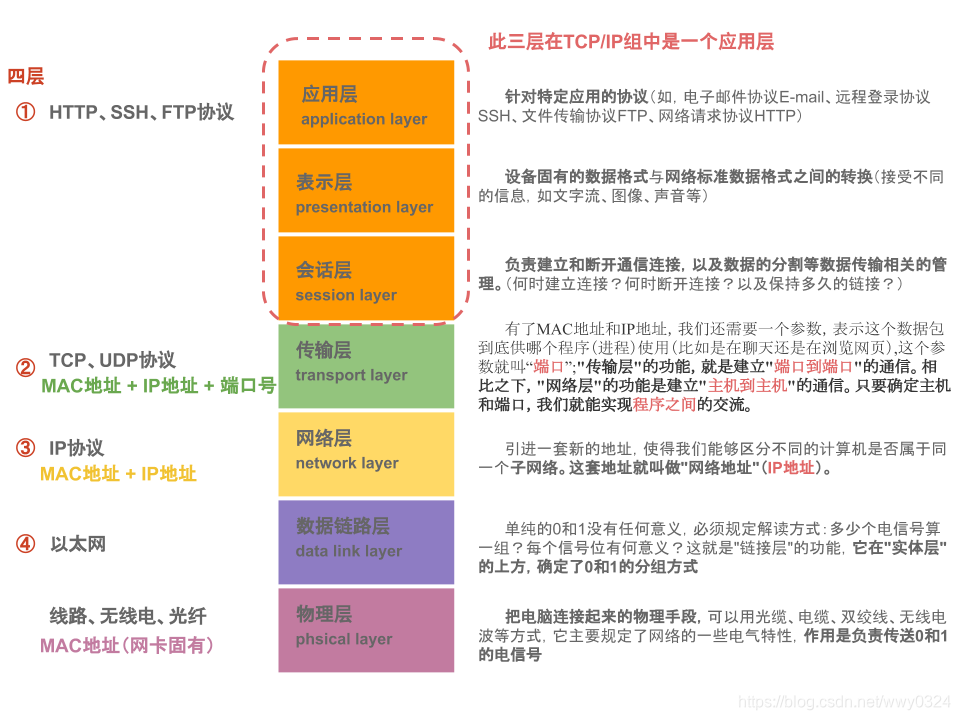
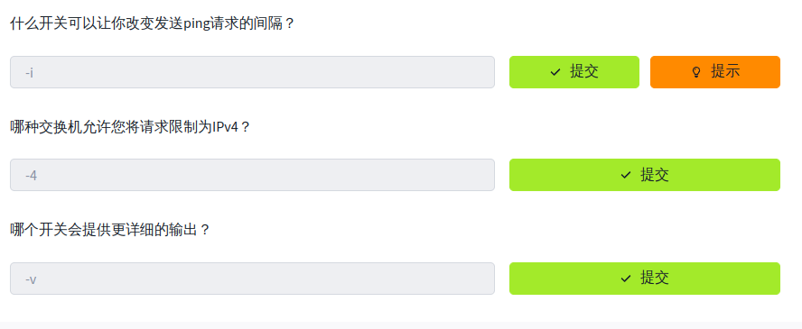
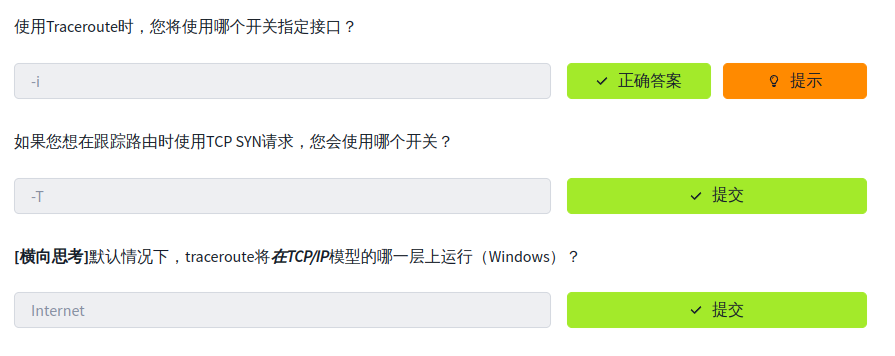

# 4.网络基础-网络入门

## OSI 七层模型


## TCP/IP 协议


## PING 命令

## Traceroute 命令

## WHOIS

查询域名工具，也可以在浏览器上搜索🔍`whois`网站进行查询。
> [!IMPORTANT]
> 在进行whois 查询时应重点关注以下字段：
>- `Registered`： 注册
>- `Tech` : 技术
>- `Admin`: 管理

## Dig

Dig允许我们手动查询我们选择的递归DNS服务器，以获取有关域的信息：

```bash
dig <doman-name> @<DNS-server-IP>
```

**示例:**

  ```shell
dig www.baidu.com @223.5.5.5
```


## 总结

到此网络入门知识就介绍结束了。
> [!TIP]
如果您想扩展您的网络理论知识，[Steve McQuerry的CISCO自学指南](https://www.amazon.co.uk/Interconnecting-Cisco-Network-Devices-ICND1/dp/1587054620/ref=sr_1_1?keywords=Interconnecting+Cisco+Network+Devices%2C+Part+1&qid=1583683766&sr=8-1)是一个很好的工作资源。
