# 5.网络基础-NMAP

当我们对一个系统进行渗透时，知道的信息越多，就会越容易，因此需要在进行任何漏洞利用尝试之前进行必要的枚举。Nmap正是一个非常强大的网络扫描工具。

在正式开始了解NMAP前，我们需要了解以下基础信息：
## 端口
- ports： 作用与OSI 传输层，用于将流量导向正确的应用
- 在计算机中共有65535个端口
- 其中0-1024 端口是常用的标准端口
## TCP 协议包头

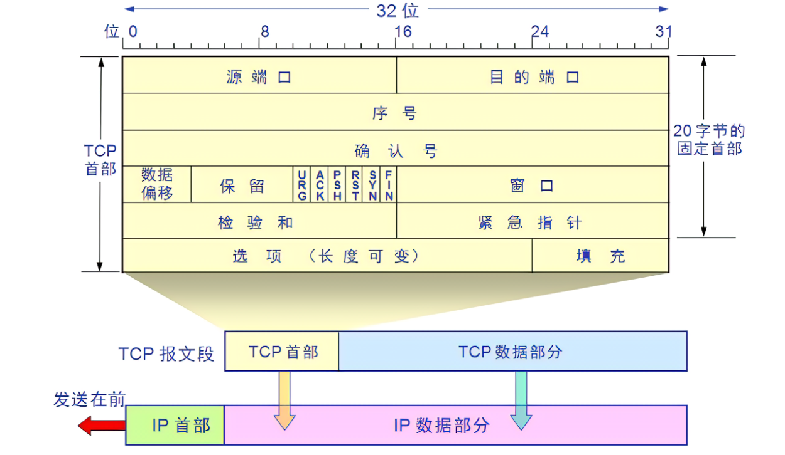

  > [!IMPORTANT] 💡注意
> -  源端口号和目的端口号（寻址）与udp中类似，用于寻找发端和收端应用进程。这两个值加上IP首部中的源端IP地址和目的端IP地址唯一确定一个，在网络编程中，一般一个IP地址和一个端口号组合称为一个套接字（socket）。
> -  序号（seq）：用来标识从TCP发端向TCP收端发送的数据字节流，它表示在这个报文段中的第一个数据字节。在tcp中tcp用序号对每个字节进行计数（这个值与发送的帧数没有关系，而是与发送的数据字节数有关系，后面会有说明）。
 >-  确认序号（seq+1）：包含发送确认的一端所期望收到的下一个序号。因此，确认序号应当是上次已成功收到数据字节序号加 1（不是单纯的序号加1，还包括数据字节数）。
>- 首部长度：用于记录tcp数据报首部的长度，一般为20字节，实际值为首部长度除以4。
> - 下面的是标志位对应的功能：
> 	- URG： 紧急指针（ urgent pointer）有效。
> 	- ACK： 响应确认。
> 	- PSH： 表示有DATA数据传输，接收方应该尽快将这个报文段交给应用层。
> 	- RST： 重建连接（一般在发送FIN之后）。
> 	- SYN： 建立连接请求。
> 	- FIN： 关闭连接。
> 	- 窗口大小：用于流量控制。
> 	- 检验和：检验和覆盖了整个的 TCP报文段： TCP首部和TCP数据，与udp相似需要计算伪首部。

## NMAP
### NMAP 参数

```bash
-sP # ping 探测主机存活

-sS # SYN Scan

-sU # UDP Scan  

-O # OS detection（系统信息检测）

-A # “侵略性”毫不演示，噪声大；对服务、操作系统、跟踪路由和通用脚本进行扫描

-T # Nmap 提供了五个级别的“定时”模板，可用于提高扫描速度，但是越快噪音越大，越容易被发现，更可能导致报错。

-sV # 应用版本检测

-D # 诱饵扫描（发送掺杂假IP的数据包，使防火墙难以判断真正的扫描源）

-v # 详细输出扫描结果

-vv # 详细级别二

-f # 随机偏移量碎片扫描（将数据包分割成更小的部分发送，使防火墙难以识别）

-mtu 8 # 指定MTU大小为8的碎片扫描

  

-oA <filename> # 导出为三种常见格式

-oN <filename> # 导出txt 文件

-oX <filename> # 导出xml文件

-oG <filename> # 导出可抓取的格式
 

-p # 端口


--script # 引用脚本格式： --script=vuln

```

### Nmap 常见扫描类型

使用Nmap进行端口扫描时，有三种基本扫描类型：
- TCP连接扫描（`-sT`）
- SYN“半开”扫描（`-sS`）
- UDP扫描（`-sU`）

#### TCP 连接扫描 （`-sT`）

原理： 看是TCP请求返回值，判断端口是否开启：

  >[!NOTE] 三次握手
>- 第一次：请求 `SYN`
>- 第二次：返回 `SYN/ACK` or `RST`（Reset 重置）
>- 第三次：确认 `ACK`
> 
>**当TCP端口关闭或隐藏在防火墙之后时，会返回`RST`**

#### SYN“半开”扫描（`-sS`）
与TCP扫描一样，SYN扫描（`-sS`）用于扫描目标的TCP端口范围;然而，这两种扫描类型的工作方式略有不同。SYN扫描有时被称为*半开(Half-open)* 扫描或*隐形(Stealth)* 扫描。

通常用于绕过旧的入侵检测系统，对现在的IDS解决方案不再适用
- 原理： 在完成三次握手的过程中，从服务器接收到SYN/ACK后发送回一个重复的TCP数据包（告诉服务器请求关闭，不正式建立连接） 。
- 优点：因为省略了向服务器返回ACK 的过程，因此扫描速度比标准扫描（-sT）快。
- 缺点： 需要`sudo` 权限，不稳定的应用，有可能会因SYN扫描导致关闭。

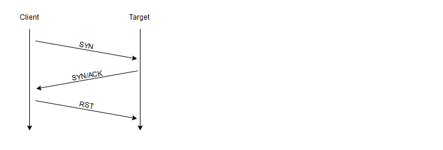
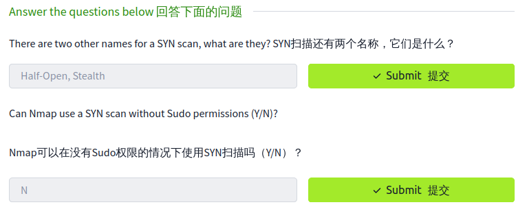
#### UDP 扫描（`-sU`）

由于UDP是无状态协议，因此判断端口是否打开需要额外的步骤，判断机制如下：

- 向端口发送数据包：

- 得到UDP响应（不寻常）：端口被标记打开

- 得不到响应：发送第二次请求作为双重检查，被标记为：`open|filtered`

- 得到端口不可达响应（ping数据包）：标记端口关闭
>[!nNOTE]
由于识别UDP端口是否实际打开的困难，与各种TCP扫描相比，UDP扫描往往非常慢（在20分钟内扫描前1000个端口，连接良好）。因此，在启用`--top-ports <number>`的情况下运行Nmap扫描通常是一个很好的做法。例如，使用`nmap -sU --top-ports 20 <target>`进行扫描。将扫描前20个最常用的UDP端口，从而使扫描时间更容易接受。

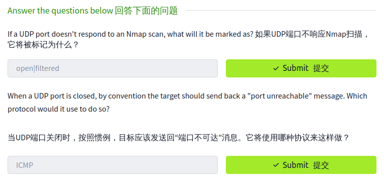

### 其他扫描类型

此外，还有几种不太常见的端口扫描类型，我们也将介绍其中一些（尽管不太详细）。这些措施包括：
#### TCP Null Scans (`-sN`)

当发送TCP 请求时，不设置标志。按照RFC规则，这种情况下，如果端口关闭，目标主机应使用应答器进行响应。
#### TCP FIN Scans (`-sF`)

当发送TCP 请求时，发送带有FIN（关闭连接）标志的空包，因为本身未建立连接，所以如果端口是开放的，就会返回一个错误值。

#### TCP Xmas Scans (`-sX`)

Xmas tree包是指`flags`中`FIN` `URG` `PUSH`被置为`1`的TCP包，因在使用Wireshark 对其响应包进行分析时，显示一个闪烁的圣诞树而得名。

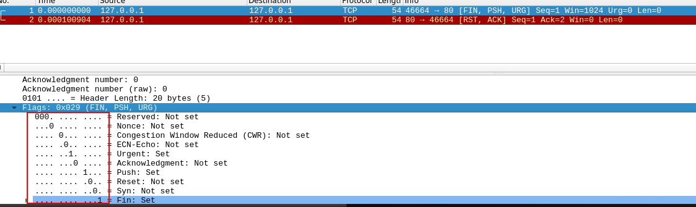


>[!NOTE]
>这三种扫描方式被称为秘密扫描（Stealthy Scan），因为相对比较隐蔽。扫描时向目标主机的端口发送的TCP FIN包或Xmas tree包/Null包，如果收到对方RST回复包，那么说明该端口是关闭的；没有收到RST包说明端口可能是开放的或被屏蔽的（open|filtered）。
>

  >[!TIP]
>虽然 RFC 793 规定，对于封闭端口，网络主机应使用 RST TCP 数据包来响应畸形数据包，而?>对于开放端口，则完全不响应。
>
>但实际情况并非总是如此，特别是 Microsoft Windows（以及许多 Cisco 网络设备），它们>会对任何畸形 TCP 数据包做出 RST 响应，而不管端口是否真正开放。这将导致所有端口显示为关闭
>
>当然，这样做的目的是为了躲避防火墙。许多防火墙都被配置为丢弃发送到已设置 SYN 标志的受>阻端口的传入 TCP 数据包（从而阻止新的连接启动请求）。通过发送不包含 SYN 标志的请求，>我们可以有效绕过此类防火墙。虽然这在理论上是好的，但大多数现代 IDS 解决方案对这些扫描>类型都很精通，因此在处理现代系统时，不要依赖它们的 100% 有效性。
!
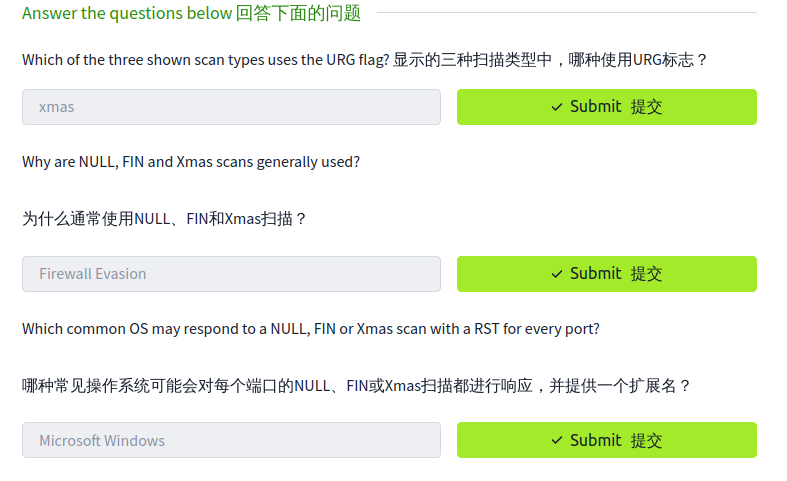

## ICMP 网络扫描

在黑盒测试中第一次接触目标网络时，我们的第一目标是获取网络架构。换句话说，我们想知道哪些 IP地址的主机是存活的，哪些未存活。通常我们会用`ping`扫描

`-sn`开关告诉Nmap不要扫描任何端口，让`nmap`主要依赖于HTTP回送数据包（或者本地网络上的`ARP`请求，如果使用`sudo`运行或者直接作为`root`用户运行）来识别目标。除了响应`echo`请求之外，`-sn`交换机还将使`nmap`向目标的端口443发送TCPSYN数据包，以及向目标的端口80发送TCP ACK（或TCPSYN，如果不作为根运行）数据包。

```bash
nmap -sn 192.168.0.0/24
```


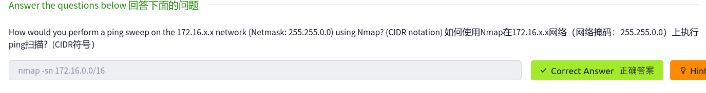
  
## Nmap脚本引擎（NSE）

nmap脚本语言有以下特征
- Lua 语言编写
- 可以用于漏洞扫描
- 能够实现自动化漏洞利用

### 脚本分类

- `safe`： 不会影响目标
- `intrusive`： 不安全：可能影响目标
- `vuln`： 扫描漏洞
- `exploit`： 尝试利用漏洞
- `auth`： 尝试绕过运行服务的身份验证（例如匿名登录FTP服务器）
- `brute`： 尝试暴力破解正在运行的服务的凭据
- `discovery`： 尝试查询正在运行的服务以获取有关网络的更多信息（例如，查询SNMP服务器）。

>[!TIP]
更详尽的列表可以在[这里](https://nmap.org/book/nse-usage.html)找到。

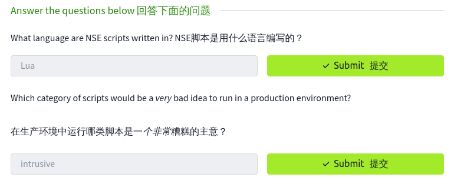

### NSE 使用

- 使用特定脚本：`--script=<script-name>`
- 使用多个脚本：`--script=<script-name1,script-name2,script-name3>`
- `http-put` : 脚本
- `--script-args` ：前面表示脚本，后面跟两个参数：目标URL,要上传的文件位置
- `http-put.url='/dav/shell.php'`：目标URL
- `http-put.file='./shell.php'` : 要上传的文件位置

::: code-group

```sh [有些脚本需要参数]
nmap -p 80 --script http-put --script-args http-put.url='/dav/shell.php',http-put.file='./shell.php'
```
::: 

>[!TIP]
>Nmap脚本带有内置的帮助菜单，可以使用`nmap --script-help <script-name>`访问。只能在本地提供有限的信息。完整的脚本列表及其相应的参数（沿着示例用例）可以在[这里](https://nmap.org/nsedoc/)找到。


### 搜索Scripts

nmap 脚本一般可以在[Nmap网站](https://nmap.org/nsedoc/)上的页面找到，kali 默认安装在`/usr/share/nmap/scripts`目录中。

我们可以通过`/usr/share/nmap/scripts/script.db`文件进行已安装脚本的搜索。

`/usr/share/nmap/scripts/script.db`文件是一个格式化的文本文件，其中包含每个可用脚本的文件名和类别。Nmap使用这个文件来跟踪（和利用）脚本引擎的脚本;然而，我们也可以通过它来查找脚本。
  
```bash
grep "ftp" /usr/share/nmap/scripts/script.db
```
 
当然也可以通过`ls`命令查看目录下保存的脚本。

  ```bash
ls -l /usr/share/nmap/scripts/*ftp*
```

  同样的技术也可以用于搜索脚本的类别：

```bash
grep "safe" /usr/share/nmap/scripts/script.db
```

### 添加脚本


更新脚本库的方法包括但不限于以下几种

- apt 包管理工具升级

```bash
sudo apt update && sudo apt install nmap
```

- wget下载

```bash
sudo wget -O /usr/share/nmap/scripts/<script-name>.nse https://svn.nmap.org/nmap/scripts/<script-name>.nse

nmap --script-updatedb
```


>[!TIP] 注意
>如果您要创建自己的NSE脚本并将其添加到Nmap中，则需要使用相同的`updatedb`命令，
>这是一项非常容易管理的任务，只需了解一些Lua的基本知识！

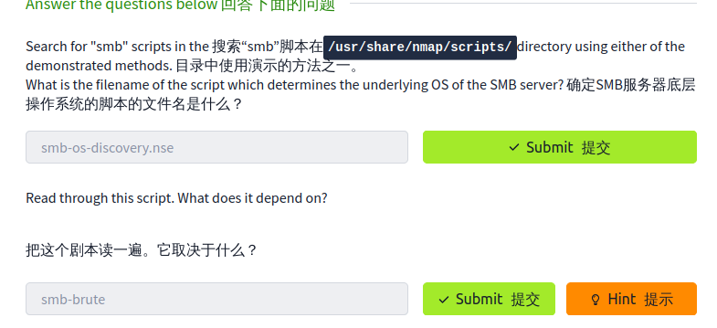

###  smb-brute

- smb-brute : 一个暴力破解脚本。

- 尝试通过SMB猜测用户名/密码组合，存储发现的组合以供其他脚本使用。

- 每次尝试都将获得有效的用户列表，并在实际使用之前验证每个用户名。

- 当一个用户名被发现时，除了被打印，它也被保存在Nmap注册表中，以便其他Nmap脚本可以使用它。

- 这意味着如果你要运行`smb-brute.nse`，你应该运行其他你想要的`smb`脚本。

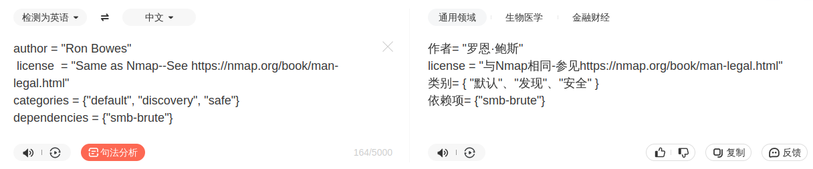
  

## 规避防火墙

  
### windows防火墙绕过

- 典型的 Windows 主机会使用默认防火墙阻止所有 ICMP 数据包，当用nmap进行ping扫描时，会认为此类主机未存活，根本不会对其进行扫描。此时就会用到`-Pn`参数，不对目标主机进行`ping`扫描，默认目标主机存活。

```bash
nmap -Pn <IP-adress>
```

- 缺点： 扫描时间长，如果主机真的未存活，`Nmap`任然会检查每个指定端口
- Nmap还有许多其他的参数可用于防火墙规避。我们不会详细讨论这些问题，但可以在[这里](https://nmap.org/book/man-bypass-firewalls-ids.html)找到。

### 检测防火墙的存在

- `--badsum` ： 这用于生成无效的数据包校验和。
任何真实的TCP/IP堆栈都会丢弃此数据包，但是防火墙可能会自动响应，而无需检查数据包的校验和。因此，此开关可用于确定防火墙/IDS的存在。

  
###  碎片扫描

  
通过将数据包分割成更小的部分发送，使得防火墙更难识别这些数据包属于一个扫描流量。

```bash
nmap -f <目标IP地址> # 使用随机偏移量的碎片扫描

nmap --mtu 8 <目标IP地址> # 指定MTU大小为8的碎片扫描
```

### 延时扫描

- 用于在发送的数据包之间添加延迟。如果网络不稳定，这是非常有用的;

- 也可以避免任何基于时间的防火墙/IDS触发器。

```
--scan-delay <time>ms
```

### 诱饵扫描

  

在扫描数据包中添加多个诱饵IP地址，使目标防火墙难以判断真正的扫描源，从而增加扫描的隐蔽性。

```bash
nmap -D RND:10 <目标IP地址> # 随机使用10个诱饵IP地址

nmap -D decoy1,decoy2,decoy3 <目标IP地址> # 指定具体的诱饵IP地址
```
### 空闲扫描

利用一台空闲主机（zombie host）作为跳板，通过向空闲主机发送经过特殊构造的数据包，间接地探测目标主机的端口状态，而无需直接向目标主机发送数据包。

```bash
nmap -P0 -sI zombie <目标IP地址> # 使用名为zombie的空闲主机进行扫描
```

  >[!NOTE] 注意
注意：这里的“「zombie」”应替换为实际的空闲主机地址（简称**「僵尸机」**）。

### 随机数据长度
  
在发送的数据包中填充随机长度的数据，以绕过一些基于数据包长度过滤的防火墙规则。

```bash
nmap --data-length 25 <目标IP地址> # 在每个数据包中填充25字节的随机数据
```

### 欺骗扫描

  通过伪造源IP地址或MAC地址，使防火墙难以追踪真实的扫描源。

```bash
nmap --sT -PN --spoof-mac aa:bb:cc:dd:ee:ff <目标IP地址> # 伪造源MAC地址进行TCP连接扫描

nmap --badsum <目标IP地址> # 发送带有错误校验和的数据包，可能绕过某些简单的防火墙规则

nmap -cloak-source <spoofed_ip1>,<spoofed_ip2> <target_ip> # 伪造ip地址进行扫描
```

### 使用特定端口或绕过常用端口

一些防火墙规则基于端口过滤，可以尝试使用特定的源端口来绕过。例如，很多防火墙允许HTTP端口（80）和HTTPS端口（443）通过。

```bash
nmap --source-port 80 <目标IP地址> # 使用HTTP端口作为源端口进行扫描
```

### ARP Ping扫描（-PR）

  

```
nmap -sn -PR <target_network>

# 或者

nmap -PR <target_network>
```

  
  

>[!TIP]
>ARP 扫描仅适用于局域网环境，因为它依赖于 ARP 协议，该协议用于在局域网内解析 IP 地>到 MAC 地址。
>
>ARP 扫描可能无法发现配置了 ARP 过滤或 ARP 欺骗防护措施的主机。

## 使用nmap NSE 脚本登陆FTP

### 执行脚本

  

```bash

nmap -p21 --script=ftp-anon 10.10.234.242

```

- 执行结果判断

- 返回状态码`230`; `200` 系列状态码表示连接成功;

- 细查`230`的含义，可得：其为输入正确密码的返回值

- 可以判定登陆成功

  

### 人工登陆验证

```bash

ftp 10.10.234.242

anonymous

anonymous

```

**登陆成功,截图为证**


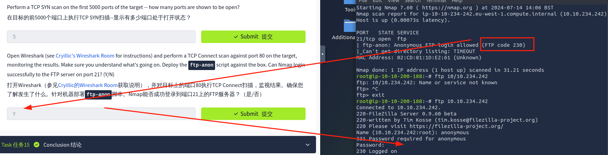
## 总结

你现在已经完成了进一步的Nmap房间-希望你喜欢它，并学到了一些新的东西！

有很多很好的资源可以让你自己学习更多关于Nmap的知识。前面和中间是Nmaps自己的（非常广泛的）[文档](https://nmap.org/book/)，在整个房间里已经提到过好几次了。这些都是极好的资源，所以，虽然逐行阅读和死记硬背是完全不必要的，但如果你需要的话，最好把它们用作参考点。


