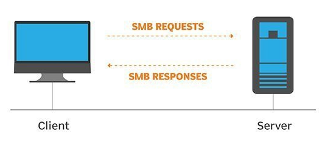
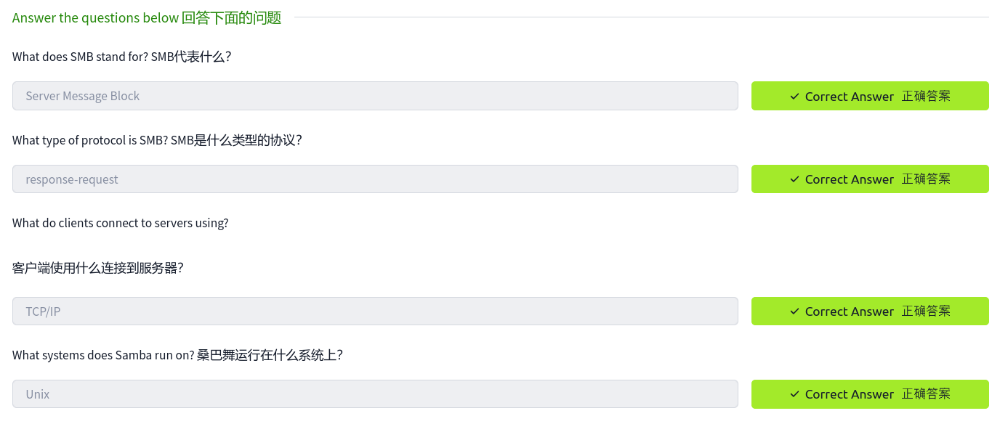
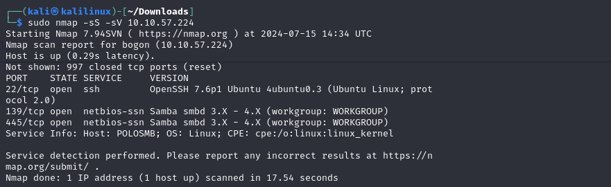
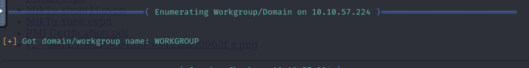
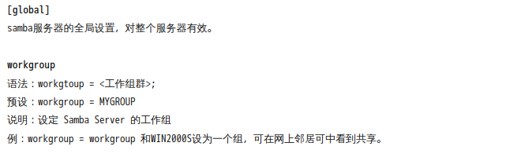
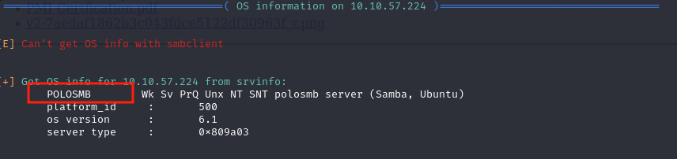
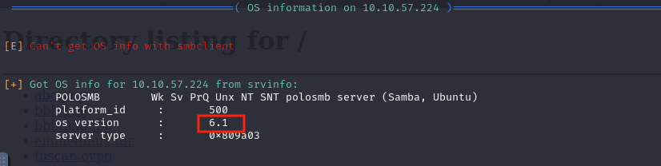
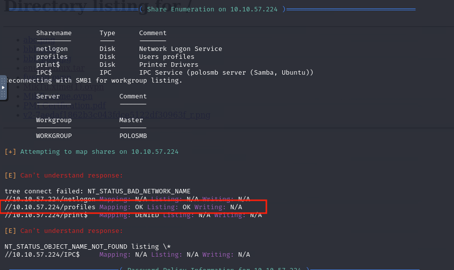

# 6.常见的网络服务-SMB


本部分讨论一些常见的网络服务和错误配置导致的安全漏洞
## 了解SMB

**SMB** ( Server Message Block)   服务器消息块协议

- 是一种 **(client-server)** 通信协议，用于共享网络上的文件、打印机、串行端口和其他资源的访问。[来源](https://searchnetworking.techtarget.com/definition/Server-Message-Block-Protocol)
- SMB 协议被称为响应请求协议 **(response-request protocol)**，它在客户端和服务器之间传输多个消息以建立连接。
- 客户端使用 TCP/IP（实际上是 RFC1001 和 RFC1002 中指定的 TCP/IP 上的 NetBIOS）、NetBEUI 或 IPX/SPX 连接到服务器。
- 建立连接后，客户端可以向服务器发送命令 (SMB)。允许客户端执行您想要对文件系统执行的所有操作。
- 所有操作都是通过网络完成的。
- 自Windows 95以来，Microsoft Windows操作系统为Unix系统提供的开源服务，用于共享文件。
- 
 

 ::: details  **回答下面问题**


:::
## 枚举SMB

枚举 **(Enumeration)** 是收集目标信息的过程，目的是找到潜在的攻击媒介并帮助利用。

这个过程对于攻击成功至关重要，因为浪费时间利用不起作用或可能使系统崩溃的漏洞可能是浪费能量。枚举可用于收集用户名、密码、网络信息、主机名、应用程序数据、服务或对攻击者可能有价值的任何其他信息。

**SMB通常是攻击者寻找发现敏感信息的绝佳起点** 如果服务器上有SMB共享驱动器，通常可以连接到并用于查看或传输文件。

### 端口扫描
枚举的第一步是进行端口扫描，尽可能多地了解目标机器的服务、应用程序、结构和操作系统。我们可以通过[NMAP](5.Network_NMAP.md)工具进行扫描。

### Enum4linux
Enum4linux是一个用于枚举Windows和Linux系统上的SMB共享的工具。它基本上是samba包中工具的包装器，可以轻松地从目标中快速提取与SMB有关的信息。它已经安装在AttackBox上，但是如果你需要在自己的攻击机器上安装它，你可以从官方[github](https://github.com/portcullislabs/enum4linux)上安装。

**使用**

语法： `Enum4linux [options] ip`


| options | 解释              |
| ------- | --------------- |
| -U      | 获取用户列表          |
| -M      | 获取机器（machine）列表 |
| -N      | 获取命名空间转储        |
| -S      | 获取共享列表          |
| -P      | 获取密码策略信息        |
| -G      | 获取组和成员列表        |
| -a      | 所有上述（完整的基本枚举)   |
### **回答下面问题**


::: details  **Task-1：** 使用nmap 扫描，发现有多少端口是开放的？ 

**答案**：3

```bash 
sudo nmap -ss -sV 10.10.75.224
```


:::

::: details  **Task-2：** SMB在什么端口上运行?    

**答案**：139/4458

```bash 
sudo nmap -ss -sV 10.10.75.224
```


:::


::: details **Task-3** 使用`Enum4Linux`,进行完整的枚举，对于新使用者，他们的名字是什么 ？ 

**答案**：workgroup



**解析:**

SMB 协议默认全局配置的预设工作组名称为Workgoup,所有匿名登陆的人，都会叫这个名字。

:::

::: details **Task-4** 机器的名字？

**答案**：POLOSMB


:::

::: details **Task-5** 操作系统版本？

**答案**：6.1



:::

::: details **Task-6** 我们需要调查？

**答案**：profiles

**解析：**


**这里问的是我们接下来要关注的是哪个目录**


从`Share Enumeration（共享枚举）` 中可以看到有一个目录是连接成功（`OK`）的，因此我们接下来要重点关注。
:::

