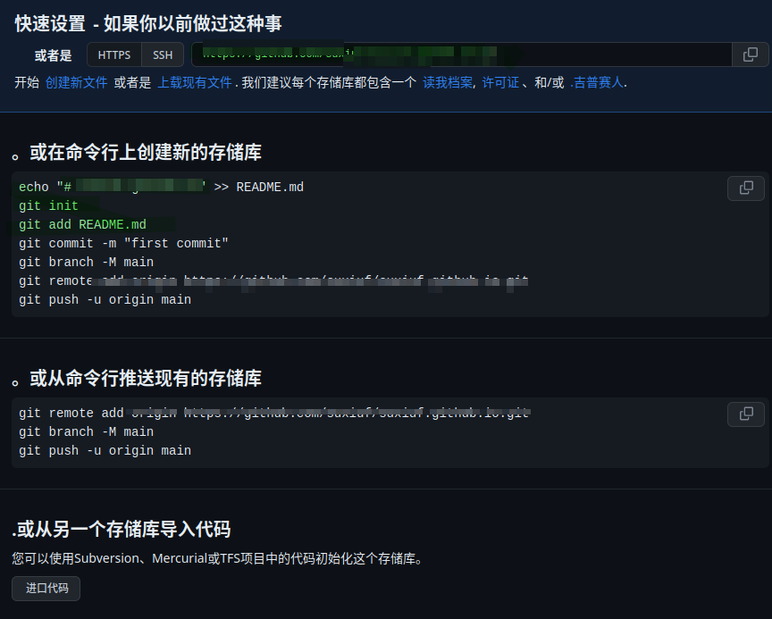
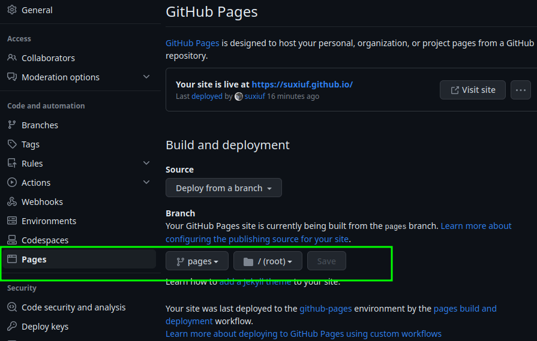
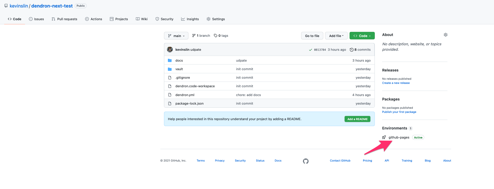

# Github发布静态网站

Dendron 可以创建本地网站，也可以发布到GitHub，官方推荐使用GitHub Actions。

---

GitHub Actions帮助提供一种自动发布形式，每当向GitHub存储库的main分支进行新提交时，都会发布您的笔记。生成的站点也会被写入存储库的pages分支，这会将发布的站点内容与您的main分支提交历史分开。

引用 ：https://wiki.dendron.so/notes/FnK2ws6w1uaS1YzBUY3BR/#steps

# 先决条件

- 安装 git
- 安装 npm
- 在工作区的根目录（dendron.yml所在的位置）初始化npm repo

```shell
npm init -y
```

- 安装dendron-cli

```shell
npm install @dendronhq/dendron-cli@latest
```

> 提示 ： dendron-cli 分全局工作和只工作在当前目录两种方式，推荐选择只工作在当前目录模式详见官网[dendron-cl](https://wiki.dendron.so/notes/RjBkTbGuKCXJNuE4dyV6G#setup)

# 创建GitHub仓库

1. 创建GitHub存储库
   见[官网](https://docs.github.com/en/repositories/creating-and-managing-repositories/creating-a-new-repository)
2. 准备推送工作区到github



```shell
git remote add origin https://github.com/suxiuf/suxiuf.github.io.git 
git init
git add . 
git commit -m "initial commit"
```

# 设置发布

3.1. 导航到工作区的根目录（目录dendron.yml）
3.2. 初始化发布

运行以下命令以设置Vault的发布。这将引入 `nextjs-template`，它将用于从您的笔记中生成静态网站。

> 注意：如果您在使用powershell时遇到问题，我们建议您按照以下步骤使用[WSL](https://docs.microsoft.com/en-us/windows/wsl/install)

```shell
npx dendron publish init
```

##  构建和预览

>运行以下命令以查看站点的本地预览。默认情况下，Dendron将发布您给定库中的所有笔记。

* 此命令启动一个开发服务器，它可以预览您发布的网站的外观。  访问http://localhost:3000以访问您的网站。
* 在终端上输入CTRL-C退出预览

```sh
npx dendron publish dev
```

## 配置URL

  要为构建要发布的笔记，请打开命令提示符并键入>Dendron: Configure (yaml)

在publishing下进行以下修改：

```yaml
...
publishing:
    ...
    siteUrl: {WEBSITE_URL}
```

> 提示： WEBSITE_URL 一般设置为https://{GITHUB_USERNAME}.github.io
> GITHUB_USERNAME ：就是github用户名，一般配置github page的时候都会让把仓库名改为{GITHUB_USERNAME}.github.io


### 发布笔记

* 注意：我们正在使用GitHub目标运行导出

```sh
npx dendron publish export --target github
```

### 部署更改

```bash
git add .
git commit -m "Dendron page update"
git push
```


# 设置GitHub page

- 创建页面分支

```shell
git checkout -B pages
git push -u origin HEAD
```

打开GitHub页面 pages分支，[选择发布源](https://docs.github.com/en/pages/getting-started-with-github-pages/configuring-a-publishing-source-for-your-github-pages-site)：
        pages分支
        / (root)文件夹



# 设置GitHub操作

- 切回主分支

```shell
git checkout main
```

- 创建工作流

**Mac和Linux**

```shell
mkdir -p .github/workflow
touch .github/workflows/publish.yml
```

 **windows**

```shell
mkdir -p .github/workflows
New-Item .github/workflows/publish.yml
```

-  设置工作流

```yml
name: Build Dendron Static Site

on:
  workflow_dispatch: # Enables on-demand/manual triggering
  push:
    branches:
    - main

jobs:
  build:
    runs-on: ubuntu-latest
    steps:
    - name: Checkout source
      uses: actions/checkout@v2
      with:
        fetch-depth: 0

    - name: Restore Node modules cache
      uses: actions/cache@v2
      id: node-modules-cache
      with:
        path: |
          node_modules
          .next/*
          !.next/.next/cache
          !.next/.env.*
        key: ${{ runner.os }}-dendronv2-${{ hashFiles('**/yarn.lock', '**/package-lock.json') }}

    - name: Install dependencies
      run: yarn

    - name: Initialize or pull nextjs template
      run: "(test -d .next) && (echo 'updating dendron next...' && cd .next && git reset --hard && git pull && yarn && cd ..) || (echo 'init dendron next' && yarn dendron publish init)"

    - name: Restore Next cache
      uses: actions/cache@v2
      with:
        path: .next/.next/cache
        # Generate a new cache whenever packages or source files change.
        key: ${{ runner.os }}-nextjs-${{ hashFiles('.next/yarn.lock', '.next/package-lock.json') }}-${{ hashFiles('.next/**.[jt]s', '.next/**.[jt]sx') }}

    - name: Export notes
      run: yarn dendron publish export --target github --yes

    - name: Deploy site
      uses: peaceiris/actions-gh-pages@v3
      with:
        github_token: ${{ secrets.GITHUB_TOKEN }}
        publish_branch: pages
        publish_dir: docs/
        force_orphan: true
        #cname: example.com
```

-  提交更改

```shell
git add .
git commit -m "add workflow"
git push
```

# 首次推送笔记

第一次推送需要一点时间，因为Next.js在初始发布时会生成一堆资产。随后的推送只会提交更改，并且会快得多。

你可以通过点击GitHub存储库中的GitHub页面来查看页面的状态。

> 由于这是您的第一次部署，可能需要一分钟才能显示页面。
> 
